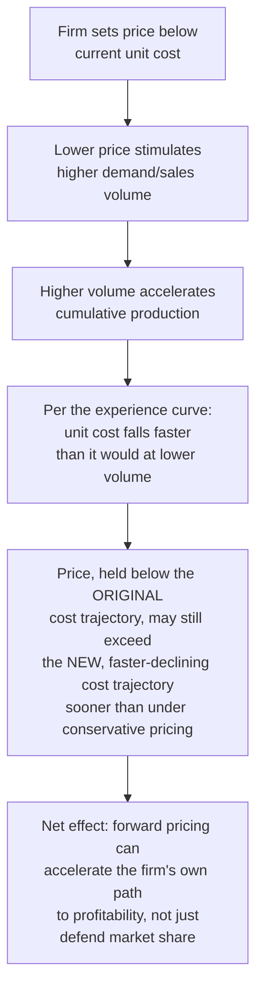

## Experience-Curve-Based Pricing Strategy

### Overview

This topic addresses pricing decisions made *deliberately in anticipation of* future experience-curve cost decline, as a distinct strategic tool — commonly termed **forward pricing** or **penetration pricing** when it involves setting price below current cost specifically to accelerate cumulative volume and, through the experience curve, pull future cost down faster than it would decline under a conservative, cost-plus pricing approach.

### Forward Pricing: The Core Mechanism

**Key Points**

- Forward pricing is distinct from simple loss-leader promotional pricing: the strategic rationale is specifically that the *pricing decision itself* influences the *volume* which in turn influences the *cost trajectory* — a genuine feedback loop, not merely a temporary promotional device
- This is conceptually different from the cost-leadership strategy's framing (see the prior topic) in emphasis: cost leadership treats experience-driven cost decline as an outcome to be achieved through volume growth generally, whereas forward pricing treats the *pricing decision itself* as the deliberate mechanism used to actively pull that volume growth forward in time
- The strategy's risk profile centers on demand elasticity: it only works if lower price genuinely stimulates enough additional volume to meaningfully accelerate the cumulative-volume trajectory — in a market with inelastic demand, forward pricing sacrifices margin without generating the volume acceleration the strategy depends on

### Distinguishing Forward Pricing from Conservative (Cost-Plus) Pricing

| Approach | Pricing Basis | Volume Consequence | Cost Trajectory Consequence |
| --- | --- | --- | --- |
| **Conservative (cost-plus) pricing** | Price set to maintain margin over *current* unit cost at each point in time | Volume grows only as fast as underlying market demand at cost-plus prices | Cost declines along the "baseline" experience curve, driven by whatever volume conservative pricing naturally generates |
| **Forward pricing** | Price set below current unit cost, anticipating future cost decline | Volume grows faster, stimulated by the lower price | Cost declines faster than the baseline trajectory, because the accelerated volume pulls the firm further along the experience curve sooner |

[Inference] This framing treats the volume-acceleration effect of forward pricing as a further compounding factor on top of the passive experience-curve decline that would occur anyway — meaning forward pricing's benefit is not merely "the same eventual cost curve, reached with lower short-term margin," but potentially "a genuinely steeper realized cost trajectory, because the pricing decision itself is inducing additional cumulative volume beyond what conservative pricing would have generated." This causal volume-elasticity link is the strategic crux of forward pricing as BCG and related strategy literature describe it, distinct from the simpler margin-sacrifice-then-reward arithmetic (which holds even without any volume-elasticity effect) covered under the cost-leadership-strategy topic.

### Quantifying the Forward-Pricing Decision

A forward-pricing decision can be evaluated by comparing two projected cost/profit trajectories: one under conservative pricing (baseline volume growth) and one under forward pricing (accelerated volume growth), each using the experience-curve total-cost formula (see the cumulative-average-model topic).

**Worked Example**

A firm projects that, under conservative cost-plus pricing, cumulative volume will reach 200 units by the end of year one. Under a forward-pricing strategy — pricing 15% below current cost-plus levels — the firm projects demand elasticity will drive cumulative volume to 350 units in the same period.

Using $C_1 = \$300$, $r=0.78$ ($b = \log_2(0.78) \approx -0.359$):

**Conservative pricing, cost at $x=200$:**

$$C_{200} = 300 \times 200^{-0.359} = 300 \times e^{-0.359 \times 5.298} = 300 \times e^{-1.9020} \approx 300 \times 0.1493 \approx 44.8$$

**Forward pricing, cost at $x=350$ (achieved via the accelerated volume):**

$$C_{350} = 300 \times 350^{-0.359} = 300 \times e^{-0.359 \times 5.858} = 300 \times e^{-2.1030} \approx 300 \times 0.1221 \approx 36.6$$

By year-end, the forward-pricing path has reached a per-unit cost of $36.60, versus $44.80 under conservative pricing — an $8.20 lower unit cost specifically attributable to the additional volume the lower price stimulated. Whether the strategy was net beneficial depends on comparing the *cumulative margin given up* during the year (from pricing 15% below cost-plus levels across the additional volume) against the *value of reaching the lower $36.60 cost position sooner* — a comparison that, as with the cost-leadership topic's margin-sacrifice framing, requires projecting forward how long that improved cost position will continue to generate benefit relative to the upfront sacrifice.

### Diagram: Baseline vs. Forward-Pricing-Accelerated Cost Trajectories

<svg xmlns="http://www.w3.org/2000/svg" viewBox="0 0 800 340">
<text x="400" y="24" text-anchor="middle" font-size="15" font-weight="bold" fill="#1a1a1a">Volume Acceleration Effect of Forward Pricing (svg_diagram)</text>
<line x1="80" y1="290" x2="740" y2="290" stroke="#333" stroke-width="2" />
<line x1="80" y1="290" x2="80" y2="50" stroke="#333" stroke-width="2" />
<text x="410" y="320" text-anchor="middle" font-size="12" fill="#1a1a1a">Time (e.g., Year 1)</text>
<text x="35" y="180" text-anchor="middle" font-size="12" fill="#1a1a1a" transform="rotate(-90 35 180)">Cumulative Volume</text>
<path d="M 100 270 Q 300 220 500 175 Q 620 150 720 130" stroke="#2563eb" stroke-width="2.5" fill="none" />
<text x="550" y="160" font-size="11" fill="#2563eb" font-weight="bold">Conservative pricing: 200 units</text>
<path d="M 100 270 Q 300 190 500 120 Q 620 85 720 60" stroke="#16a34a" stroke-width="2.5" fill="none" />
<text x="500" y="95" font-size="11" fill="#16a34a" font-weight="bold">Forward pricing: 350 units (accelerated)</text>
</svg>

### Key Risk Factors Specific to Forward Pricing

- **Demand elasticity misjudgment**: the entire strategic case depends on price reduction genuinely translating into meaningfully higher volume; if actual demand elasticity is lower than assumed, the firm sacrifices margin without achieving the offsetting volume acceleration, worsening its position relative to conservative pricing rather than improving it
- **Competitor response**: rivals may match the lower price without a correspondingly favorable cost structure, potentially triggering a broader price war that erodes industry profitability generally, independent of any single firm's individual experience-curve position
- **Capacity constraints**: successfully stimulating higher demand through forward pricing requires the operational capacity to actually fulfill that additional volume — a firm whose capacity planning (see adjusting-capacity-plans-for-productivity-gains) has not anticipated the demand response risks service failures or an inability to capture the very volume the pricing strategy was designed to generate
- **Financial sustainability during the sacrifice period**: as with the cost-leadership strategy generally, forward pricing requires the balance-sheet capacity to sustain margin sacrifice for the period before the accelerated cost decline offsets it — a firm without adequate capital reserves or investor patience may be forced to abandon the strategy before its benefits materialize

[Unverified] The relative magnitude of these risk factors varies substantially by industry and specific competitive situation; there is no general formula establishing when the expected benefit of volume acceleration reliably exceeds these risks, and the decision is properly evaluated on a case-by-case basis incorporating market research on actual demand elasticity, competitor capacity and cost position, and the firm's own financial capacity to sustain the strategy.

### When Experience-Curve-Based Pricing Is NOT Advisable

- **Shallow experience curves** (high progress ratio, weak cost-decline dynamics — see the strengthening-conditions topic): if cumulative volume does not translate into meaningful cost reduction, forward pricing sacrifices margin without a corresponding future payoff, since the "future lower cost" the strategy anticipates simply does not materialize to a significant degree
- **Markets where price is not the primary competitive lever**: in differentiated or premium markets, aggressive forward pricing may damage brand positioning without generating proportionate volume response, undermining the strategy's core premise
- **Where competitors can rapidly match volume without matching price sacrifice**: if a well-capitalized competitor can simply wait out a forward-pricing firm's margin sacrifice while maintaining its own pricing discipline, and can absorb any resulting share loss without materially damaging its own cumulative-volume trajectory, the forward-pricing firm may bear the strategy's costs without securing durable relative advantage

### Relationship to the Cost-Leadership and BCG Strategic Frameworks

Forward pricing is best understood as one specific *tactical implementation* of the broader cost-leadership strategy discussed under the prior topic, and traces its strategic logic to the same BCG experience-curve tradition (see "The Boston Consulting Group experience curve concept"). Where the cost-leadership topic addressed the general strategic posture of pursuing volume for cost-position reasons, this topic isolates *pricing specifically* as the lever used to actively accelerate that volume accumulation, rather than treating volume growth as an outcome the firm passively achieves through other means (capacity expansion, sales investment, geographic expansion, etc., which are separate, non-pricing levers for pursuing the same underlying cumulative-volume objective).

**Related Topics**

- Cost leadership strategy built on experience effects (the broader strategic frame this pricing tactic serves)
- The Boston Consulting Group experience curve concept (originating theoretical basis)
- Learning-curve effects on break-even timing (mechanics of the margin-sacrifice-then-reward pattern)
- Learning curves in pricing and competitive bidding (contract-level pricing mechanics, contrasted with market-level forward pricing)
- Demand elasticity estimation and its role in forward-pricing decision analysis