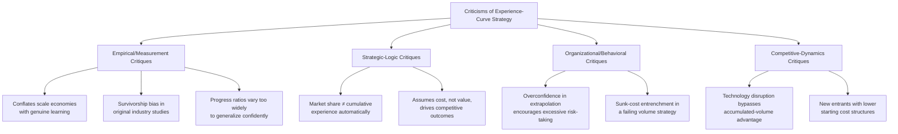

## Risks and Criticisms of Experience Curve Strategy

### Overview

The experience curve concept (see "The Boston Consulting Group experience curve concept") and the strategies built on it (cost leadership, forward pricing) have drawn substantial and sustained criticism since their popularization, from empirical, methodological, strategic, and organizational-behavior perspectives. This topic consolidates that critique landscape systematically, distinguishing criticisms of the underlying mathematical pattern from criticisms of the strategic prescriptions built on top of it.

### A Taxonomy of Criticisms

### Empirical and Measurement Critiques

**Conflation of distinct cost-decline mechanisms**

As established under "Distinguishing the learning effect from the experience effect" and "Sources of learning," the aggregate experience curve blends multiple distinct mechanisms — labor learning, process improvement, technology investment, and ordinary economies of scale. A significant methodological critique is that **static economies of scale** (cost advantages from producing at a higher *current* output rate, independent of *cumulative historical* volume) are easily conflated with genuine dynamic experience effects in aggregate cost data, since both can produce a similar-looking declining cost curve when plotted against a time series that has both volume and scale increasing together.

[Inference] This conflation matters strategically because the two mechanisms have different durability: scale economies are available to any competitor that reaches a comparable *current* output level, regardless of *cumulative historical* volume, whereas genuine experience effects are tied specifically to accumulated history that a competitor cannot instantly replicate — a firm mistaking scale-driven cost advantage for durable experience-based advantage may overestimate how defensible its cost position actually is against a well-capitalized new entrant that can quickly reach comparable current scale without needing comparable cumulative history.

**Survivorship and selection bias in original studies**

[Unverified] A commonly raised methodological critique of the original BCG-era experience-curve studies is that they often examined established, successful industries and companies, potentially overrepresenting cases where the experience-curve pattern held cleanly while underrepresenting failed ventures or industries where the pattern did not hold — this is a general methodological concern applicable to historical business-strategy case studies broadly, and its specific quantitative impact on the original BCG studies is not independently verified here; it should be treated as a documented category of critique in strategy literature rather than a specifically quantified finding.

**Wide variation in actual progress ratios undermines generalization**

As the progress-ratio reference table and the strengthening-conditions topic both establish, actual empirical progress ratios vary substantially by industry, task complexity, automation level, and workforce conditions. A criticism of experience-curve-based strategic prescriptions generally is that broad, cross-industry generalizations (e.g., "experience curves typically show 70-80% progress ratios") can mask enormous underlying variation, such that applying a generic assumed rate to a specific firm's strategic decision — rather than a rigorously firm- and industry-specific estimate (see estimating-learning-rates) — risks a materially wrong strategic conclusion.

### Strategic-Logic Critiques

**Market share and cumulative experience are not synonymous**

The core BCG strategic argument (see the BCG-concept topic) implicitly assumes current market share is a reliable proxy for cumulative experience/volume position. This assumption can fail when:

- A market has grown or contracted substantially over time, such that current share reflects recent competitive dynamics more than accumulated historical volume
- Firms have entered and exited the market, meaning today's share leader may not be the firm with the greatest all-time cumulative production
- Mergers, acquisitions, or licensing arrangements have transferred market position without transferring the underlying accumulated production experience or its embedded process/technology knowledge

**Cost leadership is not always the winning competitive basis**

As noted in the cost-leadership-strategy topic's preconditions, an experience-based cost-leadership strategy is poorly matched to markets where competition is primarily driven by differentiation, brand, innovation speed, or service quality rather than price. A strategic criticism of over-applying the experience-curve framework is that it can lead firms to over-invest in a cost-minimization strategy in markets where customers would have rewarded investment in differentiation instead — a classic critique voiced in the broader Porterian generic-strategy literature about the risk of being "stuck in the middle" or misjudging which generic strategy fits a given market.

### Organizational and Behavioral Critiques

**Extrapolation overconfidence**

Because the experience curve is a clean, visually compelling mathematical pattern (see the log-linear-plotting topic's discussion of the straight-line log-log signature), there is a documented behavioral risk that organizations place excessive confidence in extrapolating it far beyond the range where it has actually been validated — precisely the extrapolation-risk concern already raised under the plateauing-and-limitations and estimating-labor-hours topics, but here manifesting as a strategic rather than purely technical error: committing capital or pricing strategy to a projected cost position that a more rigorous confidence-interval-based analysis (see the progress-ratio topic) would have flagged as considerably less certain than the clean trend line suggested.

**Sunk-cost entrenchment in a failing volume strategy**

[Inference] Once a firm has committed substantial capital and sustained margin sacrifice to a volume-building, experience-curve-based strategy (see the cost-leadership and forward-pricing topics), there is a recognized organizational risk of continuing to pursue that strategy past the point where new evidence suggests it is not delivering the anticipated cost trajectory — a general sunk-cost/escalation-of-commitment pattern documented broadly in the behavioral strategy and decision-making literature, applied here to the specific context of experience-curve-based investment. This is presented as an application of a well-established general organizational-behavior pattern to this specific strategic context, rather than as a finding specific to experience-curve strategies in particular.

### Competitive-Dynamics Critiques

**Technology disruption bypassing accumulated advantage**

As already noted under the BCG-concept and cost-leadership topics, a fundamentally new technology or process approach can allow a new entrant to achieve a competitive (or superior) cost structure without replicating the incumbent's cumulative volume history — the experience curve's cost advantage is specific to a given technology/process paradigm, and a paradigm shift can reset the relevant "cumulative volume" count effectively to zero for purposes of the new technology, even though the incumbent's cumulative volume under the *old* paradigm remains historically accurate but strategically less relevant.

**Diagram: Paradigm Shift Resetting the Relevant Experience Base**

<svg xmlns="http://www.w3.org/2000/svg" viewBox="0 0 800 340">
<text x="400" y="24" text-anchor="middle" font-size="15" font-weight="bold" fill="#1a1a1a">Technology Disruption Interrupting an Experience-Curve Advantage (svg_diagram)</text>
<line x1="80" y1="290" x2="740" y2="290" stroke="#333" stroke-width="2" />
<line x1="80" y1="290" x2="80" y2="50" stroke="#333" stroke-width="2" />
<text x="410" y="320" text-anchor="middle" font-size="12" fill="#1a1a1a">Cumulative Volume Under Each Technology Paradigm</text>
<text x="35" y="180" text-anchor="middle" font-size="12" fill="#1a1a1a" transform="rotate(-90 35 180)">Unit Cost</text>
<path d="M 100 200 Q 250 220 400 245 Q 500 258 580 265" stroke="#2563eb" stroke-width="2.5" fill="none" />
<text x="200" y="195" font-size="11" fill="#2563eb" font-weight="bold">Incumbent: old-technology experience curve</text>
<path d="M 450 90 Q 550 150 650 195 Q 700 215 730 225" stroke="#dc2626" stroke-width="2.5" fill="none" />
<text x="500" y="85" font-size="11" fill="#dc2626" font-weight="bold">New entrant: new-technology curve (starts higher, falls faster)</text>
<line x1="450" y1="50" x2="450" y2="290" stroke="#94a3b8" stroke-width="1.5" stroke-dasharray="4,3" />
<text x="460" y="65" font-size="10" fill="#64748b">Paradigm shift point</text>
</svg>

Even though the incumbent's curve (blue) sits at a lower cost than the new entrant's curve (red) at the disruption point, if the new-technology curve is fundamentally steeper (lower progress ratio) or has a lower ultimate floor (see the plateauing-and-limitations topic's asymptotic model), the entrant can eventually surpass the incumbent's cost position despite starting with zero cumulative volume under the new paradigm — the incumbent's accumulated advantage under the *old* paradigm does not transfer proportionally to the new one.

**New entrants with structurally lower starting costs**

Separately from technology paradigm shifts, a new entrant may simply have access to lower input costs (labor, materials, capital) independent of any experience-curve dynamic at all — for example, through geographic relocation to a lower-cost region. Such a structural cost advantage is unrelated to cumulative volume and can undermine an incumbent's experience-based cost-leadership position regardless of how effectively that incumbent has executed its experience-curve strategy.

### Summary Table: Criticism Category, Mechanism, and Mitigating Practice

| Criticism | Core Mechanism | Mitigating Practice (cross-referenced) |
| --- | --- | --- |
| Scale/experience conflation | Aggregate cost decline blends static and dynamic effects | Decompose via sources-of-learning; verify genuine cumulative-volume dependency, not just current-scale dependency |
| Wide progress-ratio variation | Generic benchmarks mask firm/industry-specific reality | Use firm-specific fitted estimates (estimating-learning-rates) rather than generic assumed rates |
| Share ≠ cumulative experience | Market dynamics can decouple the two over time | Directly estimate cumulative volume history, not just current share, when assessing competitive cost position |
| Extrapolation overconfidence | Clean visual trend invites overreach | Apply confidence intervals (progress-ratio topic) and plateau/floor models (plateauing topic) to strategic projections |
| Sunk-cost entrenchment | Behavioral escalation of commitment | Establish pre-committed review triggers and exit criteria before beginning a volume-building strategy |
| Technology disruption | Paradigm shift resets the relevant experience base | Monitor for emerging alternative technologies; avoid treating current-paradigm cost leadership as permanently secure |

### Practical Synthesis: Using the Experience Curve Responsibly

[Inference] Drawing together the critiques above with the constructive material covered throughout this chapter, a defensible use of experience-curve strategy generally involves: (1) verifying the underlying cost decline is genuinely volume/experience-driven rather than an artifact of concurrent scale or technology effects, per the sources-of-learning decomposition; (2) using firm- and industry-specific fitted progress ratios with explicit confidence intervals rather than generic historical benchmarks; (3) building in monitoring and revision triggers analogous to the capacity-plan-revision process, so that a volume-building strategy not delivering its assumed cost trajectory is identified and reconsidered rather than pursued on sunk-cost momentum; and (4) maintaining active awareness of potential technology paradigm shifts that could bypass the accumulated advantage entirely. This synthesis draws together concepts and practices established across this material rather than introducing an independently new prescriptive framework.

**Related Topics**

- The Boston Consulting Group experience curve concept (the strategic framework under critique)
- Cost leadership strategy built on experience effects (the strategy whose risks are detailed here)
- Experience-curve-based pricing strategy (forward-pricing-specific risk factors)
- Sources of learning: labor, process, and technology (decomposing genuine experience effects from scale/technology conflation)
- Adjusting capacity plans for productivity gains (the monitoring/revision discipline as a mitigating practice)