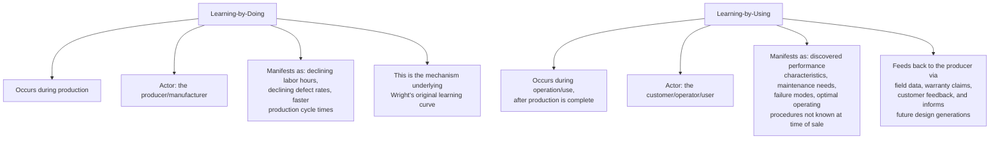

## Learning-by-Doing versus Learning-by-Using

### Overview

This distinction, most closely associated with economist Nathan Rosenberg's work on technological change, separates two temporally and causally distinct sources of productivity/efficiency improvement: gains realized during the *production* of a good (learning-by-doing) versus gains realized during its *use* by customers or operators after production is complete (learning-by-using). Both feed into overall product and cost improvement over time, but through different mechanisms, different actors, and different feedback pathways back to the producing firm.

### Core Distinction

**Key Points**

- **Learning-by-doing** is the mechanism this entire body of material has addressed under the labor-source and process-source learning topics (see "Sources of learning: labor, process, and technology") — it is production-side, accruing to whoever is manufacturing the good, and is the direct descendant of Wright's original 1936 observation
- **Learning-by-using** is a distinct, complementary phenomenon: knowledge about a product's actual performance, durability, failure modes, and optimal operating parameters that can only be discovered through *extended field operation* by end users, not through the manufacturing process itself
- The two are not competing explanations for the same phenomenon — they describe genuinely different knowledge-generation processes, occurring at different points in a product's lifecycle and generating different types of improvement (production-cost improvement vs. product-design/performance improvement)

### Learning-by-Doing: Recap in This Context

As extensively covered elsewhere in this material, learning-by-doing is the production-side phenomenon captured by the standard power-law learning curve ($Y_x = Y_1 \cdot x^{b}$), driven by the labor, process, and technology sources of learning. Within the organizational-learning framing of this chapter, it is worth explicitly noting: learning-by-doing is what converts, through repetition and institutionalization (see "Individual learning versus organizational learning"), into the organizational capability discussed throughout this material's earlier chapters.

### Learning-by-Using: The Complementary Mechanism

**What learning-by-using captures that learning-by-doing does not:**

- **Performance characteristics only observable over extended operation**: a complex product's true reliability, maintenance intervals, or performance under varied real-world conditions frequently cannot be fully characterized during manufacturing or even initial testing — these emerge only through cumulative *operating hours* or *operating cycles* accumulated by users in the field
- **Discovered failure modes**: certain failure modes only manifest after extended use, varied environmental exposure, or interaction effects with other systems that a manufacturing/testing environment does not replicate
- **User-discovered optimal operating procedures**: users often discover more efficient or effective ways of operating a product than the manufacturer anticipated at the design stage, particularly for complex capital equipment, software, or systems with many possible configurations
- **Emergent use cases**: unanticipated applications or usage patterns that inform future product iterations, distinct from any efficiency gain in the *manufacturing* of the current product generation

[Inference] Rosenberg's original framing of this distinction is most closely associated with study of the aircraft industry and other complex capital-goods sectors, where the gap between a product's manufacturing completion and the full characterization of its real-world performance is particularly pronounced — this association reflects the origin and primary application context of the concept in the technological-change economics literature rather than a claim that the distinction is limited to those industries specifically; the underlying logic (production-side vs. use-side knowledge generation) is a general one applicable wherever complex products have use-phase performance characteristics not fully knowable at the point of manufacture.

### Diagram: Two Distinct Knowledge-Generation Timelines

<svg xmlns="http://www.w3.org/2000/svg" viewBox="0 0 800 320">
<text x="400" y="24" text-anchor="middle" font-size="15" font-weight="bold" fill="#1a1a1a">Learning-by-Doing vs. Learning-by-Using Across the Product Lifecycle (svg_diagram)</text>
<line x1="80" y1="160" x2="740" y2="160" stroke="#333" stroke-width="2" />
<text x="410" y="290" text-anchor="middle" font-size="12" fill="#1a1a1a">Product Lifecycle Timeline</text>
<rect x="100" y="80" width="280" height="60" fill="#dbeafe" stroke="#2563eb" stroke-width="2" />
<text x="240" y="105" text-anchor="middle" font-size="12" font-weight="bold" fill="#1e3a8a">Learning-by-Doing</text>
<text x="240" y="125" text-anchor="middle" font-size="10" fill="#1e3a8a">(during manufacturing, producer-side)</text>
<rect x="440" y="180" width="280" height="60" fill="#dcfce7" stroke="#16a34a" stroke-width="2" />
<text x="580" y="205" text-anchor="middle" font-size="12" font-weight="bold" fill="#14532d">Learning-by-Using</text>
<text x="580" y="225" text-anchor="middle" font-size="10" fill="#14532d">(during operation, user-side)</text>
<path d="M 380 130 Q 500 150 500 180" stroke="#666" stroke-width="1.5" fill="none" marker-end="url(#arrow)" />
<text x="390" y="165" font-size="10" fill="#666">Product sold/deployed</text>
<path d="M 550 180 Q 300 250 240 140" stroke="#dc2626" stroke-width="1.5" fill="none" stroke-dasharray="5,3" />
<text x="290" y="255" font-size="10" fill="#dc2626">Feedback to producer: informs next design generation</text>
</svg>

### Feedback Pathways from Learning-by-Using Back to the Producer

Learning-by-using knowledge does not automatically benefit the producing firm — it requires deliberate feedback mechanisms to flow from the user back to the manufacturer:

- **Warranty and service data**: failure and repair records provide direct, structured field-performance data
- **Customer feedback and support interactions**: direct reports of performance issues, usability problems, or unexpected use patterns
- **Field engineering and post-deployment monitoring**: for complex capital equipment, dedicated field-engineering functions that actively study in-service performance rather than passively waiting for problems to be reported
- **Formal user studies and surveys**: structured investigation of how customers actually use a product, which may reveal patterns the manufacturer did not anticipate at the design stage

[Inference] The strength and formality of these feedback pathways plausibly determines how effectively a firm captures learning-by-using knowledge for incorporation into future product generations — a firm with weak or informal feedback mechanisms may generate substantial learning-by-using knowledge among its user base that never returns to inform subsequent design decisions, representing an organizational-learning gap analogous to (though mechanistically distinct from) the individual-to-organizational learning conversion gap discussed under "Individual learning versus organizational learning."

### Relationship to Organizational Learning Concepts Covered Elsewhere

This chapter's broader concern is organizational learning and knowledge retention. Learning-by-using extends that concern beyond the boundary of the producing organization itself:

| Concept | Learning-by-Doing | Learning-by-Using |
| --- | --- | --- |
| Where knowledge originates | Inside the producing organization | Outside the producing organization (with customers/users) |
| Primary retention mechanism | Documentation, training, embedded process/tooling (see individual-vs-organizational-learning) | Formal feedback channels (warranty data, field engineering, customer studies) |
| Risk of knowledge loss | Individual turnover without institutionalization | Absent or weak feedback channels; knowledge stays with users and never returns |
| Typical beneficiary of the resulting improvement | Current production cost/efficiency | Future product design generations |

### Practical Implications for Organizations

- **Product design and R&D functions should explicitly account for learning-by-using as a distinct input**, separate from production learning-curve data, when planning future product generations — treating only internal manufacturing data as the source of "lessons learned" misses a potentially significant category of improvement opportunity that resides with the user base instead
- **Investment in field-data collection and customer-feedback infrastructure** is the direct organizational lever for capturing learning-by-using, analogous to how investment in documentation and training systems is the lever for converting individual learning-by-doing into organizational learning-by-doing (see individual-vs-organizational-learning)
- **Complex, long-lived, or capital-intensive products** (aircraft, industrial equipment, enterprise software with long deployment lifecycles) generally offer more learning-by-using opportunity than simple, short-lived, or disposable products, since the former have more extended and information-rich use phases during which such learning can accumulate
- **Cross-generational product planning** should incorporate learning-by-using data explicitly as a planning input, distinct from the learning-by-doing cost curve used for staffing and capacity planning (see estimating-labor-hours-for-future-production-units) — the two data streams inform different types of decisions (manufacturing efficiency vs. product design improvement) and should not be conflated

[Unverified] The relative magnitude of learning-by-using's contribution to overall product/industry improvement, compared to learning-by-doing, varies considerably by industry and product type and is not established as a general quantitative ratio here; assessing this balance for any specific product category would require industry-specific empirical study rather than a general formula.

**Related Topics**

- Sources of learning: labor, process, and technology (the learning-by-doing mechanisms in detail)
- Individual learning versus organizational learning (parallel knowledge-institutionalization challenge, applied here across the firm/customer boundary)
- Organizational forgetting and the effect of production interruptions (contrast with learning-by-using, which does not depend on continuous production)
- Product design feedback loops and field-engineering practices
- Cross-generational product planning and design-for-manufacture evolution