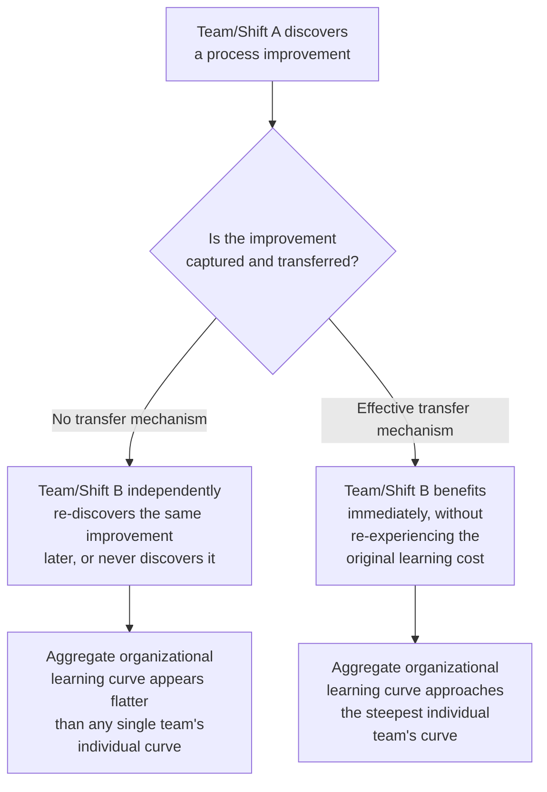

## Knowledge Transfer Across Teams and Shifts

### Overview

This topic addresses the specific organizational mechanics of moving learning-curve-relevant knowledge horizontally — between parallel teams, shifts, or production lines operating concurrently — as distinct from the vertical, over-time knowledge retention addressed under "Individual learning versus organizational learning" and the recovery-from-interruption dynamics addressed under "Forgetting curves and learning-curve regression." Multi-shift and multi-team production environments face a specific risk: each team or shift can end up re-learning lessons independently, rather than benefiting from gains already realized elsewhere in the same organization.

### The Cross-Team/Cross-Shift Knowledge Gap

**Key Points**

- Without effective cross-team/cross-shift transfer, an organization operating multiple parallel production lines or shifts on the same task can see its **aggregate** learning curve underperform what any single, well-performing team achieves individually — each team effectively starts its own separate learning-curve trajectory rather than benefiting from a shared, cumulative one
- This is a distinct problem from the individual-vs-organizational learning distinction covered earlier: that topic addressed knowledge *surviving turnover within one team over time*; this topic addresses knowledge *moving between teams operating concurrently*
- The underlying mechanism connects directly to the process-source and organizational-learning concepts already established: cross-team transfer is, in effect, the deliberate conversion of one team's individual/team-specific learning into an organizational asset available to all teams, following the same logic as the individual-to-organizational conversion but applied across a spatial/organizational boundary rather than a temporal one

### Quantifying the Cost of Poor Cross-Team Transfer

**Worked Example**

A firm operates three parallel production shifts on the same assembly task. Shift A, through independent process refinement, achieves a progress ratio of $r_A = 0.78$ over its first 100 units. Without effective cross-shift knowledge transfer, Shifts B and C each independently progress along their own separate curves, each starting from a similar $Y_1$ but discovering process improvements at their own pace — say $r_B = 0.85$ and $r_C = 0.88$, reflecting slower, less systematic improvement absent access to Shift A's discoveries.

Using $Y_1 = 200$ hours for all three shifts, comparing hours at unit 100:

Shift A ($b_A = \log_2(0.78) \approx -0.359$):

$$Y_{100}^A = 200 \times 100^{-0.359} = 200 \times e^{-0.359 \times 4.605} = 200 \times e^{-1.653} \approx 200 \times 0.1914 \approx 38.3 \text{ hours}$$

Shift B ($b_B = \log_2(0.85) \approx -0.2345$):

$$Y_{100}^B = 200 \times 100^{-0.2345} = 200 \times e^{-0.2345 \times 4.605} = 200 \times e^{-1.080} \approx 200 \times 0.3396 \approx 67.9 \text{ hours}$$

Shift C ($b_C = \log_2(0.88) \approx -0.1844$):

$$Y_{100}^C = 200 \times 100^{-0.1844} = 200 \times e^{-0.1844 \times 4.605} = 200 \times e^{-0.849} \approx 200 \times 0.4279 \approx 85.6 \text{ hours}$$

By unit 100, Shift A's per-unit hours (38.3) are less than half of Shift C's (85.6) — a substantial aggregate productivity gap attributable entirely to the absence of cross-shift transfer of Shift A's process discoveries. If Shift A's improvements had been captured and transferred promptly, Shifts B and C could plausibly have approached Shift A's steeper curve rather than each independently discovering (or failing to discover) similar improvements at their own slower pace.

[Inference] This example illustrates the mechanism and potential magnitude of a cross-team transfer gap using constructed figures; the actual gap in any real organization depends on how much of the steeper shift's advantage stems from genuinely transferable process/technology-source improvements (see sources-of-learning) versus non-transferable factors specific to that shift's particular individual workforce composition, which would not necessarily transfer even with a perfect knowledge-sharing mechanism in place.

### Diagram: Divergent Shift Curves Without Cross-Team Transfer

<svg xmlns="http://www.w3.org/2000/svg" viewBox="0 0 800 340">
<text x="400" y="24" text-anchor="middle" font-size="15" font-weight="bold" fill="#1a1a1a">Parallel Shift Curves Diverging Without Knowledge Transfer (svg_diagram)</text>
<line x1="80" y1="290" x2="740" y2="290" stroke="#333" stroke-width="2" />
<line x1="80" y1="290" x2="80" y2="50" stroke="#333" stroke-width="2" />
<text x="410" y="320" text-anchor="middle" font-size="12" fill="#1a1a1a">Cumulative Units per Shift</text>
<text x="35" y="180" text-anchor="middle" font-size="12" fill="#1a1a1a" transform="rotate(-90 35 180)">Labor Hours per Unit</text>
<path d="M 100 90 Q 300 175 500 220 T 720 250" stroke="#2563eb" stroke-width="2.5" fill="none" />
<text x="600" y="240" font-size="11" fill="#2563eb" font-weight="bold">Shift A: r=0.78 (fastest)</text>
<path d="M 100 90 Q 300 150 500 185 T 720 205" stroke="#16a34a" stroke-width="2.5" fill="none" />
<text x="580" y="195" font-size="11" fill="#16a34a" font-weight="bold">Shift B: r=0.85</text>
<path d="M 100 90 Q 300 130 500 155 T 720 175" stroke="#d97706" stroke-width="2.5" fill="none" />
<text x="580" y="165" font-size="11" fill="#d97706" font-weight="bold">Shift C: r=0.88 (slowest)</text>
</svg>

### Standard Mechanisms for Cross-Team/Cross-Shift Transfer

- **Shift-handoff documentation and briefings**: structured, mandatory communication at shift changeovers specifically capturing process discoveries, not merely production-status updates — this addresses the same institutionalization principle as documented standard work (see individual-vs-organizational learning) but applied at the shift-boundary interval rather than over a longer time horizon
- **Cross-shift/cross-team standard work unification**: when one team's process refinement is validated, formally updating the shared standard operating procedure used by all teams/shifts, rather than allowing the improvement to remain informally known only to the originating team
- **Job rotation across teams/shifts**: periodically rotating individuals or supervisors across teams working the same task, so that tacit knowledge and informal best practices spread through direct personnel movement in addition to formal documentation channels
- **Centralized continuous-improvement/kaizen coordination**: a dedicated industrial-engineering or continuous-improvement function that actively monitors performance differences *across* teams/shifts performing the same task, investigates the source of any performance gap, and drives standardization of the better-performing approach — this directly parallels the "active knowledge capture and management attention" strengthening condition discussed under conditions-that-strengthen-learning-curve-effects, but applied specifically to cross-team comparison and dissemination rather than single-team improvement
- **Shared digital knowledge repositories**: wikis, internal documentation systems, or structured lessons-learned databases accessible to all teams, reducing dependence on informal, person-to-person transfer that can fail if the right individuals do not happen to interact

### Diagnostic: Detecting a Cross-Team Transfer Gap

A practical diagnostic, extending the estimating-learning-rates methodology to a multi-team context: fit separate learning curves for each team/shift performing the same task, using the log-linear regression approach established earlier, and compare the resulting progress ratios and $Y_1$ values across teams.

- **Similar progress ratios and $Y_1$ across teams**: suggests either effective cross-team transfer is occurring, or that the teams are independently arriving at similar solutions without needing formal transfer (less common for genuinely novel process improvements, but possible for straightforward tasks with limited improvement headroom)
- **Systematically different progress ratios or performance levels across teams performing an identical task**: this divergence is itself the primary diagnostic signal of a cross-team transfer gap, and should prompt investigation into which specific team-level process differences explain the performance gap, followed by deliberate standardization

[Unverified] While comparing fitted curves across teams is a logically sound diagnostic approach consistent with the estimation methodology established elsewhere in this material, the specific practice of formally fitting and comparing separate learning curves per shift/team (as opposed to informally noticing a performance gap through routine supervision) is not established here as a universally standard organizational practice; its adoption likely varies by firm size, industrial-engineering maturity, and the perceived materiality of cross-team performance gaps.

### Relationship to Broader Organizational Learning Concepts

| Concept | Temporal/Spatial Dimension | Primary Risk Addressed |
| --- | --- | --- |
| Individual vs. organizational learning | Over time, within one team, across turnover | Individual tacit knowledge lost when a person leaves |
| Forgetting curves | Over time, across a production interruption | Accumulated learning partially reverting after a break |
| Cross-team/cross-shift transfer (this topic) | Concurrent, across parallel teams/shifts | Knowledge siloed within one team never reaching others operating the same task |
| Learning-by-using | Across the firm/customer boundary | Field-use knowledge never returning to inform design |

Each of these represents a distinct pathway by which learning-curve-relevant knowledge can fail to reach its full potential organizational value, and each calls for a correspondingly distinct organizational mechanism to address it — cross-team transfer specifically requires horizontal communication and standardization infrastructure, which is a different organizational investment than the documentation-and-training infrastructure primarily aimed at the vertical (over-time, single-team) individual-to-organizational conversion problem.

### Practical Recommendations

- Where multiple teams/shifts perform the same or highly similar tasks, establish a **standard cadence for cross-team process comparison** (e.g., a recurring cross-shift continuous-improvement review), rather than relying on ad hoc or informal awareness of performance differences
- Ensure shift-handoff and cross-team communication protocols explicitly include a **process-improvement-sharing component**, not solely production-status and scheduling information
- When investing in training systems (see workforce-training-and-staffing-implications), design them to propagate the *organization's current best-known method* consistently across all teams, rather than allowing each team to develop and perpetuate its own local variant of the standard work
- Recognize that a organization-wide progress ratio, if fitted only in aggregate without team-level decomposition, may mask substantial underlying variation — a genuinely useful learning-curve estimate for multi-team operations should be assessed at the team/shift level as a diagnostic step, even if an aggregate figure is ultimately what feeds into higher-level capacity or budget planning (see adjusting-capacity-plans-for-productivity-gains and learning-curves-in-cost-estimation-and-budgeting)

**Related Topics**

- Individual learning versus organizational learning (the temporal, single-team analog to this topic's spatial/cross-team problem)
- Sources of learning: labor, process, and technology (process-source improvements as the primary transferable content)
- Conditions that strengthen learning-curve effects (active knowledge capture as a strengthening condition)
- Estimating learning rates from historical data (adapted here to team-level comparative fitting)
- Learning-by-doing versus learning-by-using (a different organizational-boundary knowledge-transfer challenge)