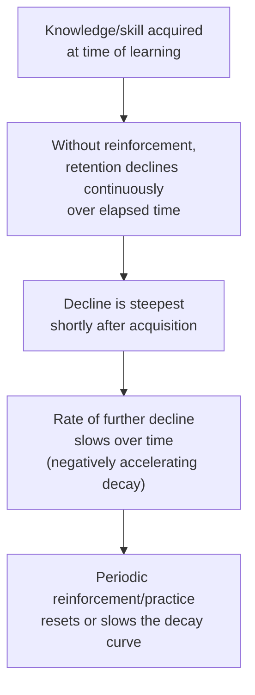

## The Forgetting Curve and Knowledge Decay

### Distinguishing This Topic from Prior Forgetting-Curve Coverage

**Key Points**

- "Forgetting curves and learning-curve regression" (covered earlier in this material) addressed forgetting specifically as a **production-interruption** phenomenon — the reversion in cost/labor-hours performance following a discrete break in production, modeled via segmented regression and retention-rate adjustments to the standard power-law learning curve
- This topic addresses knowledge decay as a **continuous, general cognitive and organizational phenomenon** — the gradual erosion of retained knowledge and skill *even without* a discrete production interruption, drawing on the foundational psychological forgetting-curve tradition (associated with Hermann Ebbinghaus's memory-retention research) and its organizational-learning implications
- The two phenomena are related but distinct: production-break forgetting is triggered by a specific event; general knowledge decay operates continuously, at a lower background rate, as a natural property of unreinforced human memory and skill retention, independent of whether production has been interrupted

### The Ebbinghaus Forgetting Curve: Origin and General Form

The classical Ebbinghaus-tradition forgetting curve is typically expressed as an exponential decay function of *elapsed time since acquisition* (in contrast to the production-break forgetting-curve topic's focus on cumulative *unit volume*):

$$R(t) = R_0 \cdot e^{-t/\tau}$$

Where:

- $R(t)$ = retention (of knowledge or skill) at elapsed time $t$ since acquisition or last reinforcement
- $R_0$ = initial retention level immediately following acquisition
- $\tau$ = a decay time constant, reflecting how quickly retention erodes without reinforcement (a larger $\tau$ means slower decay)

[Unverified] The precise mathematical form of memory decay, and the specific parameter values Ebbinghaus's original research produced, are subjects of extensive subsequent psychological research and refinement; the exponential form shown here is a widely used general approximation in both the psychological and organizational-learning literature, but should be treated as a standard simplified model rather than a precisely validated universal law applicable identically across all types of knowledge, tasks, and individuals.

### Distinguishing Time-Based Decay from Volume-Based Forgetting

| Dimension | Production-Break Forgetting (prior topic) | General Knowledge Decay (this topic) |
| --- | --- | --- |
| Independent variable | Discrete break duration; cumulative volume before/after | Continuous elapsed time since learning/last use |
| Trigger | A specific interruption event | Passive, continuous, occurs even absent any interruption |
| Typical mathematical form | Segmented power-law regression; retention-rate offset applied to cumulative unit count | Continuous exponential (or similar) decay as a function of elapsed time |
| Primary mitigation | Minimizing break duration; workforce retention through the break | Periodic reinforcement, refresher training, spaced practice |
| Relevant organizational function | Production scheduling, break planning | Training program design, refresher/recertification scheduling |

[Inference] In practice, these two forgetting mechanisms likely operate simultaneously and can compound: a production break not only interrupts the cumulative-volume-based learning-curve trajectory (as covered in the earlier topic) but also allows continuous time-based knowledge decay to act on the workforce's retained skill during the break's elapsed duration — meaning the severity of post-break reversion may reflect both the break-specific retention-rate effect already modeled and an additional continuous-decay component tied to how long, in calendar time, the break actually lasted. This combined view follows from applying both frameworks together rather than being a separately and independently validated combined model in its own right.

### Diagram: Continuous Decay Curve with Reinforcement Resets

<svg xmlns="http://www.w3.org/2000/svg" viewBox="0 0 800 320">
<text x="400" y="24" text-anchor="middle" font-size="15" font-weight="bold" fill="#1a1a1a">Knowledge Decay with Periodic Reinforcement (svg_diagram)</text>
<line x1="80" y1="270" x2="740" y2="270" stroke="#333" stroke-width="2" />
<line x1="80" y1="270" x2="80" y2="50" stroke="#333" stroke-width="2" />
<text x="410" y="300" text-anchor="middle" font-size="12" fill="#1a1a1a">Elapsed Time Since Last Reinforcement</text>
<text x="35" y="160" text-anchor="middle" font-size="12" fill="#1a1a1a" transform="rotate(-90 35 160)">Retention Level</text>
<path d="M 120 90 Q 180 160 240 200 Q 280 220 300 225" stroke="#dc2626" stroke-width="2.5" fill="none" />
<line x1="300" y1="225" x2="300" y2="95" stroke="#16a34a" stroke-width="2" stroke-dasharray="4,3" />
<text x="305" y="90" font-size="10" fill="#16a34a">Reinforcement event</text>
<path d="M 300 95 Q 360 155 420 195 Q 460 215 480 220" stroke="#dc2626" stroke-width="2.5" fill="none" />
<line x1="480" y1="220" x2="480" y2="98" stroke="#16a34a" stroke-width="2" stroke-dasharray="4,3" />
<path d="M 480 98 Q 540 150 600 185 Q 640 205 660 210" stroke="#dc2626" stroke-width="2.5" fill="none" />
<line x1="660" y1="210" x2="660" y2="100" stroke="#16a34a" stroke-width="2" stroke-dasharray="4,3" />
<path d="M 660 100 Q 700 140 730 165" stroke="#dc2626" stroke-width="2.5" fill="none" />
<text x="500" y="245" font-size="10" fill="#666">Each reinforcement resets retention closer to R0, and the decay rate may slow with repeated reinforcement</text>
</svg>

Note the pattern shown: each reinforcement event resets retention upward (though [Inference] typically not fully back to the original $R_0$ level immediately, and not necessarily fully preventing eventual re-decline), and — a pattern often associated with spaced-repetition research more broadly — repeated reinforcement cycles are frequently associated with a *slowing* of subsequent decay, though the specific degree of this slowing effect and its applicability to industrial/organizational skill contexts specifically (as opposed to the verbal-memory tasks much of the original psychological research examined) should be treated as a general pattern from the broader literature rather than a precisely established finding for industrial task-skill retention specifically.

### Organizational Implications: Skills, Certifications, and Refresher Requirements

The general knowledge-decay concept underlies several standard organizational practices, independent of any specific production-break event:

- **Mandatory recertification and refresher training intervals**: many safety-critical or highly technical skills (equipment operation certifications, quality-inspection qualifications, compliance training) are subject to mandatory periodic recertification specifically because unreinforced skill/knowledge is understood to decay over time even without a formal production interruption
- **Spaced-practice scheduling for infrequently-performed tasks**: tasks performed only occasionally (rare maintenance procedures, emergency-response protocols, low-frequency product variants) are particularly vulnerable to time-based knowledge decay between uses, since the natural production cadence itself does not provide frequent reinforcement — this differs from the high-frequency, continuously-repeated tasks that dominate the classical Wright-style learning curve, where near-continuous repetition itself provides the reinforcement
- **Documentation as a decay-resistant knowledge store**: as established under individual-vs-organizational learning, codified/documented knowledge does not decay in the same way tacit individual memory does — a comprehensive standard operating procedure remains fully "retained" (available) regardless of elapsed time since it was last consulted, which is a key argument for prioritizing codification specifically for knowledge that will be needed only infrequently

### Interaction with the Multi-Team Transfer Problem

Knowledge decay also interacts with the cross-team/cross-shift transfer challenge (see "Knowledge transfer across teams and shifts"): a process improvement transferred to another team but not subsequently reinforced through actual practice by that team is subject to the same continuous decay dynamics as any other unreinforced knowledge — meaning a one-time knowledge-transfer event (a training session, a documentation handoff) is not necessarily sufficient on its own if the receiving team does not have adequate opportunity to practice and reinforce the transferred knowledge afterward.

### Practical Recommendations for Managing Knowledge Decay

| Situation | Recommended Practice |
| --- | --- |
| High-frequency, continuously-performed tasks | Natural repetition largely self-reinforces; standard learning-curve dynamics dominate, decay is less of a distinct concern |
| Low-frequency or occasional tasks | Deliberate spaced-practice or scheduled refresher sessions, since natural task frequency does not provide sufficient reinforcement |
| Safety-critical or compliance-relevant skills | Mandatory recertification intervals, calibrated to known or assumed decay rates for the specific skill domain |
| Knowledge transferred across teams/shifts | Follow-up reinforcement (supervised practice, verification checks) rather than assuming a single transfer event is sufficient for durable retention |
| Rarely-used emergency or exception-handling procedures | Prioritize thorough documentation and periodic drills, since natural operational frequency will not provide adequate reinforcement on its own |

[Unverified] The appropriate recertification or refresher interval for any specific skill domain is typically determined by industry-specific regulatory standards, safety requirements, or organizational risk tolerance, rather than derived directly from a generic decay-curve formula; while the underlying decay concept motivates the general practice of periodic reinforcement, specific interval requirements should be sourced from the relevant regulatory or industry standard for the skill/task in question rather than calculated from the illustrative exponential model presented here.

**Related Topics**

- Forgetting curves and learning-curve regression (production-break-specific forgetting, cumulative-volume framing)
- Individual learning versus organizational learning (documentation as a decay-resistant knowledge store)
- Knowledge transfer across teams and shifts (reinforcement needs following a transfer event)
- Conditions that strengthen learning-curve effects (continuous practice as a natural reinforcement mechanism)
- Training program design for infrequently-performed or safety-critical tasks