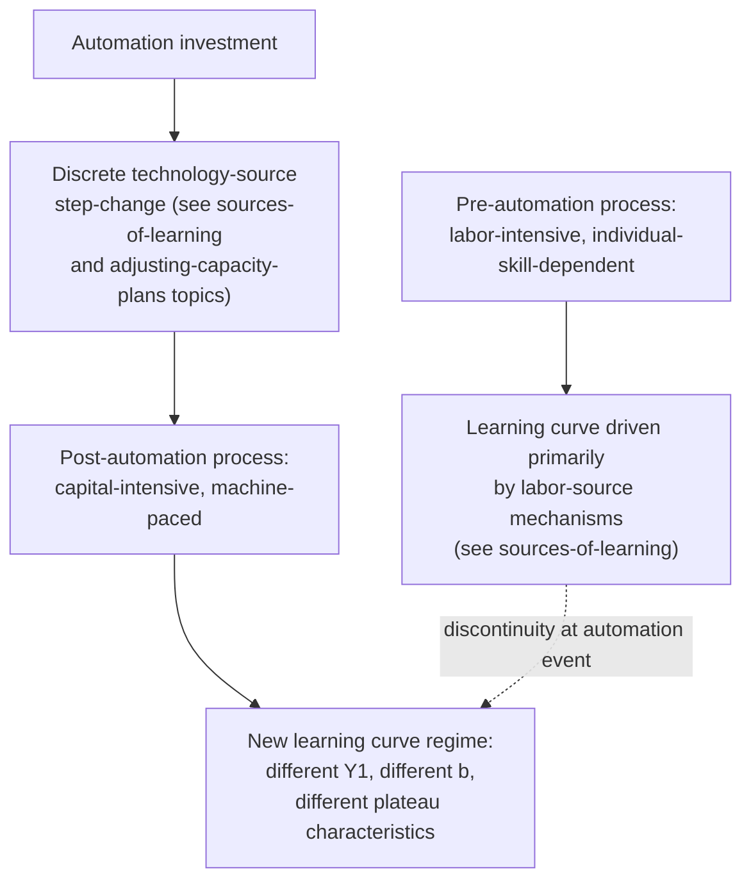
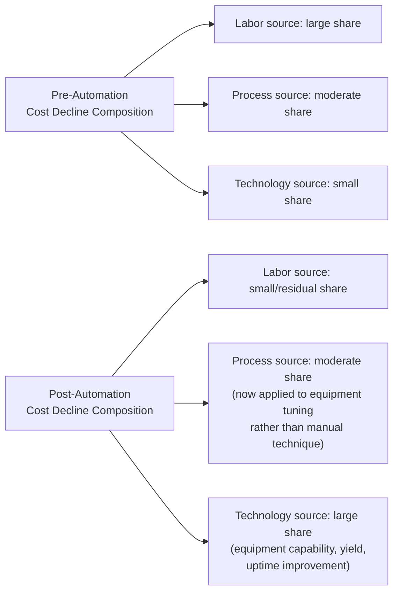

## Automation's Effect on Learning-Curve Dynamics

### Overview

Automation occupies a distinctive position across nearly every framework established in this material: it is a technology source of learning (see "Sources of learning: labor, process, and technology"), a mechanism that shifts organizational learning away from individual dependence (see "Individual learning versus organizational learning"), and a force that can fundamentally alter the shape, steepness, and plateau behavior of the learning curve itself. This topic consolidates and extends that treatment specifically around automation's structural effects on learning-curve dynamics.

### Automation as a Structural Shift, Not a Point on the Existing Curve

**Key Points**

- As established under sources-of-learning, technology-source improvements (including automation) arrive as **discrete step-changes** tied to specific capital investment events, not as continuous decline with cumulative volume — this means automation does not simply make an existing labor-learning curve steeper; it typically creates a **new curve regime** with its own distinct parameters, requiring the same treatment as any other structural break (see forgetting-curves and estimating-learning-rates topics' guidance on segmenting data around known structural events)
- Pre- and post-automation data should not be pooled into a single continuous power-law fit, for the same reasons established under the log-linear-formulation and estimating-learning-rates topics regarding structural breaks generally
- The degree to which automation shifts the curve's character depends heavily on the **extent** of automation — partial automation (automating specific sub-steps while retaining significant manual content) produces a more moderate shift than full-process automation

### Effect on the Progress Ratio (Curve Steepness)

[Inference] Automation's effect on the progress ratio itself is not uniform in direction and depends on what specifically is being automated:

- **Automating a highly variable, error-prone manual step**: can produce a *steeper* effective curve initially, as the automated step's output consistency improves through equipment tuning and process refinement (a technology-source and process-source combination) at a potentially faster rate than the manual step's labor-learning alone would have achieved
- **Automating an already highly-optimized manual step**: may produce a comparatively *flatter* curve going forward, since much of the available "learning headroom" was already captured under manual operation, and the automated equivalent may have less additional room for further improvement, at least until further automation/tooling refinement cycles occur
- **Partial automation increasing overall process complexity** (e.g., introducing new human-machine interface tasks, exception-handling procedures for automation failures): can, in some cases, introduce a *new* learning curve for the newly created human tasks surrounding the automated equipment, distinct from and potentially independent of the automated equipment's own performance trajectory

This mirrors, at the level of individual process steps, the same technology-source dynamics already established generally under sources-of-learning — automation is simply the most direct and visible embodiment of that source category.

### Shifting the Labor/Process/Technology Balance

As automation increases, the composition of cost decline shifts away from labor-source mechanisms toward technology-source mechanisms — a direct extension of the decomposition established under sources-of-learning. This has several downstream implications already touched on elsewhere in this material but worth consolidating here specifically in the automation context:

- **Reduced individual-learning dependence**: per individual-vs-organizational learning, automation inherently reduces reliance on individual tacit skill (since the machine, not the worker, performs the core task), making the resulting cost position substantially more resilient to workforce turnover than a comparable labor-intensive process — this is one of the most consistently cited organizational benefits of automation from a learning-curve-resilience perspective
- **Reduced vulnerability to forgetting**: following directly from the sources-of-learning topic's discussion, technology-embedded gains are largely immune to the production-break forgetting dynamics covered under forgetting-curves, since equipment capability does not erode during a shutdown the way individual worker skill can
- **New capital-risk exposure**: unlike labor learning (near-zero marginal investment, realized through ordinary production), automation-driven improvement requires committed capital investment, introducing a distinct financial risk profile — if projected volume does not materialize, the automation investment may not be recovered, a consideration absent from pure labor-learning-based capacity planning

### Effect on Plateau Behavior

Connecting to "Plateauing and limitations of log-linear models": automation changes where and how a process plateaus.

- **Labor-intensive processes plateau at a physiological/cognitive ceiling** (as discussed under plateauing-and-limitations) — a floor determined by human motor and cognitive limits
- **Automated processes plateau at a different, typically lower, floor** determined by equipment cycle time, physical/mechanical constraints, and yield/uptime limits — often substantially below what manual labor could achieve, which is a primary economic rationale for automation investment in the first place
- **Reaching the automated floor may itself take a different shape**: equipment-driven improvement (yield tuning, uptime optimization, maintenance-interval refinement) often follows its own distinct improvement trajectory after installation, potentially exhibiting the S-curve-like slow-start-then-plateau pattern discussed under "Alternative models: Stanford-B and S-curve formulations" (initial equipment debugging and commissioning issues, followed by a steep tuning-driven improvement phase, followed by an eventual equipment-capability plateau)

### Diagram: Curve Regime Shift at the Point of Automation

<svg xmlns="http://www.w3.org/2000/svg" viewBox="0 0 800 360">
<text x="400" y="24" text-anchor="middle" font-size="15" font-weight="bold" fill="#1a1a1a">Learning Curve Discontinuity at an Automation Investment Point (svg_diagram)</text>
<line x1="80" y1="310" x2="740" y2="310" stroke="#333" stroke-width="2" />
<line x1="80" y1="310" x2="80" y2="50" stroke="#333" stroke-width="2" />
<text x="410" y="340" text-anchor="middle" font-size="12" fill="#1a1a1a">Cumulative Units Produced</text>
<text x="35" y="180" text-anchor="middle" font-size="12" fill="#1a1a1a" transform="rotate(-90 35 180)">Cost/Labor Hours per Unit</text>
<path d="M 100 90 Q 220 160 320 200 Q 370 215 400 222" stroke="#2563eb" stroke-width="2.5" fill="none" />
<text x="150" y="105" font-size="11" fill="#2563eb" font-weight="bold">Pre-automation (labor-driven curve)</text>
<line x1="400" y1="222" x2="400" y2="130" stroke="#dc2626" stroke-width="2" stroke-dasharray="5,3" />
<text x="405" y="130" font-size="11" fill="#dc2626" font-weight="bold">Automation installed</text>
<text x="405" y="145" font-size="11" fill="#dc2626">(discrete step-change)</text>
<path d="M 400 130 Q 480 175 550 215 Q 620 245 680 260 Q 710 265 720 267" stroke="#16a34a" stroke-width="2.5" fill="none" />
<text x="480" y="280" font-size="11" fill="#16a34a" font-weight="bold">Post-automation curve (new regime, different Y1, b, and floor)</text>
<line x1="80" y1="255" x2="740" y2="255" stroke="#94a3b8" stroke-width="1" stroke-dasharray="3,3" />
<text x="620" y="250" font-size="10" fill="#64748b">New (lower) equipment-capability floor</text>
</svg>

Note that the diagram shows an initial jump *upward* at the automation point before the new curve begins its own decline — this reflects the commonly observed initial commissioning/debugging inefficiency of newly installed automated equipment (a specific instance of the S-curve slow-start pattern), before equipment tuning drives cost/hours down toward the new, lower technology-determined floor.

### Implications for Capacity and Cost Planning Around Automation Investments

Directly extending "Adjusting capacity plans for productivity gains" and "Learning curves in cost estimation and budgeting":

- **Do not extrapolate the pre-automation curve across the investment point** — as with any structural break, the pre-automation progress ratio provides no reliable basis for post-automation forecasting; a fresh estimation process (see estimating-learning-rates) must begin once sufficient post-automation data accumulates
- **Budget for an initial post-automation dip before improvement**: per the S-curve-like commissioning pattern noted above, capacity and cost plans should anticipate a temporary efficiency reduction immediately following automation deployment, rather than assuming an immediate and continuous improvement from day one
- **Reassess workforce staffing needs and skill mix, not just headcount levels**: automation typically shifts the required workforce skill profile — from direct manual task performance toward equipment operation, monitoring, and maintenance — meaning the labor-hours-based staffing models from workforce-training-and-staffing-implications must be re-parameterized for a different task, not merely reduced proportionally to the automated task's reduced labor content
- **Incorporate capital recovery timelines alongside labor-cost projections**: because automation-driven gains require upfront investment (in contrast to near-zero-marginal-cost labor learning), a complete cost/budget analysis around an automation decision should integrate the capital investment and its recovery period alongside the projected post-automation labor-hour trajectory, rather than treating the automation's operating-cost benefit in isolation

### Automation and the Experience Curve (Strategic Context)

Connecting to the strategic-cost-management chapter's concepts: automation can be a deliberate lever for pursuing an experience-curve-based cost-leadership strategy (see "Cost leadership strategy built on experience effects"), since it directly targets the technology-source component of the aggregate experience curve. [Inference] A firm assessing whether to pursue cost leadership through automation investment specifically, as opposed to relying primarily on labor-learning-driven cost decline, is effectively choosing to substitute capital risk (the automation investment, discussed above) for the individual-learning and turnover-related risks otherwise inherent in a labor-intensive cost-leadership approach — this substitution follows from combining the capital-risk and turnover-resilience points already established in this topic with the general cost-leadership strategic framework, rather than being an independently new strategic insight specific to this topic.

**Related Topics**

- Sources of learning: labor, process, and technology (technology-source mechanics in general)
- Individual learning versus organizational learning (automation's role in reducing individual-skill dependence)
- Plateauing and limitations of log-linear models (automation's effect on the achievable cost/performance floor)
- Adjusting capacity plans for productivity gains (re-baselining after a technology-driven structural break)
- Cost leadership strategy built on experience effects (automation as a strategic lever for experience-curve-based competition)