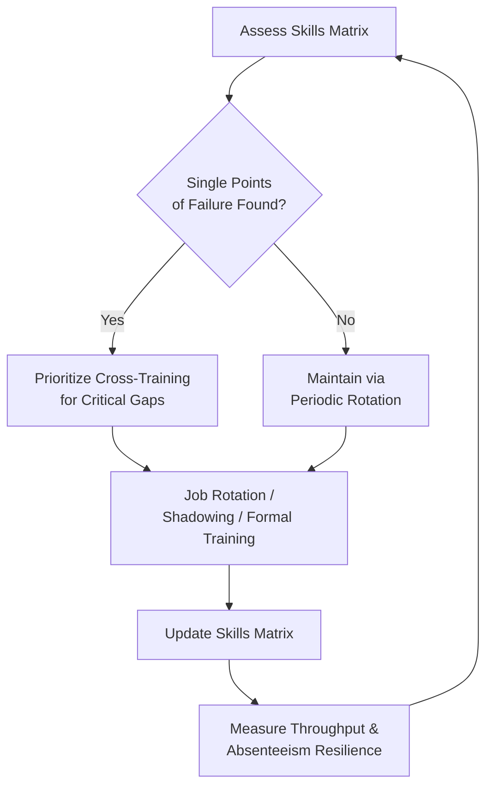

## Cross-Training and Workforce Flexibility

### Overview

Cross-training and workforce flexibility refer to the deliberate practice of developing employees' capabilities across multiple roles, tasks, or skill domains so that an organization can reallocate labor dynamically in response to demand variability, absenteeism, turnover, and bottlenecks. Within the broader context of organizational learning, cross-training is both a **knowledge retention strategy** (reducing single-point-of-failure risk when one person holds unique knowledge) and a **capacity management lever** (enabling labor to flow to wherever the constraint currently is).

### Core Rationale

- **Bus factor / key-person risk reduction**: When only one individual can perform a critical task, that person's absence, departure, or overload becomes a systemic vulnerability. Cross-training distributes tacit and explicit knowledge across multiple people.
- **Demand variability absorption**: Workloads across roles/stations rarely peak simultaneously. A flexible workforce can shift labor toward whichever process is currently constrained, directly supporting Theory-of-Constraints-style throughput management.
- **Reduced idle capacity**: Rigid, single-skill job design often leaves some workers idle while others are overloaded. Flexibility smooths utilization across the system.
- **Improved resilience to turnover**: Organizational knowledge tied to cross-trained teams survives individual attrition better than knowledge concentrated in specialists.

### Types of Workforce Flexibility

| Type | Description | Example |
| --- | --- | --- |
| Functional flexibility | Workers can perform multiple distinct job functions | A technician who can do both assembly and quality inspection |
| Numerical flexibility | Ability to adjust workforce size/hours to demand | Temporary staffing, overtime, part-time scheduling |
| Temporal flexibility | Ability to shift *when* work is performed | Flexible shifts, compressed workweeks |
| Skill-based flexibility | Depth of qualification across a skill matrix | Multi-certified operators across several machine types |

Cross-training primarily builds **functional** and **skill-based** flexibility, which in turn enable **numerical** and **temporal** flexibility to be exercised effectively.

### The Skills Matrix as a Management Tool

A **skills matrix** (or competency matrix) is the standard tool for tracking cross-training coverage:

| Employee | Task A | Task B | Task C | Task D |
| --- | --- | --- | --- | --- |
| Alice | Expert | Proficient | Trained | — |
| Bob | Trained | Expert | — | Proficient |
| Carla | — | Trained | Expert | Trained |

Typical proficiency levels: **Untrained → Trained (needs supervision) → Proficient (independent) → Expert (can train others)**. This matrix directly reveals:

- Single points of failure (a column with only one "Expert" or "Proficient" entry)
- Over-concentration of skill in one or two employees
- Gaps to prioritize in the training roadmap

### Implementation Approaches

1. **Job rotation**: Employees systematically move through different roles/stations on a scheduled basis (weekly, monthly, quarterly), building breadth over time.
2. **Shadowing and mentoring**: A less experienced worker observes and gradually assists an expert, transferring tacit knowledge that is hard to codify.
3. **Formal structured training programs**: Documented procedures, certification checklists, and competency assessments for each cross-trained skill.
4. **Job enlargement vs. job enrichment**: Enlargement broadens the *number* of tasks a worker performs at the same skill level; enrichment increases the *depth/responsibility* of a role. Cross-training typically emphasizes enlargement, though mature programs often pair it with enrichment to sustain engagement.

### Interaction with the Learning Curve

Cross-training introduces a specific tension with the learning curve model covered elsewhere in this curriculum:

- Each time a worker rotates to a new task, they restart partway down that task's individual learning curve, temporarily reducing their output/efficiency on it.
- However, the **aggregate system-level throughput** benefits from flexibility can outweigh this temporary individual efficiency loss, especially when it prevents constraint-related idle time elsewhere.
- Organizations must balance **rotation frequency** against **learning curve retention**: rotating too frequently prevents workers from ever reaching the flatter, high-efficiency portion of the curve for any given task.

$$\text{Net System Benefit} = \text{Flexibility Gain (reduced bottleneck idle time)} - \text{Learning Curve Reset Cost (temporary efficiency loss per rotation)}$$

### Trade-offs and Limitations

- **Training cost and time investment**: Cross-training requires upfront time from both trainer and trainee, representing a real opportunity cost.
- **Depth vs. breadth trade-off**: Workers spread across many tasks may never achieve the deep expertise ("expert" tier) that specialization would produce, potentially capping peak efficiency on any single task.
- **Diminishing returns on breadth**: Beyond a certain number of cross-trained skills per worker, cognitive load and context-switching costs can reduce net productivity gains. [Inference] the exact optimal breadth is highly context-dependent (task complexity, cognitive demand) and not governed by a single universal ratio.
- **Compensation and motivation structures**: Pay scales tied to single-skill specialization can create disincentives for workers to cross-train unless the organization adjusts incentive structures (skill-based pay, certification bonuses).

### Diagram: Cross-Training Flow and Skill Matrix Feedback Loop (svg_diagram)

### Practical Example

A local government document processing office (structurally similar to a records/DMS workflow) has three roles: intake scanning, metadata indexing, and archival QA. Initially, only one employee can perform metadata indexing.

- **Risk identified**: If that employee is absent, the entire pipeline backs up at the indexing stage — a classic single-point-of-failure constraint.
- **Cross-training action**: Two intake-scanning staff are trained to proficiency in metadata indexing over a 4-week rotation schedule, shadowing the specialist for the first two weeks.
- **Outcome**: When the original indexing specialist is on leave, the office can temporarily reassign a cross-trained scanner to indexing, preventing the queue from becoming a hard bottleneck, at the cost of slightly slower scanning throughput during that period — a favorable trade-off under the Net System Benefit framework above.

### Measuring Success

Common KPIs for cross-training/flexibility programs:

- **Coverage ratio**: percentage of critical tasks with 2+ proficient/expert employees
- **Time-to-cover**: how quickly a vacancy or absence can be filled internally without external hiring
- **Rotation-adjusted throughput**: system output accounting for temporary efficiency dips during rotations
- **Employee versatility index**: average number of tasks each employee is rated "proficient" or higher on

### Related Topics

- Skills matrix design and competency-based HR frameworks
- Job rotation scheduling algorithms and rotation frequency optimization
- Tacit knowledge transfer and mentoring program design
- Skill-based pay and incentive structures for multi-skilled workers
- Relationship between workforce flexibility and Theory of Constraints buffer management