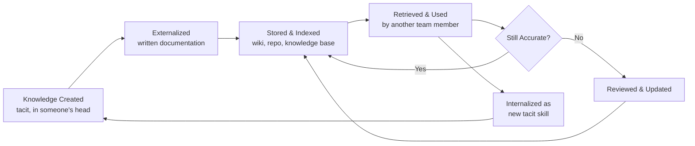

## Documentation and Organizational Memory Systems

### Overview

Documentation and organizational memory systems are the structures, artifacts, and practices through which an organization captures, stores, retrieves, and transfers knowledge across time — independent of any single individual's continued presence. Within organizational learning theory, this domain addresses the conversion of **tacit knowledge** (experience-based, hard to articulate) into **explicit knowledge** (codified, transferable), and the design of systems that prevent knowledge loss as personnel change.

### Tacit vs. Explicit Knowledge

The foundational distinction, drawn from Nonaka and Takeuchi's knowledge management theory, underlies all organizational memory design:

| Type | Characteristics | Capture Difficulty |
| --- | --- | --- |
| Explicit | Codified, written, structured (manuals, code comments, SOPs) | Low — directly documentable |
| Tacit | Experience-based, intuitive, contextual ("knowing how") | High — often requires observation, mentoring, or narrative capture |

The **SECI model** (Socialization, Externalization, Combination, Internalization) describes the conversion cycle:

- **Socialization**: tacit → tacit (mentoring, shadowing, shared experience)
- **Externalization**: tacit → explicit (writing procedures, documenting decisions)
- **Combination**: explicit → explicit (synthesizing existing documents into new documents)
- **Internalization**: explicit → tacit (a worker reads documentation and internalizes it as skill)

### Types of Organizational Memory Systems

1. **Procedural documentation**: SOPs, runbooks, checklists — captures *how* to perform recurring tasks.
2. **Decision records**: Architecture Decision Records (ADRs), meeting minutes with rationale — captures *why* a choice was made, preventing repeated re-litigation of settled questions.
3. **Institutional knowledge bases**: Wikis, internal documentation portals — centralized, searchable repositories.
4. **Version-controlled artifacts**: Git history, commit messages, changelogs — captures the evolution of a system alongside the rationale for changes when commit messages are disciplined.
5. **Post-mortems / after-action reviews**: Structured retrospectives on incidents or projects — captures lessons learned in a form intended for future reuse.
6. **Onboarding materials**: Deliberately structured knowledge transfer for new hires, often the first real test of whether existing documentation is actually usable.

### Why Documentation Alone Is Insufficient

A common failure mode in organizational learning is conflating "documentation exists" with "organizational memory is retained." Key gaps:

- **Staleness**: Documentation not tied to a maintenance process decays as systems change, becoming actively misleading rather than merely incomplete.
- **Discoverability failure**: Knowledge that exists but cannot be found when needed provides no practical retention benefit — indexing, search, and information architecture matter as much as content creation.
- **Context loss**: Procedural steps without the underlying rationale ("why this order," "why this exception") leave future readers unable to adapt the knowledge to new situations.
- **Tacit residue**: Some knowledge resists full codification (e.g., nuanced judgment calls); pure documentation systems must be paired with mentoring/socialization mechanisms for these cases.

### Documentation as Constraint and Bottleneck Mitigation

Connecting to the throughput/constraint themes elsewhere in this curriculum: poor organizational memory frequently *creates* new constraints. If only one person understands a critical subsystem (a form of undocumented tacit knowledge), that person becomes a bottleneck functionally identical to a physical capacity constraint — except the "capacity" being exhausted is irreplaceable institutional knowledge. Good documentation:

- Converts single-person bottlenecks into distributable knowledge (supporting cross-training)
- Reduces the "buffer" of onboarding/ramp-up time needed before a new team member reaches proficiency
- Shortens the effective learning curve for new hires by giving them a documented starting point rather than requiring rediscovery from scratch

### Practical Example (Software/DMS Context)

For a document management system project, a robust organizational memory setup typically includes:

- **README and architecture docs**: system overview, module boundaries, data flow — the "map" for new contributors.
- **ADRs**: e.g., "Why PostgreSQL over MongoDB for document metadata" — captures the trade-off reasoning so it isn't re-debated or accidentally reversed by someone unaware of the original constraints.
- **Inline code comments and docstrings**: explicit knowledge embedded directly where a future reader needs it, minimizing context-switching to a separate document.
- **Runbooks for operational tasks**: e.g., steps to restore from backup, rotate credentials, or handle a failed migration — reducing dependency on whichever engineer originally built the deployment pipeline.
- **Postmortems for incidents**: e.g., a document-upload outage writeup with root cause and remediation, filed in a searchable location so the same failure mode is recognized faster if it recurs.

### Documentation Lifecycle

### Governance Practices That Sustain Memory Systems

- **Ownership assignment**: every major document should have a named owner responsible for periodic review, preventing orphaned/stale content.
- **Review cadence**: scheduled documentation audits (e.g., quarterly) rather than relying on ad hoc updates.
- **Documentation-as-code practices**: storing docs alongside source code in version control so documentation changes are reviewed with the same rigor as code changes, and history is preserved.
- **Searchability and structure standards**: consistent templates, tagging, and naming conventions so information architecture doesn't degrade as content volume grows.
- **Knowledge audits**: periodic assessment of what critical knowledge remains undocumented and tacit, prioritizing externalization for the highest-risk gaps (echoing the skills-matrix gap analysis used in cross-training programs).

### Trade-offs

- **Documentation overhead vs. value**: excessive documentation requirements can slow delivery without proportional retention benefit; the goal is *sufficient, maintained* documentation, not maximal documentation.
- **Centralization vs. fragmentation**: a single centralized knowledge base improves discoverability but can become an unwieldy bottleneck to maintain; federated systems (per-team wikis) improve ownership but risk duplication and inconsistency.
- **Explicit codification vs. mentoring investment**: some organizations over-invest in written documentation while under-investing in the socialization mechanisms needed for genuinely tacit expertise — a balanced organizational memory strategy requires both.

### Related Topics

- Architecture Decision Records (ADR) format and adoption practices
- Knowledge audits and identifying undocumented single points of failure
- Documentation-as-code workflows and tooling
- Post-mortem / after-action review facilitation techniques
- Relationship between organizational memory and onboarding ramp-up time reduction