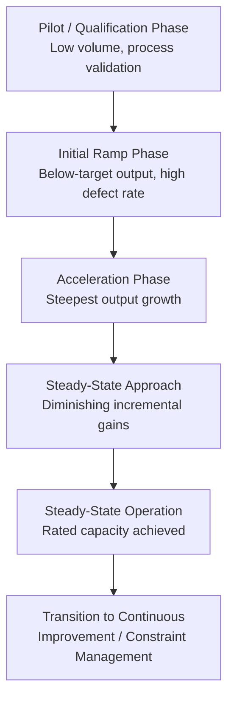

## Ramp-Up Planning for New Production Lines

### Overview

Ramp-up planning is the discipline of forecasting and managing the transition period between a production line's initial startup and its achievement of sustained target output (steady-state capacity). It sits at the intersection of capacity planning and learning curve theory: a new line cannot be assumed to produce at full rated capacity from day one, because both the workforce and the process itself must move down their respective learning curves before nominal throughput is achievable.

### Why Ramp-Up Requires Explicit Modeling

Naive capacity planning that assumes instantaneous full-rate output from a new line systematically overstates near-term capacity and understates near-term cost per unit. Ramp-up planning corrects this by modeling three compounding effects during the transition period:

- **Workforce learning curve**: new operators are unfamiliar with the specific tasks, tooling, and sequencing (see Wright's Law / Crawford's Law from aircraft manufacturing origins).
- **Process/equipment debugging**: new lines experience higher rates of unplanned downtime, quality defects, and engineering changes as issues are discovered and resolved.
- **Organizational learning**: scheduling, material flow, and coordination between stations require iteration before reaching a stable rhythm — this is distinct from individual worker skill and reflects system-level maturation.

### The Ramp-Up Curve

Ramp-up is typically modeled as an S-curve (sigmoid) rather than a pure power-law learning curve, because output is constrained both by learning (which accelerates over time) and by an approach to an asymptotic capacity ceiling:

$$Q(t) = Q_{max} \cdot \frac{1}{1 + e^{-k(t - t_0)}}$$

Where:

- $Q(t)$ = output rate at time $t$
- $Q_{max}$ = steady-state target capacity
- $k$ = ramp-up steepness (rate of learning/debugging progress)
- $t_0$ = inflection point (time at which output reaches 50% of $Q_{max}$)

In simpler practical models, especially where labor-hour-per-unit is the primary driver, the traditional power-law learning curve is applied directly to the ramp-up period:

$$Y_x = Y_1 \cdot x^{b}$$

with $x$ representing cumulative units produced since line startup, consistent with the aircraft manufacturing learning curve model.

### Key Planning Parameters

| Parameter | Description | Typical Source |
| --- | --- | --- |
| Time-to-volume (TTV) | Time from first unit to steady-state target rate | Historical data from comparable line launches |
| Yield ramp | Rate at which defect/scrap rate declines to target quality level | Process engineering estimates, pilot run data |
| Learning rate | Percentage reduction in labor hours per unit per doubling of cumulative output | Historical learning curve data for similar processes |
| Steady-state capacity ($Q_{max}$) | Rated throughput once fully mature | Equipment/process design specifications |
| Ramp duration | Calendar time budgeted for reaching $Q_{max}$ | Cross-functional estimate (engineering + operations + HR) |

### Integrating Ramp-Up into Capacity Planning

Traditional capacity planning asks "how much can this line produce?" Ramp-up-aware capacity planning asks "how much can this line produce **at time $t$**?" This has direct downstream effects:

- **Sales and operations planning (S&OP)**: committed delivery schedules during the ramp period must reflect the actual time-varying capacity curve, not the nameplate rated capacity.
- **Staffing plans**: headcount should be phased to match the workforce learning curve rather than fully staffing to steady-state levels from day one, avoiding both understaffing (unable to exploit early capacity) and overstaffing (idle labor cost during low-output early stages).
- **Buffer and safety stock strategy**: inventory buffers downstream of a ramping line should be sized larger during the ramp period to absorb the higher variability and lower reliability typical of early production, then reduced as the line matures — directly analogous to Theory of Constraints buffer management.
- **Cost/pricing models**: unit cost during ramp-up is higher than steady-state unit cost; contracts and internal cost forecasts should reflect a blended or phased cost curve rather than assuming immediate steady-state economics.

### Ramp-Up Phases

1. **Pilot/qualification phase**: low-volume production to validate process, tooling, and quality before scaling; primarily engineering-driven, not throughput-driven.
2. **Initial ramp phase**: production begins in earnest but at well below target rate; focus is on rapid iteration — identifying and resolving bottlenecks, defects, and workflow issues.
3. **Acceleration phase**: output climbs steeply as the steepest part of the learning/S-curve is traversed; this is where both workforce proficiency and process stability improve fastest.
4. **Steady-state approach**: output growth decelerates as the line approaches $Q_{max}$; remaining gains come from fine-tuning rather than fundamental fixes.
5. **Steady-state operation**: line operates at or near rated capacity; ongoing improvement shifts to continuous improvement/constraint management cycles rather than ramp-specific interventions.

### Diagram: Ramp-Up S-Curve Against Target Capacity (svg_diagram)

### Practical Example

A manufacturer launching a new assembly line rated at 500 units/day plans a 12-week ramp:

- **Weeks 1–2 (Pilot)**: 20–50 units/day, heavy engineering involvement, frequent line stoppages for tooling adjustments.
- **Weeks 3–6 (Initial ramp)**: output climbs from ~100 to ~250 units/day as operators move down the learning curve and early defect modes are resolved.
- **Weeks 7–10 (Acceleration)**: output climbs from ~250 to ~450 units/day; the steepest labor-hour-per-unit improvement occurs here, consistent with the doubling-based decline in Wright's Law.
- **Weeks 11–12 (Steady-state approach)**: output stabilizes at 480–500 units/day; remaining variance is attributed to normal operational noise rather than learning effects.

Sales commitments made in week 1 assuming 500 units/day from week 3 onward would create a significant delivery shortfall; a ramp-aware capacity plan instead phases customer commitments to match the projected S-curve.

### Common Pitfalls

- **Point-estimate capacity assumptions**: treating rated capacity as available from day one, ignoring the ramp period entirely.
- **Understaffing the acceleration phase**: since this phase has the highest rate of improvement, insufficient staffing here can artificially flatten the ramp curve and delay steady-state achievement.
- **Ignoring yield/quality ramp separately from throughput ramp**: a line can hit target unit *volume* while still producing unacceptable defect rates if quality ramp is not tracked as a distinct curve.
- **Underestimating variability during ramp**: early-stage production tends to have higher variance in both output rate and quality than mature lines; safety buffers sized for steady-state conditions are typically insufficient during ramp. [Inference] the specific variance multiplier needed is process- and industry-dependent and is not governed by a universal constant.

### Related Topics

- S-curve vs. power-law models for capacity ramp forecasting
- Yield ramp modeling in semiconductor and electronics manufacturing
- Staffing phase planning aligned to learning curve stages
- Buffer sizing strategy during production ramp (Theory of Constraints connection)
- New product introduction (NPI) process integration with capacity planning