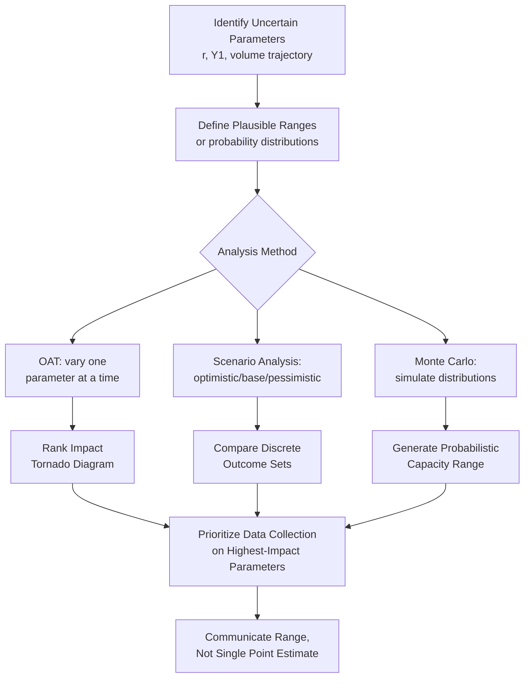

## Sensitivity Analysis of Capacity Plans to Learning Assumptions

### Overview

Sensitivity analysis of capacity plans to learning assumptions is the systematic evaluation of how forecast outputs (capacity, cost, delivery timing) change when the underlying learning curve parameters — primarily the learning rate $r$, but also $Y_1$ and cumulative volume projections — are varied within a plausible range. Because learning-adjusted capacity forecasts are exponentially sensitive to these assumptions, sensitivity analysis is essential for quantifying forecast risk rather than presenting a single point estimate as if it were certain.

### Why Learning Rate Assumptions Carry Outsized Risk

The core learning curve relationship,

$$Y_x = Y_1 \cdot x^{b}, \quad b = \frac{\ln(r)}{\ln(2)}$$

is nonlinear in $r$. Small changes in the assumed learning rate compound across doublings of cumulative volume, producing disproportionately large divergence in projected capacity at high cumulative volumes. This is fundamentally different from a linear forecasting error, which grows proportionally — here, the error grows geometrically with the number of doublings in the forecast horizon.

A learning rate assumption that is off by even 5 percentage points (e.g., assuming 85% when the true rate is 90%) can produce a materially different capacity trajectory by the time cumulative production reaches several doublings past the initial estimate.

### Key Parameters Subject to Sensitivity Analysis

| Parameter | Description | Typical Source of Uncertainty |
| --- | --- | --- |
| Learning rate ($r$) | Percentage reduction in $Y_x$ per doubling of cumulative volume | Limited early data, cross-process variability |
| First-unit performance ($Y_1$) | Labor hours/cycle time for the first unit | Pilot run conditions may not represent full-scale conditions |
| Cumulative volume trajectory ($x(t)$) | Projected production volume over time | Demand forecast uncertainty, ramp schedule slippage |
| Plateau/floor effects | Point at which learning gains diminish to near-zero | Not predicted by the basic power-law model; must be estimated separately |
| Learning curve reset triggers | Workforce turnover, process changes, product redesign | Organizational and external factors, often unpredictable in timing |

### Methods for Sensitivity Analysis

1. **One-at-a-time (OAT) sensitivity analysis**: vary a single parameter (e.g., $r$) across a plausible range (e.g., 75%–95%) while holding others constant, and observe the effect on the capacity forecast output.
2. **Scenario analysis**: construct discrete named scenarios (e.g., "optimistic learning," "base case," "pessimistic learning") each with an internally consistent set of parameter values, rather than varying parameters independently.
3. **Tornado diagrams**: rank parameters by the magnitude of their effect on a key output (e.g., time-to-target-capacity or cumulative cost), visually identifying which assumptions matter most and therefore warrant the most planning attention or data-gathering investment.
4. **Monte Carlo simulation**: assign probability distributions to uncertain parameters (e.g., $r \sim$ Normal(0.85, 0.03)) and run many simulated forecasts to generate a distribution of possible capacity outcomes rather than a single curve, enabling probabilistic statements (e.g., "80% confidence that target capacity is reached by week 10").
5. **Break-even/threshold analysis**: solve for the learning rate value at which a specific decision threshold is crossed (e.g., the minimum $r$ required to meet a contractual delivery date), reframing the question from "what will happen" to "what would have to be true."

### Worked Example: OAT Sensitivity on Learning Rate

Using $Y_1 = 10$ hours, 400 available labor hours/week, evaluating weekly capacity at cumulative volume $x = 200$:

| Learning Rate $r$ | $b = \ln(r)/\ln(2)$ | $Y_{200}$ (hrs/unit) | Weekly Capacity |
| --- | --- | --- | --- |
| 75% (pessimistic) | −0.415 | ~1.62 | ~247 units/week |
| 85% (base case) | −0.234 | ~3.13 | ~128 units/week |
| 95% (optimistic) | −0.074 | ~6.12 | ~65 units/week |

This table illustrates the magnitude of the risk directly: at the same cumulative volume, the pessimistic-to-optimistic range spans roughly a 3.8x difference in projected weekly capacity, purely from the learning rate assumption. A capacity plan built on the base case alone, without disclosing this spread, substantially understates the forecast's true uncertainty.

### Diagram: Sensitivity Analysis Workflow (svg_diagram)



### Tornado Diagram Interpretation (Conceptual)

A tornado diagram for a capacity forecast typically ranks parameters by their swing in a key output metric (e.g., "weeks to reach target capacity"):



```
Learning rate (r)              |=====================|  (largest swing)
Cumulative volume trajectory   |==============|
First-unit performance (Y1)    |========|
Plateau/floor timing           |=====|                  (smallest swing)
```

The parameter with the widest bar — typically the learning rate — represents the highest-priority target for additional data collection or expert elicitation, since narrowing its uncertainty yields the largest reduction in overall forecast risk.

### Practical Implications for Planning Decisions

- **Contractual commitments**: delivery dates or capacity guarantees tied to a learning-adjusted forecast should be pressure-tested against the pessimistic end of the sensitivity range, not just the base case, especially early in a program when data is sparse.
- **Staffing and investment timing decisions**: decisions to add headcount or equipment (the "elevate" step in constraint management) are often justified by the base-case forecast; sensitivity analysis clarifies whether that decision remains sound under a pessimistic learning scenario, avoiding premature or delayed capital commitments.
- **Rolling recalibration priority**: sensitivity analysis identifies which parameters most warrant close monitoring and rapid recalibration as actual data arrives — high-sensitivity parameters justify more frequent regression updates than low-sensitivity ones.
- **Risk communication to stakeholders**: presenting a range (e.g., via a fan chart of capacity trajectories under different $r$ values) rather than a single line better represents genuine forecast uncertainty to sales, finance, and operations stakeholders who will act on the number.

### Common Pitfalls

- **Presenting only the base case**: omitting sensitivity ranges creates false confidence in a forecast that is, by construction, highly uncertain during early production.
- **Treating all parameters as equally uncertain**: without a tornado-style ranking, planning attention can be misallocated to low-impact parameters while the dominant driver (typically $r$) remains under-scrutinized.
- **Static sensitivity bands that are never updated**: as actual production data accumulates and the learning rate is re-estimated via regression, the plausible range used in sensitivity analysis should narrow accordingly; using the same wide initial range indefinitely wastes the value of accumulated data.
- **Ignoring parameter correlation**: in Monte Carlo approaches, treating $Y_1$, $r$, and volume trajectory as fully independent when they may be correlated (e.g., an optimistic volume ramp often coincides with more resources devoted to process debugging, improving $r$) can distort the resulting probability distribution. [Inference] the direction and strength of such correlations are process-specific and would need to be estimated from historical data rather than assumed universally.

### Related Topics

- Monte Carlo simulation techniques for operations forecasting
- Tornado diagram construction and interpretation
- Regression-based learning rate re-estimation and rolling forecast updates
- Contractual risk management under capacity forecast uncertainty
- Learning curve plateau and floor-effect modeling