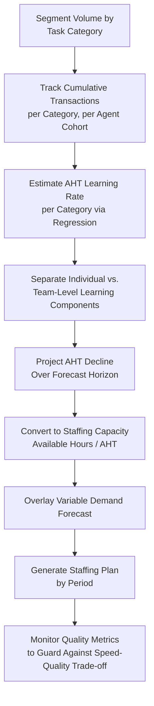

## Learning-Curve Effects in Service Capacity Planning

### Overview

Learning-curve effects in service capacity planning extend the manufacturing-derived learning curve model to environments where the "unit of production" is a transaction, case, ticket, or customer interaction rather than a physical part. Service capacity planning must account for the fact that agents, representatives, and support staff become measurably faster and more accurate with cumulative experience, but must also contend with characteristics that distinguish services from manufacturing: heterogeneous task types, higher variability, direct customer interaction, and knowledge-based rather than purely motor-skill-based learning.

### Manufacturing vs. Service Learning Curve Contexts

| Dimension | Manufacturing | Service |
| --- | --- | --- |
| Unit of output | Physical part/assembly | Transaction, case, call, ticket |
| Task homogeneity | Highly repetitive, standardized | Often heterogeneous (varying case complexity) |
| Learning driver | Motor skill, tooling familiarity | Knowledge, judgment, system navigation, soft skills |
| Quality metric | Defect rate | Customer satisfaction, first-contact resolution, error rate |
| Capacity metric | Units/hour | Transactions/hour, average handle time (AHT) |
| Demand pattern | Often smoother, plannable | Highly variable, time-of-day/seasonal peaks |

Because service tasks are frequently non-identical (each customer case differs), the classical learning curve, which assumes a repeated identical task, requires adaptation — typically applied at the level of task *category* (e.g., "password reset tickets," "billing disputes") rather than treating all service volume as homogeneous.

### Core Metric: Average Handle Time (AHT) as the Service Analog to Labor-Hours-Per-Unit

In call centers and similar service operations, **Average Handle Time** plays the role that labor-hours-per-unit plays in manufacturing:

$$AHT_x = AHT_1 \cdot x^{b}, \quad b = \frac{\ln(r)}{\ln(2)}$$

Where $x$ is cumulative transactions handled (often tracked per agent or per cohort of agents), and $r$ is the learning rate specific to that task type. As $AHT_x$ declines with cumulative experience, staffing capacity for a fixed headcount increases:

$$\text{Capacity}_{period} = \frac{\text{Available Agent-Hours}}{AHT_x}$$

This is structurally identical to the manufacturing capacity forecast conversion, substituting AHT for labor-hours-per-unit.

### Distinguishing Individual Learning from Team/System Learning

Service capacity planning must separate two learning effects that manufacturing often conflates:

- **Individual agent learning**: a specific agent's handle time improves as *they personally* accumulate experience with a task type — resets substantially when that agent leaves or is reassigned.
- **Team/organizational learning**: shared knowledge bases, refined scripts, improved routing logic, and process refinements improve *average* handle time across the whole team independent of any single agent's tenure — this component persists through individual turnover, unlike the individual component.

Capacity forecasts that fail to separate these can badly mis-predict the impact of attrition: high turnover erodes the individual-learning component repeatedly, while investment in documentation and tooling (organizational memory) protects the team-level component from being lost, directly connecting to the organizational memory systems covered elsewhere in this curriculum.

### Complications Specific to Service Environments

1. **Task heterogeneity and case-mix shifts**: unlike a single airframe model, service volume typically spans many task types of varying complexity. Learning curves must be modeled per task category, and the *mix* of task types in any given period can shift the observed blended AHT independent of any actual learning occurring — a common source of misread capacity trends.
2. **Demand variability and forecasting interaction**: service demand often has pronounced intraday, weekly, and seasonal patterns; learning-curve capacity gains must be layered on top of a variable demand forecast rather than a stable production schedule, complicating the parameter estimation described under sensitivity analysis for capacity plans.
3. **Quality-speed trade-off risk**: pressure to reduce handle time can degrade quality metrics (resolution accuracy, customer satisfaction) if learning-curve-based capacity targets are pursued without a corresponding quality floor — this mirrors the yield-ramp caution from production ramp-up planning.
4. **Knowledge-based vs. motor-skill-based learning ceiling**: service learning often plateaus at a level determined by policy complexity and system constraints rather than a hard physical limit, and the plateau can shift when policies, products, or systems change, effectively resetting part of the curve. [Inference] the specific plateau level and its sensitivity to policy change are highly context-dependent and not predicted by the basic power-law model.
5. **Cross-training overlap**: service organizations frequently cross-train agents across multiple task types (directly connecting to the cross-training and workforce flexibility topic), meaning individual agents may sit on multiple simultaneous learning curves — one per task category — with rotation-driven partial resets analogous to the manufacturing cross-training trade-off.

### Diagram: Service Learning Curve Capacity Integration (svg_diagram)

### Practical Example

A support team launches a new product line, creating a new ticket category ("Product X issues") with no prior history:

- **Week 1**: $AHT_1 = 25$ minutes per ticket; agents are unfamiliar with the new product, heavy reliance on escalation.
- **Learning rate estimate**: based on similar past product launches, $r = 0.88$ is assumed initially (with a sensitivity range of 0.82–0.93, per the sensitivity analysis approach).
- **Week 6** (cumulative ~500 tickets handled): regression on actual AHT data yields a refined $r = 0.86$, tightening the forecast.
- **Staffing implication**: the initial staffing plan, built on the conservative 0.82 assumption to protect service-level agreements during the uncertain early period, can be revised downward once the tighter 0.86 estimate is confirmed, freeing agent capacity for other queues — directly informing the numerical/temporal flexibility decisions covered under workforce flexibility.

### Governance Practices for Service Learning Curve Management

- **Segment before aggregating**: always estimate learning rates within homogeneous task categories before blending into overall capacity forecasts, to avoid case-mix shift distorting the apparent learning trend.
- **Track cohort-level data**: distinguish "tenure-in-role" cohorts (new hires vs. veterans) so individual learning effects are not masked by aggregate team averages.
- **Pair AHT metrics with quality metrics**: never publish or act on a capacity forecast driven solely by declining AHT without a paired quality/accuracy trend, to catch speed-driven quality erosion early.
- **Protect team-level learning through documentation**: since organizational memory systems (knowledge bases, scripted playbooks, updated routing rules) sustain the team-level learning component through individual turnover, investment here has a compounding effect on long-run service capacity that pure individual training does not provide alone.

### Related Topics

- Average Handle Time (AHT) forecasting and workforce management (WFM) systems
- Erlang C and related queuing models for service staffing under variable demand
- Cohort-based learning curve estimation for heterogeneous service task mixes
- Quality-speed trade-off metrics in customer service operations
- Interaction between cross-training programs and multi-category service learning curves