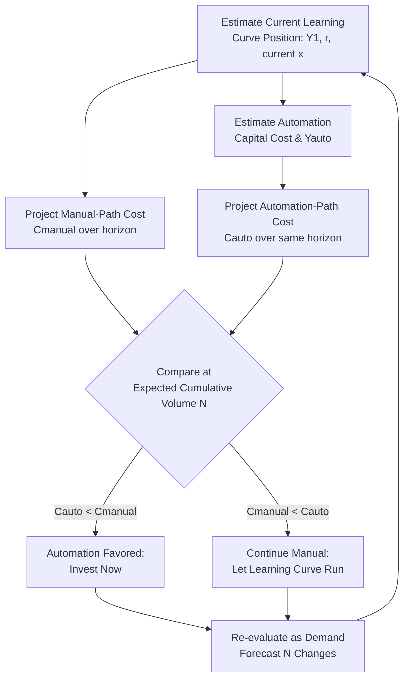

## Balancing Automation Investment Against Learning-Curve Gains

### Overview

Balancing automation investment against learning-curve gains addresses a core capital-allocation trade-off: an organization facing a capacity constraint can either invest in automation (capital expenditure that raises the throughput ceiling directly) or continue relying on the natural productivity improvement that comes from accumulated experience along the workforce learning curve (which is effectively free but bounded and slower). This decision must be made explicitly rather than by default, since committing to automation while a manual process is still early on a steep learning curve can destroy value that continued learning would have captured for free.

### The Core Trade-off

| Dimension | Automation Investment | Continued Learning-Curve Improvement |
| --- | --- | --- |
| Cost | High upfront capital expenditure | Near-zero marginal cost (occurs through normal operation) |
| Speed of capacity gain | Immediate, step-function increase | Gradual, decelerating (power-law decline) |
| Ceiling | New, typically much higher throughput ceiling | Bounded by the plateau/floor of the learning curve |
| Reversibility | Low — sunk capital, hard to reverse | High — no commitment, can be abandoned or redirected |
| Risk profile | Technology/integration risk, potential overcapacity | Demand risk, competitive risk if too slow |
| Flexibility impact | Can reduce workforce flexibility (specialized automation reduces cross-training value) | Preserves/enhances workforce flexibility |

### Why This Is Not a One-Time Decision

Because the learning curve is decelerating (each doubling of cumulative volume yields the *same percentage* improvement, but doublings take longer to achieve as cumulative volume grows), the marginal value of continued manual learning declines over time even without automation. This means the automation decision has a natural time-dependent character:

$$\frac{dY_x}{dx} = Y_1 \cdot b \cdot x^{b-1}$$

Since $b$ is negative, this derivative is negative (labor hours per unit are still falling) but its magnitude shrinks as $x$ grows — the marginal labor-hour savings from "just letting the team keep learning" diminish over time, while automation's marginal capacity gain is roughly constant regardless of when it's installed. This creates a **crossover point** where automation's marginal value begins to exceed the marginal value of continued organic learning.

### Modeling the Crossover Decision

A structured comparison evaluates total cost or capacity under each path over a defined horizon:

**Manual path (learning curve only), cumulative cost to produce $N$ units:**

$$C_{manual}(N) = \sum_{x=1}^{N} Y_x \cdot w$$

where $w$ is the labor cost rate. Using the cumulative average form, this can be approximated as:

$$C_{manual}(N) \approx Y_1 \cdot N^{1+b} \cdot w \cdot \frac{1}{1+b}$$

**Automation path**, combining upfront capital cost with a lower, largely flat per-unit cost after installation:

$$C_{auto}(N) = I_{capital} + Y_{auto} \cdot N \cdot w$$

where $I_{capital}$ is the automation investment and $Y_{auto}$ is the (typically much lower and roughly constant) labor/operating hours per unit after automation. The organization should favor automation once $C_{auto}(N) < C_{manual}(N)$ for the relevant planning horizon's expected cumulative volume $N$.

### Diagram: Automation vs. Learning-Curve Cost Crossover (svg_diagram)

### Key Factors That Shift the Balance

1. **Expected cumulative volume ($N$)**: automation's high fixed cost is amortized over more units at higher volume, making automation more favorable for high-volume, long-horizon products and less favorable for low-volume or short-lifecycle products — a product nearing end-of-life may never reach the crossover point.
2. **Current position on the learning curve**: a process still early in its learning curve (low cumulative $x$) has more organic improvement left to capture "for free," making premature automation more likely to waste that remaining learning-curve value. A process already near its plateau has little organic improvement left, strengthening the case for automation.
3. **Learning rate steepness ($r$)**: a steep learning curve (low $r$, e.g., 70%) captures large gains quickly and may reach a value close to the automated cost structure without capital investment; a shallow learning curve (high $r$, e.g., 95%) improves little regardless of continued volume, favoring earlier automation.
4. **Demand volatility**: automation reduces numerical/temporal flexibility (fixed capital vs. flexible labor); in highly volatile demand environments, retaining a flexible, cross-trainable workforce may be worth more than the throughput gain automation provides, even if automation appears cost-favorable on a pure unit-cost basis.
5. **Quality and consistency requirements**: automation typically reduces variance in output quality compared to a still-learning manual process; if quality consistency has high strategic value (e.g., regulatory compliance, safety-critical output), this can justify automation before the pure cost crossover is reached.
6. **Interaction with workforce flexibility**: automating a task removes it from the pool of tasks available for cross-training rotation, potentially reducing overall system flexibility even as it raises capacity for that specific task — this externality is often omitted from simple cost-crossover models and should be considered qualitatively alongside the quantitative comparison.

### Practical Example

A production line manager is evaluating semi-automating a manual assembly step currently at cumulative volume $x = 5{,}000$ units, with $Y_1 = 2.0$ hours and an observed learning rate $r = 0.88$ ($b \approx -0.184$).

- **Current state**: $Y_{5000} = 2.0 \times 5000^{-0.184} \approx 0.42$ hours/unit.
- **Remaining organic improvement**: projecting to $x = 20{,}000$ (next two doublings), $Y_{20000} \approx 0.32$ hours/unit — a real but modest further decline, since the process is already well down its curve.
- **Automation option**: capital cost of $150,000 for equipment yielding $Y_{auto} = 0.15$ hours/unit immediately, with negligible further learning-curve behavior expected.
- **Analysis**: because the manual process is already past most of its steep early decline (5,000 cumulative units in), remaining organic gains are limited (0.42 → 0.32 hours/unit), while automation offers a much larger and immediate step down to 0.15 hours/unit. At a demand forecast of another 50,000 units, the automation investment's per-unit savings (~0.17–0.27 hours/unit depending on comparison point) amortizes the $150,000 capital cost well within the horizon, favoring automation.
- **Contrast case**: if the same evaluation were performed at $x = 100$ units (very early in the learning curve, with a steep remaining decline still ahead), the organic path might close much of the gap to $Y_{auto}$ without capital investment, making automation premature at that stage.

### Common Pitfalls

- **Automating too early**: committing capital before the learning curve has been allowed to run its natural course wastes the "free" productivity gains still available and risks automating a process that hasn't yet been fully understood or optimized manually — automation tends to lock in whatever process design existed at the time of investment.
- **Automating too late**: waiting indefinitely for organic learning to close the gap ignores that the learning curve is decelerating; beyond a certain point, no amount of additional manual experience will match automation's throughput ceiling, and delay simply forgoes capacity and cost advantages.
- **Ignoring flexibility externalities**: treating the decision as a pure unit-cost comparison without weighing the loss of cross-training flexibility and increased demand-volatility exposure that come with capital-intensive, inflexible automation.
- **Assuming automation eliminates all learning curve effects**: automated processes still have their own learning curve for the *operators/maintainers* of the automation (setup optimization, troubleshooting proficiency), and this is sometimes overlooked in simplified crossover models. [Inference] the magnitude of this secondary learning curve is generally smaller than the original manual-task curve but is not zero and varies by automation complexity.

### Related Topics

- Capital budgeting techniques (NPV, payback period) applied to automation decisions
- Learning curve plateau estimation and its role in crossover timing
- Workforce flexibility trade-offs under increasing automation
- Total cost of ownership modeling for automated vs. manual production lines
- Real options analysis for staged/delayed automation investment decisions