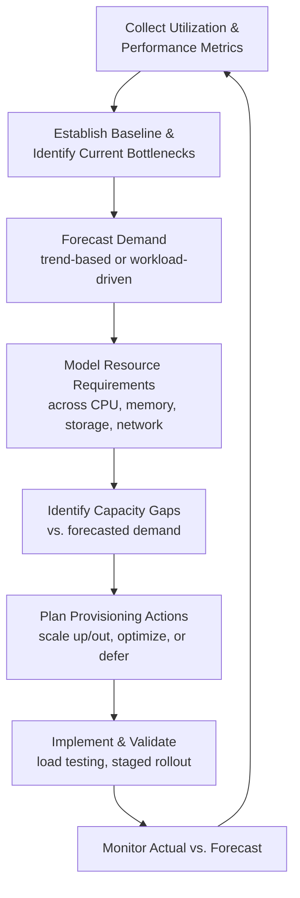

## IT Infrastructure Capacity Planning Fundamentals

### Overview

IT infrastructure capacity planning is the discipline of forecasting, provisioning, and managing compute, storage, network, and platform resources to meet current and projected workload demand while controlling cost and maintaining acceptable performance and availability. Unlike physical manufacturing capacity, IT capacity is characterized by elasticity (especially in cloud environments), multi-dimensional resource constraints (CPU, memory, I/O, network, storage), and workload patterns that can shift rapidly due to software changes, not just business demand changes.

### Core Resource Dimensions

IT capacity planning must model several resource types simultaneously, since a bottleneck in any one can constrain overall system throughput regardless of headroom in the others:

| Resource | Typical Metric | Common Bottleneck Symptom |
| --- | --- | --- |
| Compute (CPU) | Utilization %, vCPU-hours | High latency under load, request queuing |
| Memory | Utilization %, GB allocated/used | Swapping, out-of-memory errors, garbage collection pauses |
| Storage | IOPS, throughput (MB/s), capacity (GB/TB) | Slow disk I/O, storage exhaustion |
| Network | Bandwidth (Mbps/Gbps), latency, packet loss | Timeouts, degraded throughput between services |
| Database/connection pools | Connections, query latency, lock contention | Connection exhaustion, query timeouts |

A capacity plan that only tracks one dimension (commonly CPU) while ignoring others risks missing the actual constraint — directly paralleling the Theory of Constraints principle that system throughput is bounded by its single weakest link, not by the average or best-provisioned resource.

### Capacity Planning Approaches

1. **Reactive/threshold-based**: provision additional capacity when a utilization threshold (e.g., 70% CPU sustained) is crossed. Simple but risks lag between trigger and available capacity, especially for hardware procurement.
2. **Trend-based forecasting**: extrapolate historical usage growth (linear regression, moving averages) to project future resource needs over a planning horizon.
3. **Demand-driven/workload modeling**: model capacity requirements as a function of business drivers (e.g., expected user growth, transaction volume) rather than purely historical infrastructure metrics, allowing capacity plans to anticipate demand shifts before they appear in utilization data.
4. **Queuing-theory-based modeling**: apply formal queuing models (M/M/1, M/M/c) to predict latency and throughput behavior under varying load and service rates, particularly useful for request-response systems with variable arrival rates.
5. **Elastic/autoscaling-based**: in cloud environments, define scaling policies that adjust capacity dynamically in near-real-time based on observed metrics, shifting part of the capacity planning problem from static provisioning to policy design (thresholds, cooldowns, scaling limits).

### The Capacity Planning Lifecycle

### Vertical vs. Horizontal Scaling

| Approach | Description | Trade-offs |
| --- | --- | --- |
| Vertical scaling (scale-up) | Increase resources (CPU, RAM) on existing instances | Simpler, but bounded by hardware limits; single point of failure risk persists |
| Horizontal scaling (scale-out) | Add more instances/nodes to distribute load | Better fault tolerance and near-limitless growth, but requires stateless design or distributed state management |

Modern cloud-native architectures generally favor horizontal scaling for its elasticity and resilience characteristics, though vertical scaling remains relevant for workloads with strong single-node performance requirements (e.g., certain databases, in-memory caches).

### Capacity Planning Metrics and Headroom

- **Utilization headroom**: the gap between current utilization and a defined safe operating threshold (e.g., planning to keep sustained CPU utilization below 70% to leave room for traffic spikes and failover capacity).
- **Peak-to-average ratio**: the ratio between peak and average demand, which determines how much "extra" capacity must be provisioned beyond average-case needs purely to handle bursts — directly relevant to whether static provisioning or elastic autoscaling is more cost-effective.
- **N+1 / N+2 redundancy planning**: provisioning enough spare capacity to tolerate the loss of one or more nodes/instances without breaching service-level objectives, a capacity reserve conceptually similar to safety stock buffers in manufacturing/service capacity planning.
- **Growth rate assumptions**: month-over-month or year-over-year growth in traffic, data volume, or user count, typically derived from historical trend analysis combined with business forecasts.

### Interaction with Learning Curve and Organizational Concepts

Several themes from earlier in this curriculum apply directly to IT capacity planning, though the mechanisms differ from physical production:

- **Operational learning curve**: teams operating new infrastructure (a new platform, a newly adopted cloud service, a new architecture pattern) experience their own learning curve in configuration efficiency, incident response time, and cost optimization — early-stage cloud migrations often show inflated cost and lower efficiency purely due to unfamiliarity, independent of the underlying technology's capability.
- **Ramp-up analogy**: launching a new service or system follows a ramp-up pattern similar to a new production line — initial capacity is often overprovisioned defensively due to uncertainty, then rightsized downward as real usage patterns and load characteristics become better understood.
- **Constraint management**: cloud and infrastructure capacity planning is a direct application of Theory-of-Constraints thinking — identifying the current bottleneck resource, exploiting it (query optimization, caching, connection pooling) before elevating it (adding hardware/instances), then expecting the constraint to shift elsewhere after resolution.
- **Documentation and organizational memory**: capacity planning decisions (why a given instance size or scaling policy was chosen) benefit from the same Architecture Decision Record practices described under documentation systems, preventing repeated re-litigation of settled infrastructure choices as team membership changes.

### Common Pitfalls

- **Single-metric tunnel vision**: optimizing purely for CPU utilization while ignoring memory, I/O, or network constraints, missing the actual binding bottleneck.
- **Static capacity planning in an elastic environment**: applying fixed-headcount-style provisioning logic to cloud infrastructure that could instead leverage autoscaling, resulting in either chronic overprovisioning (wasted cost) or underprovisioning during demand spikes.
- **Ignoring peak-to-average ratio**: sizing infrastructure to average demand rather than accounting for burst patterns, causing performance degradation or outages during predictable peak periods (e.g., end-of-month processing, seasonal traffic).
- **Neglecting redundancy/failover capacity**: planning exactly to expected peak demand without reserve capacity for node failures or maintenance windows, eliminating the safety margin needed for resilience.
- **Forecasting from historical trend alone during architectural change**: a major software or architecture change (e.g., migrating from a monolith to microservices) can invalidate historical utilization trends; capacity forecasts should be revisited explicitly around such transitions rather than extrapolated blindly.

### Related Topics

- Cloud elasticity and autoscaling policy design
- Queuing theory models (M/M/1, M/M/c) for latency and throughput prediction
- Cost optimization and rightsizing in cloud infrastructure
- Load testing and capacity validation methodologies
- Site Reliability Engineering (SRE) capacity and error-budget practices