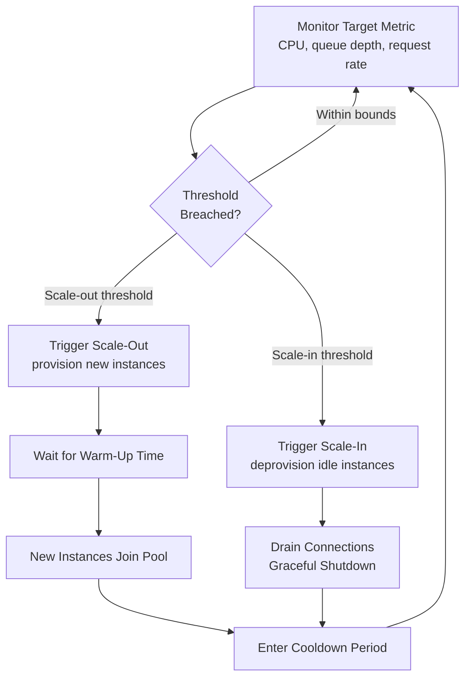

## Cloud Elasticity and Auto-Scaling Strategies

### Overview

Cloud elasticity is the capability of a system to automatically provision and de-provision resources in response to real-time demand, and auto-scaling is the mechanized implementation of that capability through policies, triggers, and orchestration systems. Where traditional IT capacity planning centers on forecasting fixed capacity ahead of time, elastic cloud environments shift part of the capacity problem into runtime policy design: the question becomes not just "how much capacity will we need" but "how quickly and precisely can capacity adjust to actual demand as it happens."

### Elasticity vs. Scalability: A Key Distinction

- **Scalability** is a system's *capability* to handle increased load by adding resources (an architectural property).
- **Elasticity** is the *automatic, bidirectional* adjustment of provisioned resources to match demand in near-real-time — scaling both out (adding) and in (removing) resources as load changes.

A system can be scalable without being elastic (e.g., manually adding servers during a planned event) but true cloud elasticity requires both the architectural capacity to scale and the automation to do so dynamically without manual intervention.

### Auto-Scaling Trigger Types

| Trigger Type | Mechanism | Best Suited For |
| --- | --- | --- |
| Reactive (metric-based) | Scale based on observed metrics (CPU, memory, queue depth, request rate) crossing thresholds | General-purpose workloads with measurable resource correlation to load |
| Scheduled | Scale based on known time-of-day/seasonal patterns | Predictable traffic cycles (e.g., business-hours traffic, batch processing windows) |
| Predictive | Scale based on forecasted demand using historical pattern modeling or machine learning | Workloads with recurring but complex patterns where reactive scaling lags too much |
| Custom/application-level | Scale based on application-specific metrics (queue length, active sessions, custom business KPIs) | Workloads where infrastructure metrics don't directly correlate with actual load |

### Horizontal vs. Vertical Auto-Scaling

- **Horizontal auto-scaling (scale-out/in)**: adjusts the *number* of instances/pods/nodes. Preferred for stateless, distributed workloads due to near-linear capacity addition and improved fault tolerance.
- **Vertical auto-scaling (scale-up/down)**: adjusts the *resource allocation* (CPU/memory) of existing instances. Useful for workloads that cannot be easily distributed (certain databases, legacy monoliths) but is typically slower (often requires a restart) and bounded by maximum instance size.

Most modern cloud-native architectures default to horizontal auto-scaling as the primary elasticity mechanism, reserving vertical scaling for specific stateful components.

### Core Auto-Scaling Policy Parameters

- **Target metric and threshold**: the signal driving scaling decisions (e.g., target 60% average CPU utilization) and the threshold at which action triggers.
- **Scale-out vs. scale-in asymmetry**: scaling out (adding capacity) is typically configured to react faster than scaling in (removing capacity), since the cost of under-provisioning (performance degradation, outages) usually exceeds the cost of brief over-provisioning.
- **Cooldown periods**: a mandatory waiting period after a scaling action before another can trigger, preventing rapid oscillation ("flapping") between scaling up and down in response to noisy metrics.
- **Minimum and maximum instance bounds**: hard floors and ceilings on the scaling range, protecting against both under-provisioning during traffic lulls and runaway cost/capacity during anomalous spikes or misconfigured triggers.
- **Warm-up/startup time**: the time a newly provisioned instance takes before it can accept traffic (container pull, application initialization, health check pass), which directly affects how far in advance scaling must be triggered relative to when the added capacity is actually needed.

### Diagram: Auto-Scaling Decision Loop (svg_diagram)

### Predictive Scaling and Its Relationship to Forecasting Models

Predictive auto-scaling applies the same forecasting discipline covered under general capacity planning — trend analysis, seasonal decomposition, and demand modeling — but operationalizes it as a continuously updated scaling schedule rather than a static plan:

- Historical usage patterns (time-of-day, day-of-week, seasonal cycles) are modeled to anticipate demand *before* reactive metrics would trigger scaling.
- This addresses the **reactive scaling lag problem**: because instances have non-zero warm-up time, purely reactive scaling always trails actual demand by at least one warm-up interval, potentially causing brief performance degradation during rapid demand ramps. Predictive scaling pre-provisions capacity ahead of the anticipated spike to close this gap.
- Predictive models must be revalidated periodically as usage patterns shift (analogous to the rolling recalibration of learning-rate parameters in manufacturing capacity forecasts), since a predictive model trained on stale patterns can pre-scale incorrectly and either waste cost or fail to prevent the lag it was meant to solve.

### The Elasticity Analog to Learning-Curve and Ramp-Up Concepts

Several themes from the manufacturing/service side of this curriculum map onto cloud elasticity, with important differences in mechanism:

- **Ramp-up parallel**: a newly launched service often runs with conservative, wide scaling bounds and frequent manual tuning while the team learns the workload's real characteristics, analogous to a new production line's pilot and initial ramp phases — over time, scaling policies are tightened and made more autonomous as confidence in the model grows.
- **Operational learning curve**: the *team* configuring auto-scaling policies improves at threshold tuning, cooldown calibration, and anomaly discrimination with experience, distinct from the automated system's own behavior — this is an organizational learning effect layered on top of the technical elasticity mechanism, benefiting from the same documentation practices (recording *why* a given threshold or cooldown value was chosen) as other organizational memory systems.
- **Constraint management parallel**: elastic scaling directly implements the "elevate the constraint" step from Theory of Constraints, but does so automatically and continuously rather than as a discrete management decision — though the underlying discipline of first exploiting existing capacity (caching, query optimization, connection pooling) before scaling out remains a cost-relevant best practice, since auto-scaling amplifies inefficiency rather than only masking it.

### Common Pitfalls

- **Flapping due to inadequate cooldowns**: overly sensitive thresholds or insufficient cooldown periods cause repeated scale-out/scale-in cycles, wasting cost on churn without net capacity benefit and potentially destabilizing the service.
- **Ignoring warm-up time in threshold design**: setting scale-out thresholds too close to the point of actual saturation, without accounting for instance startup latency, causes performance degradation during the gap between trigger and available capacity.
- **Single-metric scaling triggers**: scaling purely on CPU while ignoring memory, connection pool exhaustion, or downstream dependency saturation can leave the true bottleneck unaddressed even as the scaling system reports "healthy" behavior on its chosen metric.
- **Unbounded scale-out during anomalies**: missing or overly generous maximum instance caps can allow a traffic anomaly (bot traffic, retry storms, DDoS) to trigger runaway scaling and unexpected cost, rather than being caught by independent anomaly detection and rate limiting.
- **Stateful workload mismatches**: applying horizontal auto-scaling assumptions to inherently stateful components (databases, in-memory session stores) without appropriate data partitioning or replication design, causing scaling actions to fail or corrupt state.
- **Treating predictive models as static**: deploying a predictive scaling model once and not retraining/revalidating it as traffic patterns evolve, causing pre-scaling to become progressively less accurate over time. [Inference] the appropriate retraining cadence is workload-specific and not governed by a universal rule.

### Related Topics

- Queuing theory models for scaling threshold design
- Kubernetes Horizontal Pod Autoscaler (HPA) and Cluster Autoscaler mechanics
- Cost optimization and rightsizing in elastic cloud environments
- Stateful service scaling patterns (sharding, replication, session affinity)
- Chaos engineering and scaling resilience validation