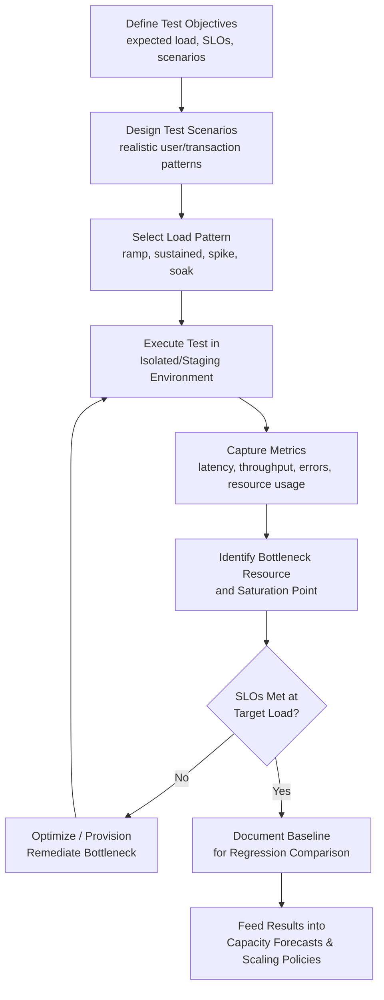

## Load Testing and Performance Benchmarking

### Overview

Load testing and performance benchmarking are the empirical validation methods used to determine how a system actually behaves under varying levels of demand, as distinct from theoretical capacity models or forecasts. Where capacity planning and auto-scaling policy design are largely predictive and model-driven, load testing and benchmarking supply the ground-truth data — actual measured latency, throughput, error rates, and resource consumption under controlled load — that those models depend on for calibration and validation.

### Core Testing Types

| Test Type | Purpose | Typical Load Pattern |
| --- | --- | --- |
| Load testing | Validate behavior under expected/target load | Ramp to expected peak, sustain |
| Stress testing | Find the breaking point beyond normal capacity | Increase load until failure or severe degradation |
| Soak testing (endurance) | Detect degradation over sustained duration (memory leaks, resource exhaustion) | Sustained moderate load over extended time (hours/days) |
| Spike testing | Validate response to sudden, sharp demand increases | Rapid step-function increase, then hold or return to baseline |
| Scalability testing | Confirm capacity increases proportionally with added resources | Incrementally add resources while increasing load, measuring throughput ratio |
| Capacity testing | Determine maximum sustainable throughput at acceptable performance levels | Gradual load increase to identify the point where SLOs are breached |

### Key Metrics Captured

- **Latency percentiles**: p50 (median), p95, p99, and sometimes p99.9 — critical because average latency alone masks tail latency that disproportionately affects user experience; a system can have excellent average latency while still failing a meaningful fraction of requests badly.
- **Throughput**: requests/transactions processed per unit time (RPS, TPS) at a given load level.
- **Error rate**: percentage of failed/timed-out requests as load increases — the point at which error rate begins rising sharply often marks the practical capacity ceiling, independent of raw throughput numbers.
- **Resource utilization**: CPU, memory, disk I/O, network, and database connection pool usage during the test, correlated against the load level to identify which resource becomes the binding constraint first.
- **Saturation point**: the load level at which throughput stops increasing (or begins decreasing) despite continued load increase — the empirical measurement of the system's actual capacity ceiling, as opposed to its theoretical/rated capacity.

### The Load Testing Workflow

### Relationship to Capacity Planning and Auto-Scaling

Load testing and benchmarking provide the empirical inputs that theoretical capacity models require to be trustworthy, closing the loop between forecast and reality:

- **Calibrating capacity forecasts**: trend-based or queuing-theory capacity models rely on assumed service rates and resource-per-transaction ratios; load testing supplies the actual measured values, replacing assumptions with data — directly analogous to how regression on actual production data refines learning-rate assumptions in manufacturing capacity forecasts.
- **Validating auto-scaling thresholds and warm-up assumptions**: spike testing specifically validates whether configured scale-out thresholds and cooldown periods actually prevent performance degradation given real instance warm-up times, rather than relying on theoretical warm-up estimates.
- **Establishing safe operating headroom**: the empirically observed saturation point informs what utilization threshold (e.g., "keep sustained CPU below 70%") leaves adequate headroom for traffic bursts, directly feeding the headroom parameters used in general IT capacity planning.
- **Regression detection**: benchmarking the same scenario across software releases detects performance regressions introduced by code changes before they reach production, serving a role analogous to a post-mortem/documentation system in preventing repeated, previously-solved performance problems from resurfacing unnoticed.

### Test Environment Considerations

- **Production parity**: load test environments should mirror production configuration (instance types, network topology, data volume characteristics) as closely as feasible; results from a scaled-down or differently-configured environment can significantly misrepresent actual production capacity.
- **Realistic traffic modeling**: synthetic load should reflect actual user behavior patterns (request mix, think time, session structure) rather than simplistic uniform request floods, since unrealistic load patterns can produce misleading bottleneck identification.
- **Data volume realism**: database and cache behavior can differ substantially between small test datasets and production-scale data volumes (index performance, cache hit rates); testing against unrealistically small datasets risks missing scalability issues that only appear at production data scale.
- **Isolation from production traffic**: load tests should generally run in isolated environments to avoid impacting real users, though some organizations employ carefully controlled production load testing (e.g., shadow traffic, canary load) for validation that staging environments cannot fully replicate.

### Common Load Testing Tools and Approaches (General Categories)

- **Open-source load generators**: tools that simulate concurrent virtual users executing scripted request sequences against target endpoints, commonly used for HTTP/API load testing.
- **Distributed load generation**: for very high target loads, load generation itself is distributed across multiple machines/regions to avoid the load generator becoming the bottleneck rather than the system under test — a subtle but important distinction, since a load test that is actually constrained by generator capacity produces misleading results about the target system.
- **APM (Application Performance Monitoring) integration**: correlating load test results with detailed application tracing (identifying slow database queries, external API calls, or code paths under load) rather than relying on aggregate metrics alone.

### Practical Example

A team preparing for an anticipated traffic surge (e.g., a public announcement expected to drive a spike in document-upload requests to a records management system) runs a structured test sequence:

1. **Baseline load test**: confirm current system meets SLOs (e.g., p95 latency < 500ms) at expected average daily load.
2. **Spike test**: simulate a sudden 5x traffic increase over 60 seconds to validate auto-scaling reacts fast enough, given known instance warm-up time, without breaching SLOs during the scaling lag window.
3. **Stress test**: increase load beyond the anticipated spike until the system begins failing, to identify the actual ceiling and confirm it exceeds the worst-case anticipated demand with adequate margin.
4. **Soak test**: run at sustained elevated load for several hours to catch gradual degradation (e.g., memory leaks, connection pool exhaustion) that a short spike test would not reveal.

Results from this sequence directly inform the auto-scaling minimum/maximum instance bounds and cooldown settings, and establish the documented performance baseline referenced in future regression testing.

### Common Pitfalls

- **Testing only the happy path**: omitting error conditions, retries, and realistic failure-mode traffic (e.g., malformed requests, authentication failures) can miss capacity issues that only manifest under a realistic, imperfect traffic mix.
- **Load generator bottleneck masquerading as system limit**: if the load generation infrastructure itself saturates before the target system does, results will understate the system's true capacity.
- **Ignoring tail latency**: reporting only average latency can mask a system that technically meets throughput targets while failing a meaningful percentage of users badly at the p99 level.
- **Stale baselines**: failing to re-run and update performance baselines after significant architecture or dependency changes, causing capacity assumptions to silently drift out of validity. [Inference] the appropriate re-testing cadence depends on deployment frequency and architectural volatility and is not fixed by a universal rule.
- **Testing in non-representative environments**: extrapolating staging-environment results directly to production capacity planning without accounting for configuration or data-scale differences between the two.

### Related Topics

- Queuing theory and its use in interpreting load test saturation curves
- Application Performance Monitoring (APM) and distributed tracing
- Chaos engineering as a complement to structured load testing
- Service Level Objectives (SLOs) and error budgets
- Regression testing practices for performance across software releases