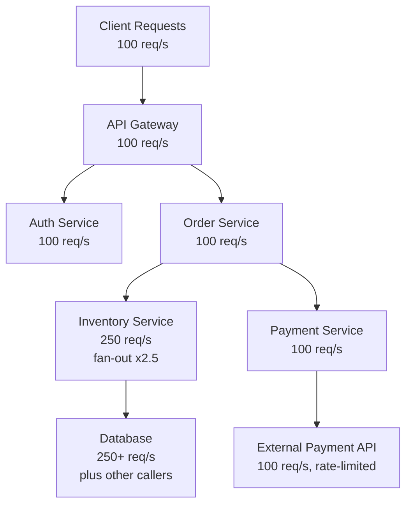
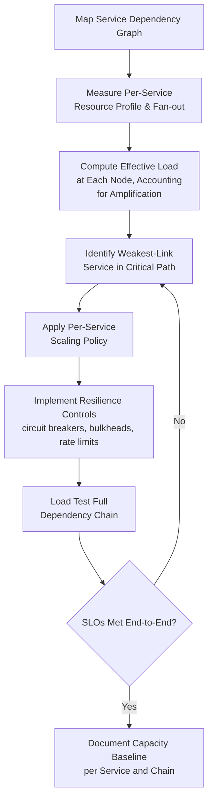

## Capacity Planning for Distributed and Microservice Systems

### Overview

Capacity planning for distributed and microservice systems addresses the unique complexity introduced when a single logical application is decomposed into many independently deployed, independently scaled services communicating over a network. Unlike monolithic capacity planning, where a single resource pool serves the whole application, microservice capacity planning must account for per-service resource profiles, inter-service dependency chains, network overhead, and cascading failure risk — any one of which can become the binding constraint even when the overall system appears to have ample aggregate resources.

### Why Microservices Change the Capacity Planning Problem

- **Distributed bottlenecks**: a system's overall throughput is bounded by whichever individual service in the call chain saturates first — a direct extension of the Theory of Constraints principle, but now applied across a dependency graph rather than a single production line.
- **Non-uniform scaling needs**: different services have different resource profiles (CPU-bound vs. memory-bound vs. I/O-bound) and different demand elasticity, so a uniform scaling policy across all services is almost always suboptimal.
- **Network as a first-class resource**: inter-service calls introduce latency, bandwidth consumption, and serialization overhead that don't exist in a monolith's in-process function calls; network capacity and service mesh overhead must be explicitly modeled.
- **Cascading and amplification effects**: a slowdown in one downstream service can cause upstream services to queue requests, exhaust connection pools, or retry excessively, amplifying a localized capacity problem into a system-wide outage — a failure mode largely absent in monolithic architectures.

### Per-Service Capacity Modeling

Each service in a distributed system should be capacity-planned individually before aggregate system capacity is assessed:

| Consideration | Description |
| --- | --- |
| Resource profile | Whether the service is CPU-bound, memory-bound, I/O-bound, or network-bound |
| Request fan-out | How many downstream calls a single incoming request triggers (a request fanning out to 5 services multiplies load on those 5 relative to the entry point) |
| Latency budget | The portion of overall request latency this service is allowed to consume within the end-to-end SLO |
| Independent scaling policy | Auto-scaling thresholds and bounds tuned specifically to this service's own resource profile and demand pattern, rather than inherited from a global default |
| Failure isolation requirements | Whether this service needs bulkheading/circuit breaking to prevent its saturation from cascading to callers |

### Fan-Out and Amplification Effects

A critical distributed-systems-specific capacity consideration is **request amplification**: if an incoming request to a front-line service triggers calls to $N$ downstream services, and each of those triggers further calls, the effective load multiplies through the call graph. This means a front-line service's capacity headroom does not by itself guarantee the system can handle a given request rate — downstream services experiencing the multiplied fan-out load may saturate well before the entry-point service does.

$$\text{Load}_{downstream} = \text{Load}_{entry} \times \text{Fan-out Factor}$$

Capacity planning must therefore trace the full dependency graph and compute effective load at each node, not just at the system's external entry points.

### Diagram: Dependency Chain and Fan-Out Capacity Impact (svg_diagram)

In this pattern, the Inventory Service and its underlying Database absorb amplified load relative to the client-facing request rate, making them likely capacity constraints even though the API Gateway and Order Service show comfortable headroom at their own layer.

### Queuing and Backpressure in Distributed Chains

Because services communicate over the network with independent scaling and independent failure modes, capacity planning for distributed systems relies heavily on explicit **backpressure and resilience mechanisms** to prevent local saturation from becoming system-wide failure:

- **Circuit breakers**: stop sending requests to a downstream service once it shows signs of saturation/failure, preventing the caller's own resources (threads, connections) from being exhausted waiting on a failing dependency.
- **Bulkheading**: isolate resource pools (thread pools, connection pools) per downstream dependency so that saturation in one does not exhaust resources needed to serve other, healthy dependencies.
- **Rate limiting and load shedding**: deliberately reject or defer excess requests at a service boundary once capacity is reached, protecting the service (and everything downstream of it) from cascading overload, at the cost of some requests failing fast rather than queuing indefinitely.
- **Timeout and retry policy tuning**: overly aggressive retries during a downstream slowdown can amplify load on an already-struggling service (a retry storm), turning a transient issue into an extended outage; retry budgets and exponential backoff with jitter are standard mitigations.

### Capacity Planning Workflow for Distributed Systems

### Observability as a Capacity Planning Prerequisite

Because bottlenecks in distributed systems can hide behind healthy-looking aggregate metrics, capacity planning for microservices depends heavily on distributed observability:

- **Distributed tracing**: following an individual request across every service it touches, revealing which specific hop contributes disproportionate latency — critical for identifying the true constraint in a multi-hop chain rather than guessing from aggregate dashboards.
- **Per-service and per-dependency dashboards**: aggregate system-level metrics can mask a single saturated service; capacity monitoring must be granular enough to isolate individual services and their specific downstream calls.
- **Service-level objectives (SLOs) at each hop**: setting per-service latency/error budgets that sum coherently to the overall end-to-end SLO, so capacity issues can be localized to the specific service breaching its allotted budget.

### Interaction with Broader Capacity Planning Themes

- **Constraint management applied per-service**: the Theory of Constraints 5-focusing-steps cycle applies directly at the service level — identify the currently saturated service, exploit it (caching, query optimization), subordinate other services' scaling to avoid overwhelming it further, elevate it (scale out), then expect the constraint to migrate to a different service in the chain.
- **Independent learning curves per team**: in organizations where each microservice is owned by a different team, each team experiences its own operational learning curve in tuning that service's scaling policies and resilience controls — organizational memory practices (documented runbooks, ADRs for scaling decisions) are especially valuable here since knowledge is naturally siloed by service ownership.
- **Load testing complexity**: load testing a distributed system requires testing not just individual services in isolation but the full dependency chain under realistic fan-out conditions, since isolated per-service load tests can miss amplification effects that only appear when the whole chain is exercised together.

### Common Pitfalls

- **Capacity planning services in isolation**: sizing each service based only on its own direct inbound traffic without accounting for fan-out amplification from upstream callers, leading to underprovisioned downstream dependencies.
- **Uniform scaling policies across heterogeneous services**: applying the same CPU-utilization-based auto-scaling threshold to all services regardless of whether they are CPU-bound, memory-bound, or I/O-bound, causing some services to over- or under-scale relative to their actual constraint.
- **Missing retry storm risk**: configuring aggressive retry policies without backoff/jitter or retry budgets, risking amplification of a transient downstream slowdown into a full cascading outage.
- **Insufficient dependency-graph visibility**: lacking distributed tracing or dependency mapping, making it difficult to identify which service in a long call chain is the actual binding constraint during a capacity incident.
- **Testing services independently only**: validating each service's capacity in isolation without full-chain load testing, missing amplification and cascading effects that only manifest under realistic end-to-end load.

### Related Topics

- Distributed tracing and observability tooling for microservices
- Circuit breaker, bulkhead, and backpressure design patterns
- Service mesh capacity and network overhead considerations
- Service-level objectives (SLOs) and error budget allocation across dependency chains
- Chaos engineering for validating cascading failure resilience