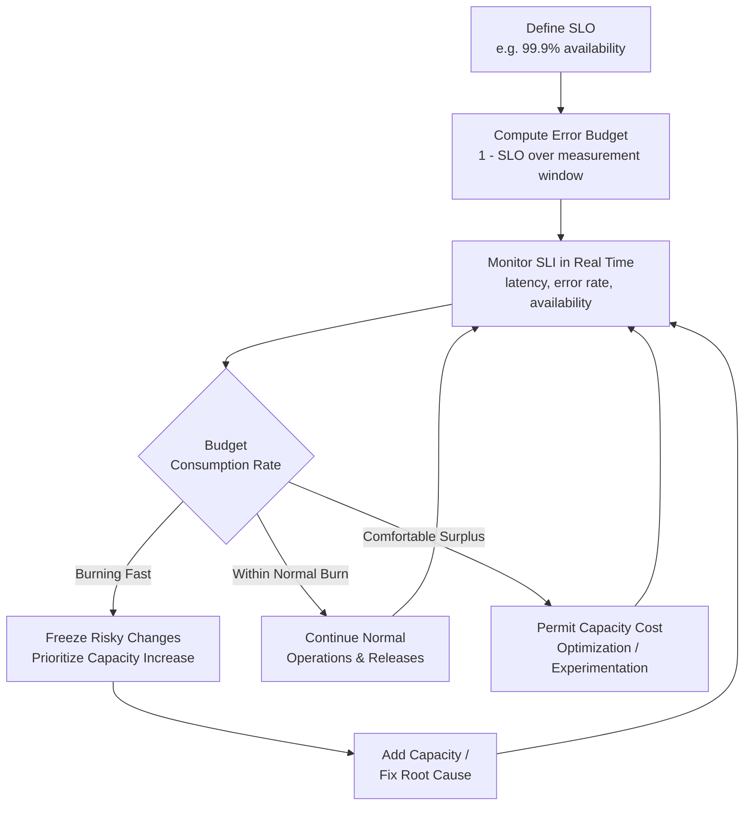

## Site Reliability Engineering Approaches to Capacity

### Overview

Site Reliability Engineering (SRE) approaches capacity planning as an extension of its broader reliability discipline, grounding provisioning decisions in explicit reliability targets rather than treating capacity and reliability as separate concerns. Where general IT capacity planning asks "how much resource do we need," SRE reframes the question as "how much capacity do we need to meet our reliability commitments, given a quantified and continuously tracked error budget" — making capacity decisions traceable to concrete service-level objectives rather than intuition or historical habit.

### Service Level Indicators, Objectives, and Agreements

SRE capacity planning is built on a layered measurement framework:

| Term | Definition | Example |
| --- | --- | --- |
| SLI (Service Level Indicator) | A quantitative measure of service behavior | Request latency, error rate, availability |
| SLO (Service Level Objective) | An internal target for an SLI over a period | 99.9% of requests succeed within 300ms over 30 days |
| SLA (Service Level Agreement) | An external, often contractual commitment, typically looser than the internal SLO | 99.5% uptime guaranteed to customers, with penalties for breach |

Capacity plans are sized to keep SLIs within SLOs under expected and reasonably anticipated peak load — not to some arbitrary utilization ceiling disconnected from actual reliability commitments.

### Error Budgets as a Capacity Governance Mechanism

The **error budget** is the SRE-specific tool that connects capacity decisions to reliability targets quantitatively:

$$\text{Error Budget} = 1 - \text{SLO}$$

For a 99.9% availability SLO, the error budget is 0.1% — the amount of unreliability (downtime, errors, or latency breaches) the service is allowed to accumulate over the measurement window before further risk-taking (including under-provisioning) must stop.

- **Budget consumption as a capacity signal**: rapid error budget consumption is a strong signal that current capacity is insufficient for the actual demand and reliability target, prompting either immediate capacity increases or a freeze on further capacity-risking changes (e.g., feature launches, aggressive cost-cutting on infrastructure).
- **Budget as permission to take capacity risk**: conversely, an intact error budget gives teams explicit permission to experiment with tighter capacity margins, more aggressive autoscaling cost optimization, or delayed capacity investment, since some room for error has been deliberately reserved.
- **This reframes capacity trade-offs as budget trade-offs**: instead of a purely qualitative debate about "should we add more servers," SRE practice quantifies the decision as "how much of our remaining error budget would under-provisioning consume, and is that acceptable given other planned risk."

### Diagram: Error Budget-Driven Capacity Decision Loop (svg_diagram)

### Toil Reduction and Its Capacity Implications

SRE explicitly distinguishes **toil** (manual, repetitive, automatable operational work that scales linearly with service size) from engineering work that scales sub-linearly or not at all with growth. Capacity planning under SRE principles extends beyond infrastructure resources to *operational capacity* — the team's own ability to manage growing scale:

- If capacity growth requires proportionally more manual intervention (manual scaling decisions, manual incident triage) as the system scales, the operational team itself becomes the binding constraint, regardless of how much infrastructure headroom exists — a direct parallel to workforce capacity constraints in the manufacturing and service capacity planning material earlier in this curriculum.
- SRE practice caps toil (a common guideline is that toil should not exceed roughly 50% of an SRE's time) and prioritizes automation investment specifically to keep operational capacity scaling sub-linearly with service growth. [Unverified] the specific 50% figure is a widely cited SRE community guideline rather than a universal or formally standardized threshold, and adopted targets vary by organization.

### Capacity Planning Cadence in SRE Practice

1. **Organic growth forecasting**: regular (often quarterly) capacity reviews projecting resource needs from historical growth trends, similar to trend-based IT capacity forecasting generally.
2. **Precipitous/launch-driven growth planning**: separate, event-specific capacity planning for known future demand shocks (product launches, marketing campaigns, seasonal peaks) that historical trend extrapolation would not capture — structurally similar to the ramp-up planning discipline for new production lines, but compressed into a much shorter timeframe.
3. **Load testing validation**: as covered under load testing and performance benchmarking, SRE teams use structured load and stress testing to validate that provisioned capacity actually meets SLOs at forecasted load, rather than relying on capacity models alone.
4. **Continuous headroom monitoring**: ongoing tracking of the gap between current utilization and defined safe thresholds, feeding back into both auto-scaling policy tuning and longer-horizon capacity forecasts.

### Graceful Degradation as a Capacity Strategy

A distinctly SRE-flavored capacity practice is designing systems to **degrade gracefully** rather than fail completely when capacity limits are approached or exceeded:

- **Load shedding**: deliberately rejecting or deferring lower-priority requests to preserve capacity for higher-priority ones once a saturation threshold is reached, rather than allowing uncontrolled queuing that degrades service for all requests equally.
- **Feature flagging under load**: disabling non-critical, resource-intensive features automatically when the system approaches capacity limits, preserving core functionality at the expense of secondary features.
- **Quality-of-service tiering**: differentiating capacity allocation by customer tier or request type, ensuring the most critical traffic is protected even if aggregate capacity is temporarily insufficient for all demand.

This connects directly to the resilience patterns (circuit breakers, bulkheading, rate limiting) discussed under distributed and microservice capacity planning — SRE treats these not merely as failure-prevention mechanisms but as deliberate capacity management tools that shape *how* a system fails when capacity is exceeded, rather than assuming capacity will always be sufficient.

### Postmortems and Capacity-Related Incident Learning

Consistent with the organizational memory practices discussed earlier in this curriculum, SRE mandates blameless postmortems for significant incidents, including capacity-related outages:

- Capacity-related postmortems document the specific bottleneck resource, why existing monitoring/alerting didn't surface the risk earlier, and what forecasting or headroom assumption proved incorrect.
- Action items typically feed directly back into capacity model refinement (adjusting growth assumptions, headroom thresholds, or auto-scaling parameters) — closing the loop between real incidents and the predictive models used for future planning, analogous to how regression on actual production data refines manufacturing learning-rate assumptions.

### Common Pitfalls

- **Capacity planning disconnected from SLOs**: provisioning based on generic utilization thresholds (e.g., "keep CPU below 70%") without explicitly tying those thresholds back to what they mean for actual SLO compliance, making it hard to reason about acceptable risk trade-offs.
- **Ignoring operational/toil capacity**: focusing exclusively on infrastructure capacity while ignoring whether the operations team's own capacity (time, headcount, automation maturity) can keep pace with system growth.
- **Treating error budget policy as punitive rather than enabling**: using budget exhaustion purely to assign blame rather than as a structured trigger for capacity investment or risk-taking pauses, undermining the intended governance function.
- **Under-investing in graceful degradation**: designing systems that fail completely at capacity limits rather than degrading predictably, turning a capacity shortfall into a full outage rather than a controlled, prioritized reduction in service.
- **Skipping precipitous-growth-specific planning**: relying solely on organic trend-based forecasting and missing known future demand shocks (launches, campaigns) that require dedicated capacity planning outside the regular cadence.

### Related Topics

- Service Level Objectives (SLOs) and error budget policy design
- Toil identification and automation prioritization frameworks
- Blameless postmortem practices for capacity-related incidents
- Load shedding and graceful degradation design patterns
- Quarterly capacity planning cadences and precipitous-growth event planning