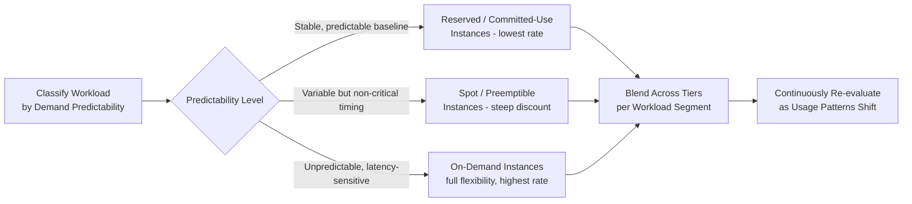

## Cost-Aware Capacity Optimization in the Cloud

### Overview

Cost-aware capacity optimization in the cloud is the discipline of provisioning infrastructure capacity that meets performance and reliability requirements at the lowest sustainable cost, treating cost as a first-class constraint alongside throughput, latency, and availability rather than an afterthought calculated post hoc. Cloud environments make this both more tractable and more necessary than traditional data-center capacity planning: pay-as-you-go pricing exposes cost/capacity trade-offs in near-real-time, but the same elasticity that enables fine-grained optimization also enables invisible waste if left unmanaged (commonly termed cloud cost sprawl).

### The Core Tension: Headroom vs. Cost

Capacity planning generally favors provisioning headroom above expected demand to absorb bursts and protect SLOs (as covered under general IT capacity planning and SRE approaches). Cost-aware optimization does not eliminate this headroom but forces it to be **deliberate and quantified** rather than defaulted to generous, unexamined margins:

$$\text{Cost of Overprovisioning} = (\text{Provisioned Capacity} - \text{Actual Peak Utilization}) \times \text{Unit Cost} \times \text{Time}$$

Every unit of idle, paid-for capacity is a direct cost with no offsetting reliability or performance benefit once it exceeds what is actually needed for headroom, redundancy, and burst absorption. The goal of cost-aware optimization is to minimize this gap without pushing utilization so high that it erodes the safety margins established under SRE and general capacity planning practices.

### Core Cost Optimization Levers

| Lever | Mechanism | Trade-off |
| --- | --- | --- |
| Rightsizing | Matching instance/resource size to actual observed workload requirements | Requires ongoing measurement; risk of under-sizing if based on incomplete data |
| Reserved/committed-use pricing | Committing to sustained usage in exchange for lower per-unit rates | Reduces flexibility; poor fit for highly variable or uncertain workloads |
| Spot/preemptible instances | Using excess cloud provider capacity at steep discounts, subject to reclamation | Requires fault-tolerant, interruption-resilient architecture |
| Auto-scaling tuning | Scaling in aggressively during low demand, not just scaling out during peaks | Requires confidence in scale-in safety (state management, connection draining) |
| Storage tiering | Moving infrequently accessed data to cheaper storage classes | Retrieval latency/cost trade-offs for cold-tier data |
| Workload scheduling | Shifting deferrable/batch workloads to off-peak or lower-cost windows | Only applicable to workloads without strict real-time latency requirements |

### Rightsizing as the Foundation

Rightsizing — matching provisioned instance size, memory allocation, and storage tier to actual measured workload requirements — is typically the highest-leverage and lowest-risk cost optimization lever, and should generally precede more aggressive strategies like spot instance adoption or reserved commitments:

- **Utilization-based rightsizing**: analyzing historical CPU, memory, and I/O utilization to identify consistently overprovisioned resources (e.g., an instance sized for 16 vCPUs that never exceeds 20% utilization even at peak).
- **Right-sizing is continuous, not one-time**: workload characteristics shift as application code, traffic patterns, and dependencies evolve, so rightsizing analysis should be a recurring practice rather than a single initial exercise — closely paralleling the rolling recalibration emphasized in manufacturing capacity forecasting as new data accumulates.
- **Interaction with load testing**: rightsizing decisions should be validated against the empirically measured saturation points from load testing rather than relying solely on average utilization, since average-based rightsizing can under-provision for legitimate peak demand.

### Pricing Model Selection Strategy

Cloud providers typically offer a spectrum of pricing commitment levels, and cost-aware capacity planning involves deliberately allocating workloads across this spectrum based on their demand predictability:

- **Reserved/committed-use capacity** is most cost-effective for the stable, predictable baseline portion of a workload — analogous to how a manufacturing line's steady-state capacity, once well understood, justifies fixed capital investment rather than continued reliance on flexible/variable resourcing.
- **Spot/preemptible instances** suit fault-tolerant, interruption-resilient workloads (batch processing, stateless horizontally-scaled services with graceful node loss handling) where steep discounts offset the operational complexity of handling reclamation events.
- **On-demand pricing** remains appropriate for the unpredictable, bursty portion of demand where commitment would either be wasted (if demand doesn't materialize) or insufficient (if demand exceeds the commitment), and where spot interruption risk is unacceptable for latency-sensitive workloads.

### The Autoscaling-Cost Connection

Cost-aware capacity optimization treats auto-scaling policy tuning (covered separately under cloud elasticity) as a direct cost lever, not purely a performance/reliability mechanism:

- **Scale-in aggressiveness**: overly conservative scale-in policies (slow to remove capacity after demand subsides) directly translate to wasted spend; cost-aware tuning balances faster scale-in against the flapping risk discussed under elasticity strategies.
- **Minimum instance floors**: unnecessarily high minimum instance counts (often set defensively without revisiting) represent a fixed cost floor regardless of actual off-peak demand; periodic review of these floors against actual observed minimum load is a common source of easy savings.
- **Scheduled scaling for known patterns**: workloads with predictable low-demand windows (e.g., overnight, weekends) can use scheduled scale-down independent of reactive metrics, capturing savings that purely reactive auto-scaling might miss due to conservative thresholds.

### Cost Observability and Governance

- **Cost allocation tagging**: attributing cloud spend to specific services, teams, or products enables identifying which components are the largest cost drivers and prioritizing optimization effort accordingly — analogous to per-service capacity modeling in distributed systems, applied to cost rather than raw resource metrics.
- **Cost anomaly detection**: automated alerting on unexpected cost spikes (e.g., a misconfigured auto-scaling policy allowing runaway scale-out, or an unbounded storage growth pattern) catches cost issues before they accumulate into a large unexpected bill, mirroring the unbounded scale-out pitfall discussed under elasticity strategies.
- **Regular cost review cadence**: similar to the quarterly capacity planning cadence common in SRE practice, cost-aware optimization benefits from a recurring review rhythm rather than one-off cost-cutting exercises, since both workload patterns and cloud provider pricing options evolve over time.
- **FinOps as an organizational practice**: many organizations formalize cost-aware capacity optimization under a dedicated FinOps function, bringing together engineering, finance, and operations to jointly own the cost/capacity/reliability trade-off rather than leaving it solely to infrastructure teams. [Unverified] the specific organizational structure and maturity of FinOps practice varies significantly across companies and is not a single standardized model.

### Practical Example

A team reviews their document management system's cloud infrastructure and finds:

- **Baseline compute**: a steady, predictable load of background indexing and metadata-processing jobs running 24/7 — a strong candidate for reserved/committed-use pricing given its stable, predictable resource profile.
- **Batch archival jobs**: nightly batch jobs converting and archiving documents, tolerant of interruption and not time-critical within the night's processing window — a strong candidate for spot instances given their fault-tolerant, deferrable nature.
- **User-facing upload/query API**: variable, latency-sensitive traffic tied to business hours — kept on-demand with auto-scaling, but with scheduled scale-down overnight and on weekends when usage historically drops sharply, and a lowered minimum instance floor validated against measured overnight minimum load.

This blended approach applies the right pricing model to each workload segment based on its actual demand predictability and fault tolerance, rather than applying a single pricing strategy uniformly across the whole system.

### Common Pitfalls

- **Optimizing cost before establishing reliability baselines**: aggressively reducing headroom or adopting spot instances before load testing and SLO definitions are in place risks trading cost savings for reliability incidents whose cost (in outages, customer impact, and incident response effort) exceeds the savings achieved.
- **Static reserved commitments against changing workloads**: committing to reserved capacity based on a workload's current shape without anticipating architectural changes (e.g., a planned migration or refactor) can leave the organization paying for committed capacity a redesigned system no longer needs.
- **Treating spot instances as a drop-in replacement without architectural changes**: adopting spot pricing for workloads that aren't actually fault-tolerant to interruption, causing reliability degradation rather than pure cost savings.
- **One-time rightsizing without ongoing review**: performing a single rightsizing pass and never revisiting it as workload characteristics evolve, allowing overprovisioning to silently re-accumulate over time.
- **Missing cost allocation visibility**: without per-service or per-team cost tagging, it becomes difficult to identify which specific workloads are driving spend, making optimization efforts unfocused and less effective.

### Related Topics

- FinOps organizational practices and cost governance frameworks
- Spot/preemptible instance architecture patterns for fault tolerance
- Reserved instance and committed-use discount planning strategies
- Storage tiering and lifecycle policies for cost-optimized data management
- Cost anomaly detection and cloud spend observability tooling