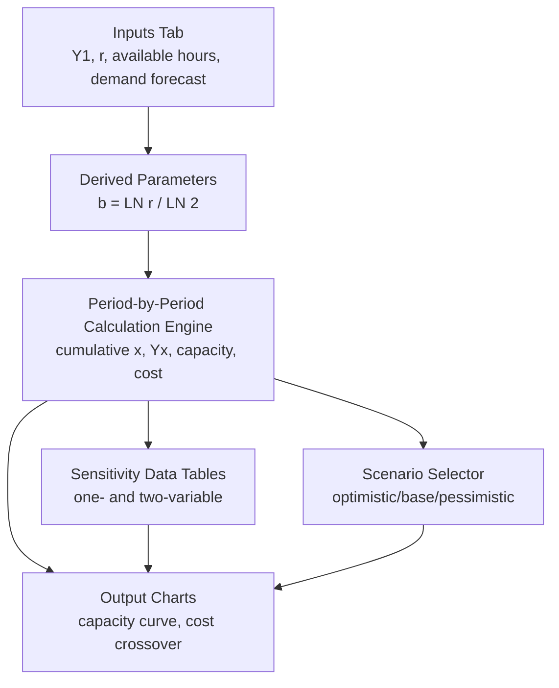

## Spreadsheet Modeling for Capacity and Learning Curves


### Overview

Spreadsheet modeling for capacity and learning curves is the practical implementation layer that translates the mathematical models covered earlier in this curriculum — Wright's Law, Crawford's Law, capacity forecasting, sensitivity analysis, and cost crossover comparisons — into working, auditable tools that planners can build, share, and iterate on without specialized software. Spreadsheets remain the dominant platform for this work in most operational settings due to their accessibility, transparency, and ease of collaborative review, even where more sophisticated statistical or simulation software exists.

### Core Structural Approach

A well-structured learning curve and capacity spreadsheet model separates inputs, calculations, and outputs into distinct sections to keep assumptions auditable and to make sensitivity analysis straightforward:

| Section | Contents |
| --- | --- |
| Assumptions/Inputs | $Y_1$ (first-unit hours/cost), learning rate $r$, available capacity per period, demand forecast |
| Derived Parameters | $b = \ln(r)/\ln(2)$, cumulative volume schedule |
| Core Calculations | $Y_x$ per period (cumulative average or unit model), capacity per period, cost per period |
| Outputs/Summary | Capacity forecast chart, cost projections, crossover points |
| Sensitivity Tables | Data tables varying key assumptions ($r$, $Y_1$) across plausible ranges |

Keeping assumptions isolated in a dedicated input section (rather than embedding constants directly inside formulas) is the single most important spreadsheet modeling discipline for this domain, since learning curve outputs are highly sensitive to the learning rate assumption, and hard-coded constants make sensitivity analysis and error-checking far more difficult.

### Implementing Wright's Law in Spreadsheet Formulas

The cumulative average model,

$$Y_x = Y_1 \cdot x^{b}, \quad b = \frac{\ln(r)}{\ln(2)}$$

translates directly into a spreadsheet formula pattern. With $Y_1$ in a named cell, $r$ in a named cell, and cumulative unit count $x$ in a column:



```
b = LN(r) / LN(2)
Y_x = Y_1 * (x ^ b)
```

For the incremental (Crawford's Law) model, the same formula structure applies, but $Y_x$ is interpreted as the labor hours for the specific $x$-th unit rather than the cumulative average — the formula is identical, but the column of $x$ values and the interpretation of the output differ, and mixing the two interpretations within one model is a common source of error.

### Log-Log Regression for Learning Rate Estimation

Once actual production or transaction data exists, spreadsheets can estimate the learning rate empirically using the linearized form:

$$\ln(Y_x) = \ln(Y_1) + b \cdot \ln(x)$$

This is implemented as a linear regression of $\ln(Y_x)$ against $\ln(x)$:



```
slope (b) = SLOPE(LN(actual_Yx_range), LN(x_range))
intercept (ln Y1) = INTERCEPT(LN(actual_Yx_range), LN(x_range))
implied_r = 2 ^ slope
```

Most spreadsheet applications also support this via a built-in trendline/power-fit function on an XY scatter chart of the raw (non-logged) data, which fits $Y = Y_1 \cdot x^b$ directly and displays the fitted equation and $R^2$ goodness-of-fit value — a convenient visual complement to the explicit regression formulas, useful for quickly assessing whether the power-law learning curve model is actually a good fit for the observed data before committing to it for forecasting.

### Building the Capacity Forecast Conversion

Converting $Y_x$ into a period-by-period capacity forecast requires linking the learning curve calculation to a labor-hours or resource-hours availability assumption:



```
Capacity_period = Available_Hours_period / Y_x_period
```

This should be modeled across a time-indexed row or column (weeks, months) with cumulative volume $x$ carried forward cumulatively from period to period based on the projected production/transaction rate, since $x$ is cumulative output, not a per-period value — a frequent modeling error is applying $Y_x$ using the current period's volume instead of the running cumulative total.

### Sensitivity Analysis Implementation: Data Tables

Spreadsheet **data table** features (a built-in what-if analysis tool in most spreadsheet applications) are the standard mechanism for the one-at-a-time sensitivity analysis described earlier in this curriculum, without needing to manually recalculate the model for each scenario:

- A **one-variable data table** varies a single input (e.g., learning rate $r$ across 75%, 80%, 85%, 90%, 95%) down a column and shows the resulting output (e.g., capacity at a target cumulative volume) for each value, automatically recalculating the underlying model for each row.
- A **two-variable data table** varies two inputs simultaneously (e.g., $r$ across rows and cumulative volume $x$ across columns), producing a grid of outputs useful for visualizing how sensitivity to the learning rate changes at different points in the production run — directly supporting the tornado-diagram-style prioritization discussed under sensitivity analysis of capacity plans.

### Scenario Modeling Structure

Beyond continuous data tables, discrete scenario comparison (optimistic/base/pessimistic, as discussed under sensitivity analysis) is typically implemented with a scenario selector cell driving all downstream calculations:



```
scenario_r = CHOOSE(scenario_selector, 0.75, 0.85, 0.95)
```

or via a lookup table keyed to a named scenario, allowing a single dropdown or toggle to switch the entire model between named scenarios for presentation and comparison purposes, rather than requiring separate parallel model copies for each scenario.

### Diagram: Spreadsheet Model Architecture (svg_diagram)



### Visualization Practices

- **Log-log plots**: because the power-law learning curve appears as a straight line on log-log axes, plotting $Y_x$ against $x$ on a log-log scale is the standard diagnostic visualization for assessing whether observed data follows the expected learning curve pattern, and for visually spotting deviations (plateaus, discontinuities from process changes) that a linear-scale plot would obscure.
- **Capacity forecast charts**: a standard line chart of projected capacity per period over the forecast horizon, often overlaid with the demand forecast to visually identify capacity gap periods.
- **Tornado charts for sensitivity results**: horizontal bar charts ranking input parameters by their impact on a chosen output metric, built from the results of one-variable data tables run across each parameter of interest — directly implementing the tornado diagram concept from sensitivity analysis.

### Model Validation and Auditability Practices

- **Separate raw data from model logic**: actual historical production/transaction data used for regression should be kept in a distinct, clearly labeled section separate from the forecasting formulas that consume it, so the model can be validated against updated data without restructuring the calculation logic.
- **Explicit unit labeling**: given the exponential sensitivity of learning curve models to input values, clearly labeling units (hours vs. minutes, cumulative vs. per-period volume) throughout the model reduces a common and costly class of spreadsheet error.
- **Version control and change documentation**: because capacity models are frequently revised as new data arrives (echoing the rolling recalibration theme from capacity forecasting), maintaining a changelog of when and why key assumptions ($Y_1$, $r$) were updated preserves the organizational memory needed to understand why past forecasts differed from current ones — directly connecting to the documentation and organizational memory practices covered earlier in this curriculum.
- **Cross-checking against known reference points**: validating the model reproduces known historical figures (e.g., actual $Y_x$ at a known past cumulative volume) before relying on it for forward-looking forecasts, catching formula errors before they propagate into capacity decisions.

### Common Pitfalls

- **Hard-coding the learning rate inside formulas**: embedding $r$ or $b$ directly into calculation formulas rather than referencing a dedicated input cell, making sensitivity analysis and updates error-prone and labor-intensive.
- **Confusing cumulative average and incremental unit models**: applying Wright's Law (cumulative average) formulas but interpreting outputs as if they were Crawford's Law (per-unit) values, or vice versa, leading to systematically incorrect capacity or cost projections.
- **Using per-period volume instead of cumulative volume**: a frequent and consequential error where $x$ in the $Y_x$ formula is mistakenly set to the current period's production volume rather than the running cumulative total since process start.
- **Extrapolating the power-law fit indefinitely without a plateau check**: since real processes eventually flatten out (as discussed under incorporating learning rates into capacity forecasts), a spreadsheet model that projects the pure power-law formula far into the future without a floor/plateau adjustment can substantially overstate long-run capacity gains. [Inference] the appropriate plateau floor is process-specific and must be estimated separately; it is not derivable from the basic power-law formula itself.
- **Overwriting scenario results instead of using data tables/scenario selectors**: manually changing input cells to test scenarios and recording results by hand, rather than using built-in data table or scenario management features, increases the risk of leaving the model in an inconsistent state or losing track of which scenario a given saved result corresponds to.

### Related Topics

- Log-log regression and power-law curve fitting techniques
- Spreadsheet data table and scenario manager features for what-if analysis
- Model auditability and version control practices for financial/operational models
- Tornado diagram construction from sensitivity analysis outputs
- Transitioning from spreadsheet models to dedicated simulation or statistical software for advanced Monte Carlo analysis