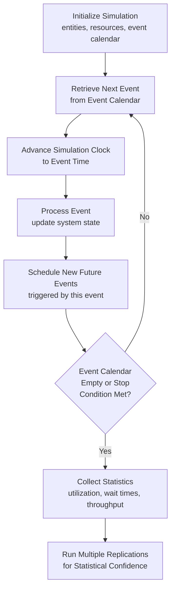

## Discrete-Event Simulation Software

### Overview

Discrete-event simulation (DES) software models systems as sequences of distinct events occurring at specific points in time, where the system state changes only at those event instants rather than continuously. For capacity planning and learning curve applications, DES provides a modeling capability that closed-form formulas (Wright's Law, queuing theory, spreadsheet models) cannot: the ability to represent stochastic variability, complex resource contention, and dynamic interactions between multiple entities (workers, machines, customers, tickets) simultaneously moving through a system over simulated time.

### Why Discrete-Event Simulation Complements Closed-Form Models

Closed-form learning curve and queuing models generally assume idealized, often deterministic or simply-distributed behavior. Real systems exhibit variability and interdependencies that these models abstract away:

- **Stochastic variability**: arrival rates, service times, and even individual learning curve progression vary randomly around their expected values; DES can sample from probability distributions for each of these rather than assuming a single expected value applies uniformly.
- **Resource contention**: multiple entities competing for shared, limited resources (a shared tool, a single QA reviewer, a database connection pool) produce queuing and blocking behavior that is difficult to capture in closed-form formulas once more than one or two resource types interact.
- **Complex, conditional logic**: routing rules, priority schemes, and conditional branching (e.g., "if defect rate exceeds X, route to rework") are naturally expressed in a simulation's event logic but awkward to encode in algebraic formulas.
- **Time-varying and interacting learning curves**: DES can model individual entities (workers) each progressing along their own learning curve simultaneously, with cross-training rotations, shift patterns, and absenteeism all interacting dynamically — capturing the kind of system-level complexity that the cross-training and workforce flexibility material described qualitatively.

### Core DES Concepts

| Concept | Description |
| --- | --- |
| Entities | The objects flowing through the system (parts, customers, tickets, patients) |
| Events | Discrete occurrences that change system state (arrival, service start, service completion, departure) |
| Resources | Limited-capacity elements entities compete for (machines, staff, equipment) |
| Queues | Waiting lines that form when entities arrive faster than resources can process them |
| Event calendar | The simulation engine's ordered list of future scheduled events, processed in time order |
| Clock advancement | The simulation clock jumps directly to the next scheduled event time, rather than advancing in fixed small increments (distinguishing DES from time-step simulation) |

### The Discrete-Event Simulation Execution Loop

### Applying DES to Capacity Planning and Learning Curves

1. **Modeling learning-curve-affected service times**: rather than using a fixed or simple-average service time, entity service times in a DES model can be made a function of that specific resource's (worker's) cumulative experience count, directly implementing Wright's or Crawford's Law at the level of individual simulated workers rather than as an aggregate formula.
2. **Modeling ramp-up scenarios stochastically**: since ramp-up planning inherently involves substantial uncertainty (in demand, defect rates, and learning progression), DES allows running many randomized replications of a ramp-up scenario to generate a distribution of possible time-to-target-capacity outcomes, rather than a single deterministic S-curve projection.
3. **Modeling cross-training and workforce flexibility**: DES can represent a pool of workers each with individual skill levels across multiple task types, dynamically routing them to whichever task is currently the bottleneck — directly simulating the Theory of Constraints subordination principle and quantifying the throughput benefit of a given cross-training strategy under realistic, variable demand.
4. **Modeling distributed/microservice capacity with realistic variability**: DES can represent request arrival variability, fan-out amplification, queuing at each service, and resource contention simultaneously, providing a more realistic capacity stress-test than static fan-out multiplication alone, particularly for validating auto-scaling policy behavior under bursty, correlated traffic patterns.
5. **Comparing automation vs. learning-curve investment scenarios**: DES can simulate both a "continue manual, let learning curve progress" scenario and an "invest in automation" scenario side-by-side under the same randomized demand pattern, generating a distribution of relative outcomes that a single deterministic crossover calculation cannot capture — particularly useful when demand volatility is a major factor in the automation investment decision.

### Verification, Validation, and Statistical Rigor

DES models require specific rigor beyond simply writing correct simulation logic:

- **Warm-up period exclusion**: many systems start in an artificial empty/idle state that doesn't represent steady-state behavior; statistics collected during this initial warm-up period are typically discarded to avoid biasing results toward unrealistic startup conditions.
- **Multiple replications**: because DES incorporates randomness, a single simulation run represents only one possible realization; running many independent replications (each with different random number seeds) and reporting confidence intervals around key metrics is standard practice, directly paralleling the Monte Carlo simulation approach described under sensitivity analysis.
- **Model validation against real data**: wherever possible, simulation outputs should be validated against actual historical system performance (a technique sometimes called "face validation" or "historical data validation") before the model is trusted for forward-looking capacity decisions.
- **Input distribution fitting**: rather than assuming arrival or service times follow a specific textbook distribution by default, well-validated DES models fit distributions to actual observed historical data (arrival time gaps, service durations) to ensure the simulation's randomness realistically reflects the real system's variability.

### Common Modeling Patterns

- **Queuing network models**: representing a system as a network of interconnected queues and servers, directly extending simple queuing theory (M/M/1, M/M/c) into more complex topologies with multiple stages, priority classes, and routing logic — a natural fit for distributed/microservice capacity modeling and multi-station production lines alike.
- **Agent-based hybrid models**: combining DES's event-driven mechanics with individual agent behavior rules (e.g., each simulated worker has their own skill profile, fatigue model, and decision logic), useful for detailed workforce flexibility and cross-training scenario analysis.
- **What-if scenario batteries**: running a structured set of DES scenarios (varying staffing levels, cross-training coverage, automation adoption, or demand growth assumptions) as a batch, producing a comparative table or distribution of outcomes across scenarios rather than a single simulation run — extending the discrete scenario analysis approach from spreadsheet modeling into a stochastic, more realistic setting.

### When DES Is (and Isn't) the Right Tool

| Favor DES When | Favor Closed-Form/Spreadsheet Models When |
| --- | --- |
| Multiple interacting resources and complex routing logic | Single-resource, single-bottleneck systems |
| Significant stochastic variability matters to the decision | Deterministic or near-deterministic behavior is an acceptable approximation |
| Individual entity-level heterogeneity matters (skill levels, priority classes) | Aggregate/average behavior is sufficient for the decision |
| Decision requires understanding the distribution of outcomes, not just the expected value | A single point estimate or simple sensitivity range is sufficient |
| Time and analytical expertise are available to build and validate a more complex model | A quick, transparent, easily-reviewed model is preferred (spreadsheet strengths) |

DES models require substantially more setup effort, specialized software or scripting skill, and validation rigor than spreadsheet models; the added complexity is justified only when the closed-form or spreadsheet approach's simplifying assumptions would materially mislead the actual capacity decision at hand.

### Common Pitfalls

- **Insufficient replications for statistical confidence**: drawing conclusions from a single simulation run (or too few replications) without reporting confidence intervals, risking decisions based on a non-representative random outcome.
- **Ignoring warm-up bias**: including statistics from the artificial startup transient in reported results, skewing utilization and wait-time metrics away from true steady-state behavior.
- **Unvalidated input distributions**: assuming convenient theoretical distributions (e.g., exponential service times) without checking them against actual historical data, potentially producing a model that behaves nothing like the real system despite superficially correct mechanics.
- **Over-engineering simplicity out of the model**: building excessive complexity and detail into a DES model when a much simpler closed-form or spreadsheet approach would have answered the actual decision question just as well, at far lower cost and with easier stakeholder review.
- **Treating simulation output as certain rather than probabilistic**: presenting a single simulation run's result as a definitive forecast rather than communicating the distribution and confidence interval across replications, understating genuine forecast uncertainty. [Inference] the appropriate number of replications needed for adequate statistical confidence is model- and metric-specific and is not fixed by a universal rule.

### Related Topics

- Queuing theory (M/M/1, M/M/c) as the analytical foundation DES extends
- Monte Carlo simulation techniques and their relationship to DES replication analysis
- Agent-based modeling for workforce flexibility and cross-training scenario analysis
- Input distribution fitting techniques for simulation model calibration
- Statistical output analysis and confidence interval construction for stochastic simulation results