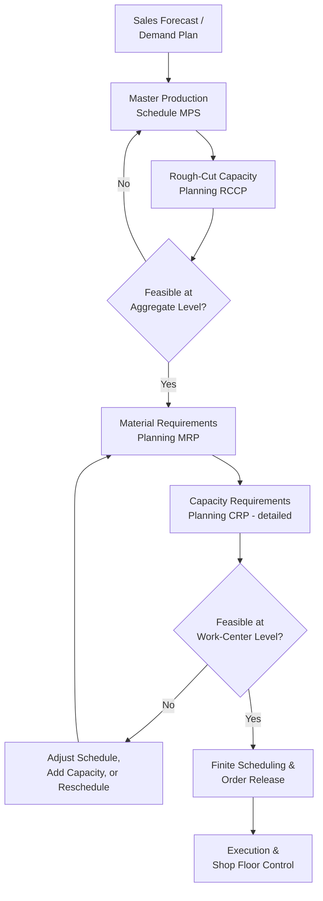

## ERP Capacity Planning Modules

### Overview

ERP (Enterprise Resource Planning) capacity planning modules are the integrated software components within larger ERP systems (such as SAP, Oracle, Microsoft Dynamics, or similar platforms) that translate production schedules, sales forecasts, and resource master data into capacity requirements and availability checks across an organization's manufacturing or service operations. Unlike standalone spreadsheet models or discrete-event simulation tools, ERP capacity modules operate as part of an integrated data environment where capacity calculations draw directly on live production orders, bills of materials, routing data, and resource calendars already maintained in the system for other business processes.

### Core ERP Capacity Planning Functions

| Function | Description |
| --- | --- |
| Rough-Cut Capacity Planning (RCCP) | High-level, fast capacity feasibility check against a master production schedule, using simplified resource profiles |
| Capacity Requirements Planning (CRP) | Detailed, work-center-level capacity calculation based on actual routings and operation-level time standards |
| Finite scheduling | Sequencing production orders against genuinely limited resource availability, respecting capacity constraints explicitly (as opposed to infinite/unconstrained scheduling) |
| Available-to-Promise (ATP) / Capable-to-Promise (CTP) | Checking whether a new customer order can be fulfilled given current inventory and/or production capacity, used for order commitment decisions |
| Resource/work center master data | Defines available capacity per resource (machine, work center, labor pool) including calendars, shift patterns, and efficiency factors |

### Rough-Cut vs. Detailed Capacity Planning

ERP systems typically implement capacity planning in two tiers of granularity, applied at different planning horizons:

- **Rough-Cut Capacity Planning (RCCP)** operates against the master production schedule at an aggregate level (e.g., total hours needed per work center per week), using simplified time-per-unit factors rather than full routing detail. This is fast enough to run interactively during sales and operations planning (S&OP) cycles, providing an early feasibility check before committing to a detailed schedule.
- **Capacity Requirements Planning (CRP)** operates against the detailed material requirements planning (MRP) output, using full routing data (specific operations, sequence, setup and run times per operation) to calculate precise capacity requirements per work center per time bucket. This is more computationally intensive and typically run less frequently or during dedicated planning cycles.

This two-tier structure mirrors the general capacity planning principle of matching model detail to planning horizon — coarse, fast models for long-horizon strategic feasibility, and detailed, precise models for near-term execution planning.

### Diagram: ERP Capacity Planning Data Flow (svg_diagram)

### Integration with Master Data

A defining characteristic of ERP capacity modules, distinguishing them from standalone tools, is their dependence on and integration with core master data already maintained for other operational purposes:

- **Routings**: define the sequence of operations required to produce an item, the work center(s) used for each operation, and standard setup/run time per operation — this same routing data drives both capacity calculations and shop floor execution instructions.
- **Work center master data**: defines available capacity (shifts, calendars, efficiency/utilization factors, and sometimes explicit downtime allowances) for each resource, forming the "supply" side of the capacity balance equation.
- **Bills of Materials (BOM)**: while primarily a materials-planning input, BOM structure interacts with capacity planning by determining which sub-assemblies and components (each with their own routing and capacity requirements) must be produced to support a given end-item production order.
- Because this data is shared across MRP, shop floor control, and costing modules, changes to routing times or work center calendars automatically propagate into capacity calculations without requiring a separate, manually-synchronized capacity model — a key integration advantage over standalone spreadsheet or simulation tools, at the cost of requiring disciplined master data governance to keep capacity calculations accurate.

### Finite vs. Infinite Capacity Scheduling

ERP systems typically support (or can be extended with advanced planning modules to support) two fundamentally different scheduling philosophies:

- **Infinite capacity scheduling**: schedules orders purely based on lead times and due dates, without checking whether a resource actually has available capacity at the scheduled time — capacity overloads are only reported after the fact via a capacity load report, requiring manual intervention to resolve.
- **Finite capacity scheduling**: actively respects capacity constraints during the scheduling process itself, sequencing and timing orders so that no resource is scheduled beyond its actual available capacity — directly implementing constraint-aware scheduling logic closer to the Theory of Constraints principles discussed earlier in this curriculum, though typically without the explicit "identify-exploit-subordinate-elevate" management framing.

Many standard ERP capacity modules default to infinite capacity logic for simplicity and speed, with finite scheduling capability available through advanced planning and scheduling (APS) add-on modules or third-party integrations for organizations where capacity constraints are a frequent, business-critical planning concern.

### Capacity Leveling and Load Balancing

When CRP or finite scheduling reveals a capacity overload at a specific work center in a specific time bucket, ERP systems typically offer several standard leveling mechanisms:

1. **Order rescheduling**: shifting orders earlier or later within available slack to smooth demand across time buckets, reducing peak load at the constrained resource.
2. **Alternative routing/work center assignment**: redirecting operations to an alternative qualified work center with available capacity, where alternative routings have been pre-defined in master data.
3. **Overtime/capacity increase flags**: identifying periods where temporary capacity increases (overtime shifts, temporary labor) would resolve an overload, feeding into the same "exploit before elevate" logic from constraint management.
4. **Subcontracting triggers**: flagging operations that could be outsourced to external suppliers when internal capacity is insufficient within the required timeframe.

### Interaction with Broader Capacity Planning Themes

- **Learning curve integration**: standard ERP routing time standards are typically static (a fixed standard time per operation) unless specifically configured otherwise; incorporating learning-curve-adjusted time standards (as covered under incorporating learning rates into capacity forecasts) often requires either periodic manual updates to routing standard times as processes mature, or integration with a specialized add-on, since native ERP capacity logic does not always model continuously declining unit times out of the box. [Unverified] the extent of native learning-curve modeling support varies significantly across specific ERP platforms and versions and should be verified against the specific system in use.
- **Ramp-up planning support**: new product introduction processes in ERP systems typically allow time-phased routing/standard-time changes (e.g., a higher standard time during initial production, stepping down at defined milestones) to approximate the ramp-up curve, though this is usually implemented as discrete time-phased steps rather than a continuous learning curve function.
- **Constraint management alignment**: CRP capacity load reports directly support the "identify the constraint" step of the Theory of Constraints 5-focusing-steps cycle by highlighting which work center is overloaded in a given period; however, translating this into the full TOC management discipline (exploit, subordinate, elevate) generally requires organizational process built around the ERP's raw capacity data rather than being automated by the ERP module itself.
- **Distributed/service capacity parallels**: the work-center-and-routing structure of ERP capacity planning has a loose conceptual parallel to per-service capacity modeling in distributed IT systems (each work center behaves like a service with its own capacity profile and queue), though the underlying software and terminology differ substantially between manufacturing ERP and IT infrastructure domains.

### Common Pitfalls

- **Stale or inaccurate master data**: since capacity calculations depend entirely on routing times and work center calendars, outdated standard times (not reflecting actual current process performance, including learning-curve improvements) produce systematically biased capacity plans that no longer match real observed throughput.
- **Relying on infinite capacity scheduling without a leveling process**: generating production schedules that look feasible on paper but silently overload specific work centers, discovered only when execution falls behind — without a disciplined manual or automated leveling review, capacity overloads can persist undetected until they cause missed due dates.
- **Treating RCCP feasibility as sufficient**: passing the aggregate-level rough-cut check does not guarantee detailed, work-center-level feasibility; skipping the more detailed CRP step for speed can allow a schedule to proceed that fails at the granular level.
- **Ignoring alternative routing and leveling options during overload resolution**: manually rescheduling or expediting without checking whether pre-defined alternative work centers, subcontracting options, or standard leveling tools could resolve an overload more efficiently.
- **Assuming native learning-curve support exists**: standard ERP capacity modules often calculate against static standard times; assuming built-in support for continuously improving capacity as cumulative volume grows, without verifying and configuring accordingly, can produce a persistent gap between the ERP capacity forecast and actual improving performance.

### Related Topics

- Master Production Scheduling (MPS) and Material Requirements Planning (MRP) integration
- Advanced Planning and Scheduling (APS) systems and finite capacity scheduling algorithms
- Available-to-Promise (ATP) and Capable-to-Promise (CTP) order commitment logic
- Routing and work center master data governance practices
- Theory of Constraints-based scheduling approaches (Drum-Buffer-Rope) versus standard ERP scheduling logic