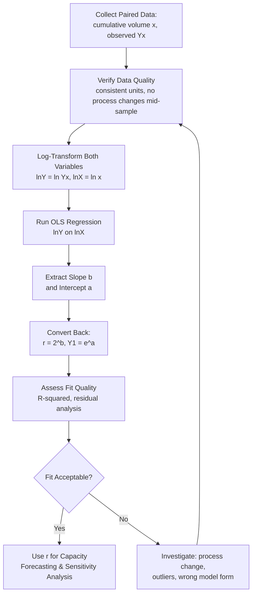

## Statistical Regression for Learning-Rate Estimation

### Overview

Statistical regression for learning-rate estimation is the quantitative method used to derive an empirical learning rate $r$ from observed production or transaction data, replacing assumed or industry-benchmark learning rates with values fitted directly to an organization's own historical performance. This method underpins the "estimate/regress" steps referenced throughout earlier topics in this curriculum — incorporating learning rates into capacity forecasts, sensitivity analysis, spreadsheet modeling, and ERP capacity planning — by providing the actual statistical technique used to produce a defensible $r$ estimate rather than a guess.

### The Linearization Approach

Wright's Law in its raw form,

$$Y_x = Y_1 \cdot x^{b}, \quad b = \frac{\ln(r)}{\ln(2)}$$

is a nonlinear power function, which is inconvenient to fit directly using ordinary least squares (OLS) regression. Taking the natural logarithm of both sides linearizes the relationship:

$$\ln(Y_x) = \ln(Y_1) + b \cdot \ln(x)$$

This is now a standard linear equation of the form $Y' = a + b \cdot X'$, where $Y' = \ln(Y_x)$, $X' = \ln(x)$, $a = \ln(Y_1)$, and $b$ is the same exponent from the original power-law model. This substitution allows the learning curve parameters to be estimated using ordinary least squares regression, a widely available and well-understood statistical method.

### Recovering the Learning Rate from the Regression Slope

Once OLS regression is run on the transformed (logged) data, the fitted slope $b$ is converted back into the learning rate using the inverse of the original exponent relationship:

$$r = 2^{b}$$

And the fitted intercept $a = \ln(Y_1)$ is converted back to the first-unit performance estimate via:

$$Y_1 = e^{a}$$

This two-step process — log-transform, run OLS, then exponentiate the results back — is the standard workflow for empirical learning curve estimation across manufacturing, service, and IT operational contexts alike.

### Step-by-Step Regression Workflow

### Assessing Fit Quality

A regression's usefulness for capacity forecasting depends heavily on how well the linearized model actually fits the data, not merely on obtaining *some* slope value:

- **R-squared ($R^2$)**: the proportion of variance in $\ln(Y_x)$ explained by $\ln(x)$; a high $R^2$ (commonly expected in the 0.85–0.99+ range for genuine learning curve phenomena) supports confidence that the power-law model is an appropriate description of the observed pattern, while a low $R^2$ suggests either substantial noise, a process change mid-sample, or that the power-law form itself may not fit this particular process well.
- **Residual analysis**: plotting residuals (differences between observed and fitted $\ln(Y_x)$ values) against $\ln(x)$ can reveal systematic patterns — a curved residual pattern suggests the pure power-law model is misspecified, while residuals that widen or narrow across the range (heteroscedasticity) suggest the variance of $Y_x$ is not constant across cumulative volume, which can affect the reliability of confidence intervals around the fitted slope.
- **Confidence intervals on the slope**: because $b$ (and therefore $r$) is estimated with sampling uncertainty, especially with limited early-stage data, reporting a confidence interval around the fitted learning rate (not just a single point estimate) directly feeds the sensitivity analysis practices covered earlier in this curriculum, providing a statistically grounded range rather than an arbitrarily chosen scenario spread.

### Sample Size and Early-Data Caveats

A critical practical limitation of regression-based learning rate estimation is that **reliable estimates require a meaningful number of data points spanning a reasonable range of cumulative volume** — early in a new process's life, this creates a difficult tension:

- With only a handful of early observations, the fitted regression line is highly sensitive to noise in those few data points, and the resulting $r$ estimate can be unstable — a single outlier early observation can swing the fitted slope substantially.
- This is precisely the period (early ramp-up) when an accurate learning rate is most valuable for capacity forecasting, creating a natural tension between needing more data for a reliable estimate and needing the estimate before that data exists.
- Standard practice addresses this by starting with an industry-benchmark or comparable-process learning rate assumption (as discussed under incorporating learning rates into capacity forecasts), then progressively re-running the regression as actual data accumulates, tightening the estimate and its confidence interval over time — treating the initial assumption as a Bayesian-style prior that gets refined rather than as a fixed input locked in from the start.

### Handling Process Changes and Structural Breaks

A common pitfall in learning-rate regression is fitting a single line across a dataset that spans a **structural break** — a point where the underlying process itself changed (new equipment, a design change, a significant personnel change, or an automation investment as discussed under balancing automation against learning-curve gains):

- Data from before and after such a change do not belong to the same learning curve; naively regressing across the full combined dataset produces a distorted slope that reflects neither the pre-change nor post-change process accurately.
- The standard remedy is to segment the data at the known (or statistically detected) break point and fit separate regressions to each segment, effectively treating the post-change process as starting a new learning curve with its own $Y_1$ and potentially its own $r$.
- **Detecting undocumented structural breaks**: when a break point is not already known from process records, visual inspection of the log-log plot (looking for a kink or discontinuity) or formal statistical structural-break tests can help identify where a single-curve assumption is no longer appropriate. [Inference] the appropriate formal test and its sensitivity depend on the specific dataset characteristics and are not reducible to a single universal procedure.

### Weighted and Robust Regression Variants

Standard OLS regression assumes each data point carries equal weight and reliability, which is not always appropriate for learning curve data:

- **Weighted least squares**: appropriate when data points represent averages over unequal batch sizes (e.g., some observations are averages over 10 units, others over 100), since averages over larger batches are typically more reliable and should be weighted more heavily in the fit.
- **Robust regression**: less sensitive to outlier observations than standard OLS, useful when isolated data points (e.g., a single unit affected by an unusual disruption) might otherwise disproportionately distort the fitted slope.
- **Rolling/windowed regression**: refitting the regression on a moving window of the most recent data (rather than the full historical dataset) can better capture a learning rate that is genuinely evolving over time, at the cost of discarding potentially useful older data — appropriate when there is reason to believe the underlying rate itself is not constant across the full production history.

### Practical Example

A support operation (echoing the service capacity planning context) has tracked average handle time (AHT) for a new ticket category across cumulative ticket volume:

| Cumulative Tickets ($x$) | Observed AHT ($Y_x$, minutes) | $\ln(x)$ | $\ln(Y_x)$ |
| --- | --- | --- | --- |
| 25 | 22.4 | 3.22 | 3.11 |
| 100 | 18.1 | 4.61 | 2.90 |
| 400 | 14.9 | 5.99 | 2.70 |
| 1,600 | 12.3 | 7.38 | 2.51 |

Running OLS on $\ln(Y_x)$ against $\ln(x)$ yields a slope $b \approx -0.144$, giving $r = 2^{-0.144} \approx 0.905$, or a 90.5% learning rate — this fitted value, together with its confidence interval, replaces whatever initial benchmark assumption was used to build the earliest capacity forecasts for this ticket category, and would be used going forward until further data justifies re-estimation.

### Common Pitfalls

- **Regressing across a structural break without segmentation**: producing a distorted, practically meaningless learning rate by combining pre- and post-change data as if they belonged to a single continuous learning curve.
- **Over-relying on a low-sample-size early estimate**: treating a regression fitted on only a handful of early observations as a stable, final value rather than an initial estimate expected to tighten with more data.
- **Ignoring poor fit quality**: proceeding to use a fitted $r$ for capacity forecasting despite a low $R^2$ or clearly patterned residuals, without investigating whether the power-law model form is actually appropriate for this specific process.
- **Confusing cumulative-average and per-unit data in the regression**: mixing Wright's Law (cumulative average) and Crawford's Law (per-unit) style observations within the same regression dataset, producing a fitted slope that doesn't cleanly correspond to either model's intended interpretation.
- **Failing to update the estimate over time**: treating an initial regression result as permanent rather than as part of a rolling recalibration process, missing genuine drift in the learning rate as the process, workforce, or technology evolves.

### Related Topics

- Ordinary least squares regression fundamentals and residual diagnostics
- Structural break detection methods in time-series and cumulative production data
- Weighted and robust regression techniques for noisy operational data
- Confidence interval construction and its role in sensitivity analysis of capacity plans
- Bayesian updating approaches to learning rate estimation with limited early data