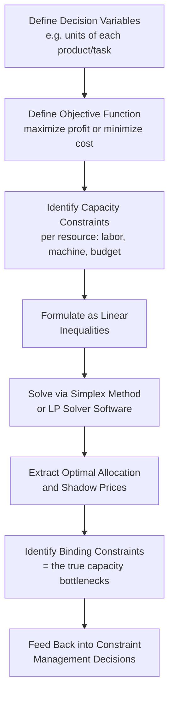

## Linear Programming for Capacity Allocation

### Overview

Linear programming (LP) for capacity allocation is a mathematical optimization technique that determines how to allocate limited resources (labor hours, machine time, budget, cloud instances) across competing demands to maximize or minimize an objective (throughput, profit, cost) subject to a set of linear constraints. Where earlier topics in this curriculum addressed *forecasting* capacity (learning curves, ramp-up models, regression) and *monitoring* capacity (load testing, error budgets), linear programming addresses the distinct problem of *optimally allocating* a fixed or constrained capacity pool across multiple products, tasks, or services when simple heuristics are insufficient to find the best allocation.

### The Standard LP Formulation

A linear program consists of three components: an objective function, decision variables, and a set of linear constraints.

$$\text{Maximize (or Minimize): } Z = \sum_{i=1}^{n} c_i x_i$$

Subject to:

$$\sum_{i=1}^{n} a_{ij} x_i \leq b_j \quad \text{for each constraint } j$$

$$x_i \geq 0$$

Where:

- $x_i$ = decision variables (e.g., units of product $i$ to produce, hours allocated to task $i$)
- $c_i$ = objective coefficients (e.g., profit per unit, cost per hour)
- $a_{ij}$ = resource consumption coefficient (e.g., hours of resource $j$ required per unit of $x_i$)
- $b_j$ = available capacity of resource $j$ (the capacity constraint itself)

### Why LP Fits Capacity Allocation Problems Naturally

Capacity allocation problems frequently have the exact structure LP is designed to solve: multiple products or activities compete for the same limited resources (labor hours, machine time, budget), and the goal is to find the allocation that best achieves an objective without violating any resource's capacity limit. This directly formalizes the Theory of Constraints intuition — that a system's constrained resource(s) determine the achievable outcome — into a solvable mathematical structure rather than a purely heuristic 5-focusing-steps process.

### Classic Formulation: Product Mix Under Capacity Constraints

A canonical capacity allocation LP determines the optimal production mix across multiple products, each requiring different amounts of shared, limited resources:

| Product | Profit/Unit | Resource A (hrs/unit) | Resource B (hrs/unit) |
| --- | --- | --- | --- |
| Product 1 | $40 | 2 | 1 |
| Product 2 | $30 | 1 | 3 |
| Available Capacity | — | 100 hrs | 90 hrs |

The LP formulation:

$$\text{Maximize } Z = 40x_1 + 30x_2$$

$$\text{Subject to: } 2x_1 + x_2 \leq 100 \quad \text{(Resource A)}$$

$$x_1 + 3x_2 \leq 90 \quad \text{(Resource B)}$$

$$x_1, x_2 \geq 0$$

Solving this (via the simplex method or LP solver software) identifies the exact production quantities $x_1$ and $x_2$ that maximize total profit without exceeding either resource's available capacity — directly answering the capacity allocation question rather than relying on trial-and-error or single-constraint heuristics.

### Diagram: LP Capacity Allocation Workflow (svg_diagram)

### Shadow Prices: The Direct Link to Constraint Management

One of LP's most operationally valuable outputs, beyond the optimal solution itself, is the **shadow price** (dual value) associated with each constraint — the marginal value of relaxing that constraint by one unit:

$$\text{Shadow Price}_j = \frac{\partial Z^*}{\partial b_j}$$

A shadow price of zero indicates the constraint is **non-binding** (there is slack/unused capacity in that resource at the optimal solution), while a positive shadow price indicates a **binding constraint** — the true capacity bottleneck limiting further improvement of the objective. This provides a rigorous, quantitative identification of exactly which resource constitutes the system's constraint, directly operationalizing the "identify the constraint" step from Theory of Constraints with an exact marginal value attached, rather than relying on qualitative observation alone.

- A high shadow price on a given resource indicates that adding capacity there would yield a large marginal improvement in the objective — directly informing the "elevate the constraint" investment decision with a quantified expected return.
- Resources with zero shadow price (non-binding, slack capacity) should not be prioritized for additional investment, since relaxing them would not improve the objective at the current optimal allocation — this is the LP-formalized version of the general capacity planning caution against optimizing non-constraint resources.

### Integer and Mixed-Integer Programming Extensions

Pure LP assumes decision variables can take any continuous (fractional) value, which is often unrealistic for capacity allocation decisions involving discrete units:

- **Integer Programming (IP)**: requires some or all decision variables to take integer values (e.g., you cannot allocate 3.7 workers to a shift, or purchase 2.5 machines) — solved using specialized branch-and-bound or branch-and-cut algorithms rather than the standard simplex method.
- **Mixed-Integer Programming (MIP)**: combines continuous and integer variables in the same model, common in capacity allocation problems that mix continuous resource quantities (e.g., budget dollars) with discrete decisions (e.g., whether to open a new facility, represented as a binary 0/1 variable).
- **Binary decision variables**: frequently used to represent yes/no capacity investment decisions (e.g., "should we build this additional line," "should we automate this station" — directly connecting to the automation-versus-learning-curve investment decision, where LP/MIP can jointly optimize *which* automation investments to make across multiple candidate processes subject to a limited capital budget, rather than evaluating each investment decision in isolation).

### Multi-Period and Multi-Resource Extensions

Real capacity allocation problems often span multiple time periods and multiple interacting resource types simultaneously, extending the basic single-period formulation:

- **Multi-period LP**: decision variables are indexed by time period as well as product/task, with constraints linking periods together (e.g., inventory carried over, cumulative capacity used-to-date affecting a learning-curve-adjusted resource requirement in later periods) — this is the natural LP extension for incorporating the time-varying capacity from learning-curve-adjusted forecasts directly into an allocation optimization rather than treating capacity as a fixed constant across the planning horizon.
- **Network flow formulations**: for capacity allocation across a distributed or multi-stage system (e.g., allocating traffic or work across multiple services in a dependency chain, echoing the distributed/microservice capacity planning theme), LP can be formulated as a network flow problem, where capacity constraints exist on each "edge" or node in the network, directly modeling the fan-out and dependency-chain considerations discussed earlier.
- **Stochastic/robust LP variants**: since capacity constraints and demand are rarely known with certainty, extensions such as stochastic programming (optimizing expected value across demand scenarios) or robust optimization (optimizing against worst-case scenarios within an uncertainty set) address the same sensitivity concerns raised under sensitivity analysis of capacity plans, but embed the uncertainty directly into the optimization formulation rather than analyzing it after the fact.

### Practical Example

A support organization (echoing the service capacity planning context) must allocate a fixed pool of 500 agent-hours per week across three ticket categories, each with different resolution value and different average handle time:

| Category | Value per Resolved Ticket | AHT (hrs) | Max Demand (tickets/week) |
| --- | --- | --- | --- |
| Category A | $15 | 0.5 | 400 |
| Category B | $25 | 0.4 | 300 |
| Category C | $10 | 0.25 | 600 |

Formulated as an LP maximizing total value subject to the 500-hour capacity constraint and demand caps per category, the solver identifies the ticket-count allocation across categories that maximizes total resolved value — and the shadow price on the 500-hour constraint quantifies exactly how much additional value one more agent-hour of capacity would generate, directly informing a staffing investment decision with a precise dollar figure rather than a qualitative judgment.

### Common Pitfalls

- **Treating a genuinely nonlinear relationship as linear**: LP assumes proportional (linear) resource consumption and objective contribution; forcing a nonlinear relationship (such as the power-law learning curve's declining unit cost) into a linear approximation without acknowledgment can distort the optimal allocation, particularly across widely varying volume levels — piecewise-linear approximations or nonlinear programming extensions may be needed when this nonlinearity is material.
- **Ignoring integer/discreteness requirements**: applying a pure continuous LP to a problem with genuinely discrete decisions (whole shifts, whole machines, binary invest/don't-invest choices) can produce a fractional "optimal" solution that isn't actually implementable, requiring the more complex integer or mixed-integer programming extensions instead.
- **Misinterpreting shadow prices outside their valid range**: shadow prices are only valid for small changes in the constraint's right-hand side (within a specific "ranging" interval); using a shadow price to estimate the value of a large capacity increase (e.g., doubling a resource) rather than a marginal unit increase can produce a substantially incorrect valuation.
- **Static single-period formulations for genuinely dynamic problems**: applying a single-period LP to a problem that actually involves time-varying capacity (due to learning curves, seasonal demand, or phased capacity investments) can miss inter-period trade-offs that a multi-period formulation would capture.
- **Ignoring demand and cost uncertainty**: relying on a deterministic LP formulated against point-estimate demand and cost figures without considering how sensitive the optimal allocation is to those estimates, missing the same uncertainty risks flagged under sensitivity analysis of capacity plans more broadly. [Inference] the appropriate choice between deterministic LP, stochastic programming, and robust optimization depends on the specific decision's cost of being wrong and is not determined by a single universal rule.

### Related Topics

- Simplex method and interior-point algorithms for solving linear programs
- Mixed-integer programming (MIP) for discrete capacity investment decisions
- Network flow optimization for multi-stage and distributed capacity allocation
- Stochastic and robust optimization under demand and capacity uncertainty
- Shadow price interpretation and its connection to Theory of Constraints bottleneck identification