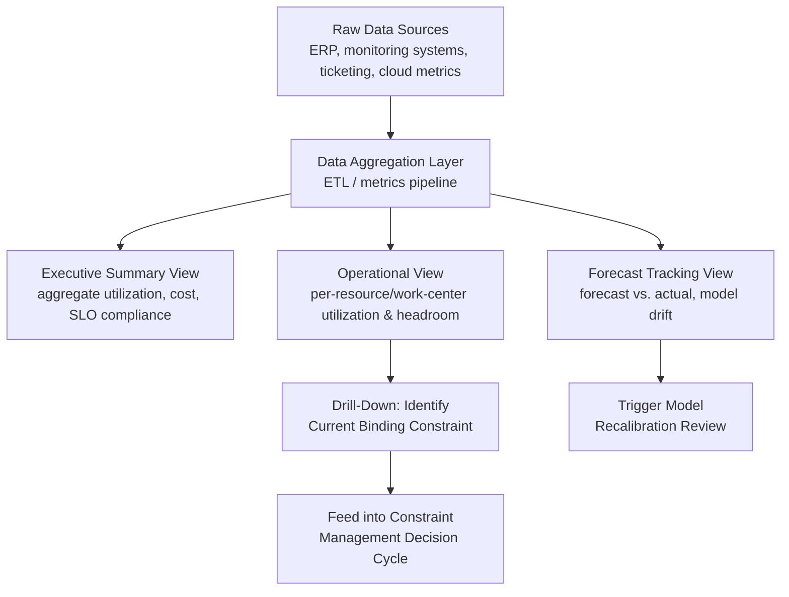

## Capacity Dashboards and Utilization Reporting

### Overview

Capacity dashboards and utilization reporting are the visualization and communication layer that translates raw capacity metrics, forecasts, and model outputs into actionable, continuously monitored information for operational decision-makers. Where earlier topics in this curriculum focused on the underlying mathematics and modeling techniques (learning curves, regression, LP, simulation), dashboards and reporting address the practical question of how that information is surfaced, tracked over time, and acted upon by the people who make staffing, scheduling, and investment decisions day to day.

### Core Purposes of Capacity Dashboards

- **Real-time situational awareness**: showing current utilization against capacity limits so operators and managers can detect approaching constraints before they cause service degradation or missed commitments.
- **Historical trend visibility**: tracking utilization, throughput, and capacity metrics over time to reveal gradual drift, seasonal patterns, or the effects of process changes — directly supporting the trend-based forecasting and regression re-estimation practices discussed earlier.
- **Forecast-versus-actual tracking**: comparing capacity forecasts (from learning curve models, ERP capacity plans, or cloud auto-scaling projections) against what actually occurred, closing the feedback loop needed for rolling recalibration.
- **Bottleneck/constraint identification**: surfacing which specific resource, work center, or service is currently the binding constraint, operationalizing the "identify" step of Theory of Constraints management as a continuously visible signal rather than a periodic manual analysis.
- **Cross-functional communication**: providing a shared, common reference point for operations, finance, and leadership to discuss capacity trade-offs (staffing, automation investment, cloud spend) using consistent, agreed-upon metrics.

### Key Metrics for Capacity Dashboards

| Metric Category | Example Metrics | Relevance |
| --- | --- | --- |
| Utilization | % utilization per resource/work center/service | Core signal for headroom and bottleneck detection |
| Throughput | Units/transactions/tickets processed per period | Measures actual output against capacity |
| Queue/backlog | Work-in-process, queue depth, backlog age | Signals building pressure before utilization metrics fully reflect it |
| Forecast accuracy | Forecast vs. actual variance | Validates and calibrates underlying capacity models |
| Cost efficiency | Cost per unit/transaction, cost vs. budget | Connects capacity utilization to cost-aware optimization goals |
| Quality/error rate | Defect rate, SLA/SLO compliance | Guards against capacity gains achieved at the expense of quality (the speed-quality trade-off) |

### Dashboard Design Principles for Capacity Reporting

1. **Lead with the constraint, not the average**: since system throughput is bounded by the single binding constraint (per Theory of Constraints), a dashboard that only shows average utilization across all resources can obscure a critical bottleneck at one specific resource; effective dashboards prominently surface the current highest-utilization or most at-risk resource rather than burying it in an aggregate view.
2. **Show headroom explicitly, not just raw utilization**: displaying the gap to a defined safe threshold (e.g., "72% of 80% safe limit" rather than just "72%") makes the actionable signal — how much room remains — immediately visible rather than requiring the viewer to mentally compare against a remembered threshold.
3. **Pair capacity metrics with quality/SLO metrics side by side**: isolating utilization or throughput metrics from quality and SLO compliance risks presenting an incomplete, potentially misleading picture — a dashboard showing rising throughput without adjacent error-rate or SLO-compliance context can mask quality degradation.
4. **Distinguish forecast from actual visually**: overlaying forecasted capacity/demand against actual observed values (rather than showing them as separate, hard-to-compare views) makes forecast accuracy and drift immediately apparent, directly supporting model recalibration decisions.
5. **Segment appropriately**: dashboards aggregated at too high a level (e.g., total company-wide utilization) can hide localized constraints; capacity dashboards should generally support drill-down from aggregate views to the specific work center, service, or task category level where a constraint actually resides.

### Diagram: Capacity Dashboard Information Architecture (svg_diagram)

### Alerting and Threshold-Based Reporting

Beyond passive visualization, mature capacity reporting systems incorporate active alerting so that approaching constraints surface proactively rather than requiring someone to notice them on a dashboard:

- **Static threshold alerts**: notify when utilization crosses a fixed threshold (e.g., 80% sustained utilization), directly mirroring the safe-operating-headroom concept from general IT capacity planning and the error-budget burn-rate alerting from SRE practice.
- **Trend-based/predictive alerts**: notify based on the trajectory toward a threshold (e.g., "at current growth rate, this resource will breach its safe threshold within 2 weeks") rather than only reacting once the threshold is already crossed, providing more lead time for proactive capacity actions.
- **Anomaly detection**: flag utilization or throughput patterns that deviate significantly from historical norms, catching unusual capacity consumption (a runaway process, an unexpected demand spike, a misconfigured auto-scaling policy) before it develops into a full constraint or cost problem, echoing the cost anomaly detection practices discussed under cloud cost optimization.

### Connecting Dashboards to the Constraint Management Cycle

Capacity dashboards serve as the continuous monitoring backbone for the Theory of Constraints Five Focusing Steps cycle covered earlier in this curriculum:

- **Identify**: the dashboard's highest-utilization or most frequently threshold-breaching resource is the empirical signal for where the current constraint resides, replacing ad hoc or intuition-based constraint identification with data-driven visibility.
- **Exploit/Subordinate**: utilization dashboards for non-constraint resources help confirm whether subordination is actually happening — non-constraint resources should show intentionally lower utilization or idle time when properly subordinated to the constraint's schedule, and a dashboard revealing unexpectedly high utilization elsewhere may indicate subordination isn't being followed.
- **Elevate**: forecast-tracking views showing a resource consistently approaching or breaching its safe threshold over multiple reporting periods provide the evidentiary basis for capacity investment decisions (staffing increases, automation, cloud scaling limit increases).
- **Repeat**: because constraints migrate after being resolved (per the 5FS "repeat" step), dashboards must continue monitoring across all resources rather than narrowing focus permanently to the just-resolved constraint, catching the new bottleneck as it emerges.

### Reporting Cadence and Audience Tailoring

Different stakeholders require different levels of detail and different reporting rhythms:

| Audience | Typical Cadence | Level of Detail |
| --- | --- | --- |
| Shop floor / operational staff | Real-time / continuous | Highly granular, per-resource, actionable now |
| Team/department managers | Daily/weekly | Work-center or team-level aggregation, trend context |
| Executive/leadership | Monthly/quarterly | High-level aggregate trends, cost implications, major constraint shifts |
| Finance/FinOps | Monthly/quarterly | Cost-per-unit, utilization-versus-spend efficiency, budget variance |

Presenting overly granular data to an executive audience (or overly aggregated data to operational staff needing to make immediate decisions) undermines the dashboard's usefulness regardless of how accurate the underlying data is — matching detail level to the audience's actual decision-making needs is as important as the accuracy of the metrics themselves.

### Common Pitfalls

- **Vanity metrics without actionable thresholds**: displaying utilization or throughput numbers without any indication of what constitutes a healthy, at-risk, or critical level, leaving viewers unable to distinguish normal variation from a genuine emerging problem.
- **Averaging away the constraint**: presenting only system-wide or department-wide average utilization, which can mask a single severely overloaded resource within an otherwise healthy-looking aggregate.
- **Reporting utilization without quality/SLO context**: showing rising throughput or utilization improvements without paired quality metrics, risking celebration of gains that are actually being achieved through quality degradation (the speed-quality trade-off flagged under service capacity planning).
- **Stale or infrequently updated dashboards**: capacity dashboards that lag significantly behind real operational conditions lose their value for proactive constraint management, effectively reverting the organization to reactive, after-the-fact capacity management.
- **Alert fatigue from poorly tuned thresholds**: overly sensitive alerting thresholds that fire frequently on normal variation train recipients to ignore alerts, undermining the entire purpose of proactive threshold-based reporting — thresholds should be calibrated against genuine historical variability, not set arbitrarily. [Inference] the appropriate threshold sensitivity is specific to each metric's natural variability and is not governed by a single universal setting.

### Related Topics

- Metrics pipeline and ETL architecture for operational dashboards
- Alerting and anomaly detection design for operational monitoring systems
- Forecast accuracy tracking and rolling model recalibration practices
- Theory of Constraints-aligned dashboard design for bottleneck visibility
- FinOps cost dashboards and their integration with capacity utilization reporting