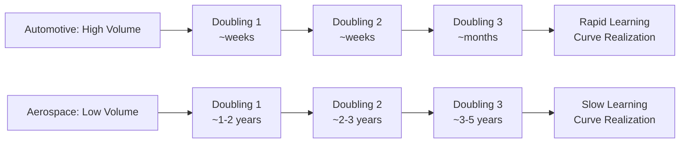

## Capacity Planning in Automotive and Aerospace Manufacturing

### Overview

Capacity planning in automotive and aerospace manufacturing applies the general capacity planning, learning curve, and constraint management principles covered throughout this curriculum to two industries with distinctive production characteristics: automotive's high-volume, tightly synchronized assembly-line environments, and aerospace's low-volume, high-complexity, long-lifecycle production. Both industries were historically foundational to the development of these methods — aerospace directly originated the learning curve concept, as covered under historical origins in aircraft manufacturing — but they now apply the resulting toolkit in structurally different ways due to their differing volume, complexity, and regulatory environments.

### Structural Differences Between the Two Industries

| Dimension | Automotive | Aerospace |
| --- | --- | --- |
| Production volume | High (thousands to millions of units/year) | Low (tens to low thousands of units/year) |
| Product complexity | Moderate, highly standardized platforms | Very high, extensive customization and certification requirements |
| Learning curve doublings achieved | Many, over relatively short calendar time | Few, over long calendar time (each doubling may take years) |
| Capacity planning horizon | Shorter, more frequent model changeovers | Very long, often spanning decades for a single platform |
| Regulatory oversight | Significant but generally lighter-touch than aerospace | Extremely stringent (FAA, EASA certification requirements) |
| Supply chain depth | Deep, global, highly synchronized (just-in-time common) | Deep but often more specialized, lower-volume, longer-lead-time suppliers |

### Automotive Capacity Planning Characteristics

**Just-in-Time (JIT) and Synchronized Flow**: Automotive assembly is historically the origin of many lean manufacturing and JIT principles, where capacity planning is tightly coupled with minimizing inventory buffers and synchronizing supplier delivery with the exact assembly line takt time. This creates a capacity planning environment where:

- **Takt time governs capacity**: the line's cycle time (takt time) is set to match customer demand rate, and capacity planning becomes fundamentally about ensuring every station on the line can complete its operations within that takt time — a direct application of the Theory of Constraints principle that the slowest station governs overall line throughput.
- **High doubling frequency accelerates learning curve effects**: because automotive volumes are large, cumulative production doublings occur relatively quickly, meaning learning-curve-driven labor efficiency gains (as modeled by Wright's Law) compound rapidly within a single model's early production life, making learning-rate-adjusted capacity forecasting (as covered under incorporating learning rates into capacity forecasts) particularly impactful during new model launches.
- **Model changeover capacity planning**: periodic retooling for new vehicle model years or generations creates recurring ramp-up planning events, structurally similar to the general ramp-up planning for new production lines topic, but occurring on a predictable, recurring cycle rather than as a one-time event.
- **Platform sharing and flexible tooling**: many modern automotive plants use flexible tooling capable of producing multiple models on the same line, which introduces a capacity allocation problem across product variants analogous to the linear programming product-mix formulation covered earlier, optimizing the mix of models produced within shared capacity constraints.

**Automotive Supply Chain Capacity Interdependency**: Because automotive JIT systems minimize buffer inventory, capacity constraints anywhere in the multi-tier supplier network can rapidly propagate to final assembly — a phenomenon dramatically illustrated by semiconductor supply shortages affecting vehicle production in recent years, where a constraint several supply-chain tiers removed from final assembly became the binding constraint for the entire system, exactly matching the Theory of Constraints principle that the weakest link anywhere in the chain governs overall throughput.

### Aerospace Capacity Planning Characteristics

**Low-Volume, Long-Horizon Learning Curves**: Because aerospace platforms produce far fewer units than automotive, learning curve doublings take much longer to accumulate — a commercial aircraft program might take years to double cumulative production, compared to weeks or months in automotive. This has direct capacity planning implications:

- **Slower realization of learning-curve cost reductions**: the labor-hour reductions predicted by Wright's Law and Crawford's Law (both originally derived from aerospace data) unfold over a much longer calendar timeframe, meaning capacity and cost forecasts must plan for a multi-year, rather than multi-month, learning trajectory.
- **Greater sensitivity to learning rate assumption error**: because so few doublings occur before major program milestones (certification, delivery commitments), an inaccurate learning rate assumption has more time to compound into significant forecast error before enough actual data accumulates to correct it via regression — directly connecting to the sensitivity analysis and statistical regression estimation challenges discussed earlier, which are especially acute in this low-doubling-frequency environment.
- **Certification and regulatory gating of capacity ramp**: unlike automotive, aerospace capacity ramp-up is gated not only by workforce learning and process debugging but by regulatory certification milestones (type certification, production certification) that can hold ramp-up at a fixed rate regardless of underlying learning curve readiness, introducing an external constraint the pure learning-curve model does not capture.

**High Complexity and Configuration Management**: Aerospace products typically involve extensive customization per customer order (engine options, interior configurations, avionics packages), meaning "cumulative volume" for learning curve purposes is often tracked per major structural assembly or subsystem rather than per fully identical end unit, requiring more careful application of the learning curve model's assumption of task repetition than in automotive's more standardized production.

### Diagram: Learning Curve Doubling Pace Comparison (svg_diagram)

### Shared Application of Constraint Management Principles

Despite their structural differences, both industries apply Theory of Constraints-style thinking to capacity bottleneck resolution, though at different scales:

- **Automotive**: bottleneck identification often occurs at the individual line-station level (a specific weld station or paint booth constraining line takt time) or at the tier-1/tier-2 supplier level (a specific component supplier constraining overall vehicle output) — the high-frequency, high-volume environment allows for rapid, near-continuous application of the 5-Focusing-Steps cycle as bottlenecks are identified and resolved on short cycles.
- **Aerospace**: bottleneck identification more often occurs at the major-subassembly level (e.g., a specific structural component or specialized subsystem with long lead times and limited qualified suppliers) or at the certification/regulatory-approval stage itself, which can function as a non-physical but very real capacity constraint on the overall production ramp — resolution cycles are correspondingly much longer, often spanning months or years rather than days or weeks.

### ERP and Advanced Planning System Usage

Both industries rely heavily on the ERP capacity planning modules described earlier in this curriculum, but with different emphases:

- **Automotive** typically emphasizes finite capacity scheduling and just-in-time sequencing logic tightly integrated with supplier systems, given the high volume and tight synchronization requirements — advanced planning and scheduling (APS) systems layered on top of core ERP are common given the need for detailed, near-real-time line balancing.
- **Aerospace** typically emphasizes configuration management and long-lead-time procurement planning within ERP systems, given the high degree of product customization and the extended supplier lead times for specialized components — capacity requirements planning (CRP) here often spans a much longer planning horizon per production order than automotive's shorter-cycle equivalents.

### Common Pitfalls Specific to These Industries

- **Applying automotive-paced learning curve expectations to aerospace programs**: assuming labor-hour reductions will materialize on an automotive-like timescale when actual aerospace doubling frequency is far slower, leading to overly optimistic near-term cost or capacity forecasts.
- **Underestimating supply chain capacity interdependency in JIT automotive systems**: focusing capacity planning exclusively on final assembly capacity while underestimating how a constraint several supplier tiers upstream can become the binding constraint for the entire system, given minimal buffer inventory in JIT environments.
- **Treating certification milestones as pure calendar events rather than capacity constraints**: in aerospace, failing to model regulatory certification and approval processes as genuine capacity-gating constraints (with their own "capacity" in terms of review throughput) alongside physical production capacity, understating a major source of ramp-up delay risk.
- **Insufficient learning-rate re-estimation given sparse aerospace data**: given aerospace's slow doubling pace, an initial learning rate assumption may remain effectively unvalidated by fresh regression data for a long period; programs that fail to periodically reassess this assumption using whatever data is available risk carrying a stale, potentially inaccurate rate for an extended, cost-consequential period.
- **Ignoring configuration/variant effects on cumulative volume tracking**: in highly customized aerospace production, naively treating all units as identical for learning curve cumulative volume purposes (ignoring configuration-driven variation in actual labor content) can distort the resulting $Y_x$ estimates. [Inference] the appropriate method for normalizing cumulative volume across configuration variants is program-specific and not governed by a single standard approach.

### Related Topics

- Just-in-time (JIT) manufacturing and takt time-based line balancing
- Aerospace program certification processes and their interaction with production ramp-up
- Multi-tier supply chain capacity risk management
- Configuration management and variant-driven learning curve tracking
- Advanced Planning and Scheduling (APS) systems for high-volume synchronized assembly