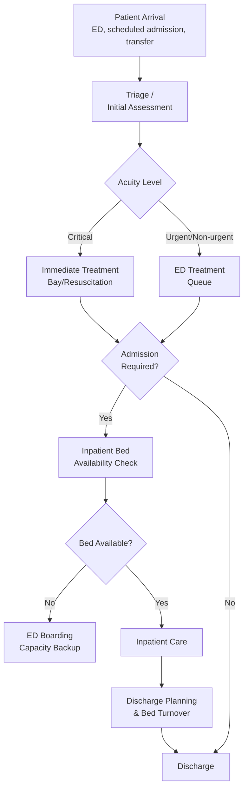

## Capacity Planning in Healthcare Service Delivery

### Overview

Capacity planning in healthcare service delivery applies the general capacity planning, queuing, and learning curve principles covered throughout this curriculum to an environment defined by high-stakes variability, regulatory constraints, and the inseparability of capacity decisions from patient safety and outcomes. Unlike manufacturing or even general service capacity planning, healthcare capacity decisions directly affect clinical outcomes, and unlike most IT or industrial systems, "demand" often cannot be deferred, shed, or rate-limited without direct human consequence — a patient in acute need cannot simply wait in an unbounded queue the way a lower-priority support ticket might.

### Structural Characteristics That Distinguish Healthcare Capacity Planning

| Characteristic | Implication for Capacity Planning |
| --- | --- |
| High demand variability and unpredictability | Unlike scheduled manufacturing, emergency demand arrives stochastically and cannot be smoothed by production scheduling |
| Inability to shed or defer critical demand | Unlike IT load shedding, life-critical patient care cannot simply be rejected under capacity pressure |
| Multiple interacting resource types | Beds, staff (by specialty), equipment, and operating rooms must all be jointly available for care to proceed |
| Regulatory and credentialing constraints | Staff capacity is bounded not just by headcount but by licensure, credentialing, and scope-of-practice rules |
| High cost of both under- and over-capacity | Underinvestment risks patient harm and staff burnout; overinvestment strains already-constrained healthcare budgets |
| Strong learning-curve and quality interaction | Clinical learning curves affect not just speed but patient safety outcomes directly |

### Queuing Theory Application in Healthcare

Healthcare capacity planning draws directly on queuing models (introduced under general IT capacity planning fundamentals) but applies them to patient flow rather than digital transactions:

- **Emergency department (ED) capacity modeling**: patient arrivals are frequently modeled using queuing theory (e.g., M/M/c-style models with $c$ representing available treatment bays or physicians), where the objective is minimizing wait time and boarding time while respecting realistic staffing constraints.
- **Bed capacity and hospital-wide patient flow**: modeling patient flow across the full care pathway (ED → inpatient bed → discharge) as a network of interconnected queues, directly analogous to the queuing network models discussed under discrete-event simulation software, since a bottleneck anywhere in this chain (e.g., insufficient downstream inpatient beds) can back up patients in the ED even when ED-specific capacity appears adequate — a direct healthcare parallel to the fan-out and dependency-chain bottleneck effects covered under distributed systems capacity planning.
- **Operating room (OR) scheduling**: OR capacity is a classic constrained-resource allocation problem, often addressed using the same linear programming and scheduling optimization techniques covered under linear programming for capacity allocation, balancing surgeon availability, case duration variability, and equipment/room availability.

### The Clinical Learning Curve

Healthcare exhibits a distinctive and well-documented version of the learning curve phenomenon, with direct patient safety implications not present in most other capacity planning contexts:

- **Procedure-specific learning curves**: surgical and procedural outcomes (complication rates, procedure duration, success rates) have been shown in clinical research to follow learning-curve-like improvement patterns as an individual clinician or care team accumulates case volume in a specific procedure — directly analogous to Wright's Law, but with the "output" metric being a clinical outcome or duration rather than pure labor hours.
- **Institutional vs. individual learning curves**: similar to the individual-versus-team distinction raised under service capacity planning, healthcare learning curves separate an individual clinician's personal experience curve from the broader institutional/team learning that persists through staff turnover (protocols, checklists, team coordination familiarity) — this distinction has particularly high stakes here, since losing institutional learning through staff turnover can directly affect patient safety outcomes, not merely productivity.
- **New technique/technology adoption curves**: when a hospital adopts a new surgical technique, device, or technology, both individual clinicians and the broader care team move down a learning curve during which complication rates and procedure times are typically elevated relative to eventual steady-state performance — directly paralleling the ramp-up planning concepts from manufacturing, but with quality/safety monitoring taking priority over pure throughput optimization during the ramp period.

### Diagram: Healthcare Patient Flow as a Constrained Queuing Network (svg_diagram)

### Staffing Capacity and Credentialing Constraints

Unlike general workforce flexibility, healthcare staffing capacity is bounded by regulatory and credentialing structures that limit how freely labor can be reallocated across roles, creating a distinctive constraint on the cross-training approach discussed earlier in this curriculum:

- **Scope-of-practice limitations**: a nurse cannot be reassigned to perform physician-level tasks regardless of experience or willingness, and specific procedures often require specific certifications — meaning the "cross-training" flexibility model from general workforce planning applies only within regulatory bounds, not universally across all tasks.
- **Nurse-to-patient ratio regulations**: many jurisdictions mandate minimum staffing ratios by unit type, creating hard regulatory capacity floors that function similarly to the minimum instance bounds in cloud auto-scaling, but are externally imposed rather than internally chosen for cost/risk trade-offs.
- **Specialist availability as a hard constraint**: certain specialties (e.g., specific surgical subspecialties) may have very limited local supply, creating a capacity constraint that cannot be resolved through the general "elevate the constraint" playbook (hiring, training) on any reasonably short timeframe, unlike most manufacturing or service capacity constraints.

### Capacity Planning Tensions Specific to Healthcare

1. **Surge capacity planning**: healthcare systems must plan for infrequent but severe demand surges (mass casualty events, pandemic surges, seasonal illness peaks) that require maintaining reserve capacity that sits idle most of the time — a starkly different cost/benefit calculus than the general cost-aware capacity optimization principles applied in cloud or manufacturing contexts, where idle capacity is more straightforwardly treated as pure waste.
2. **Quality-throughput trade-off with heightened stakes**: the speed-versus-quality tension discussed under service capacity planning is present in healthcare with substantially higher stakes — pushing clinical throughput too aggressively during a learning curve or capacity crunch can directly translate to patient harm, not merely customer dissatisfaction.
3. **Regulatory capacity planning requirements**: many healthcare systems face explicit regulatory reporting and planning requirements around capacity (e.g., certificate-of-need processes for major capacity expansions in some jurisdictions), introducing an external governance layer on capacity investment decisions not present in most other industries covered in this curriculum.
4. **Interaction between capital capacity (beds, equipment) and workforce capacity**: adding physical capacity (new beds, new operating rooms) is only useful if matched with corresponding staffing capacity, and healthcare systems frequently face situations where physical capacity sits unused due to staffing shortages — directly illustrating the Theory of Constraints principle that the true constraint may not be the resource that initially appears most visible or most invested in.

### Common Pitfalls

- **Planning capacity around average demand rather than variability and surge**: healthcare demand variability (especially in emergency and urgent care settings) is often higher than in many industrial contexts; capacity plans anchored to average daily volume without adequate buffer for variability risk chronic overcrowding and boarding.
- **Treating physical capacity and staffing capacity as independently sufficient**: adding beds or equipment without ensuring corresponding staffing capacity produces capacity that exists on paper but cannot actually be utilized, a healthcare-specific version of the general capacity planning principle that all required resource dimensions must be jointly available.
- **Underestimating institutional learning curve loss from turnover**: given healthcare's direct patient-safety stakes, failing to invest in documentation, protocols, and team-level knowledge retention (echoing the organizational memory systems topic) to protect against the loss of institutional learning when experienced staff depart can have consequences well beyond the productivity losses seen in other industries.
- **Insufficient surge/reserve capacity planning**: optimizing too aggressively for average-case cost efficiency, following general cost-aware capacity optimization principles without adaptation for healthcare's surge requirements, can leave a system dangerously under-resourced during predictable seasonal or foreseeable emergency surges.
- **Ignoring regulatory/credentialing constraints in flexibility modeling**: applying general workforce flexibility and cross-training models without accounting for scope-of-practice and credentialing limits can produce theoretically appealing but practically inapplicable staffing flexibility plans. [Inference] the specific regulatory constraints vary significantly by jurisdiction and healthcare role, and planners should verify current local requirements rather than assume a universal standard.

### Related Topics

- Queuing theory models for emergency department and patient flow capacity
- Surgical learning curve research methodology and patient safety monitoring
- Surge capacity and emergency preparedness planning frameworks
- Nurse staffing ratio regulations and their capacity planning implications
- Certificate-of-need and healthcare capacity regulatory processes