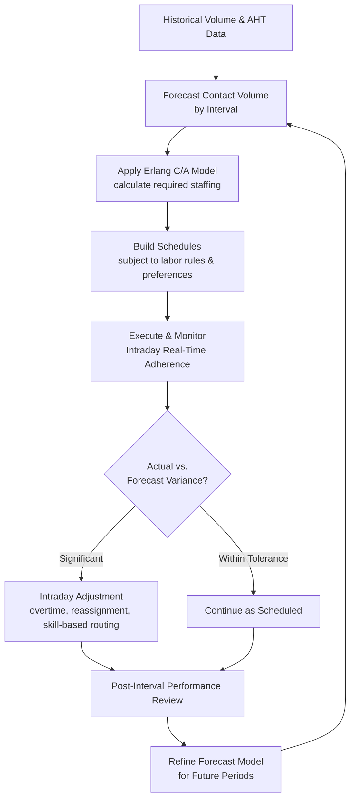

## Capacity Planning in Call Centers and Shared Services

### Overview

Capacity planning in call centers and shared services applies the queuing theory, service-capacity, and learning-curve principles covered throughout this curriculum to environments defined by high-volume, high-variability transactional demand and a labor force whose skills, availability, and scheduling flexibility are the primary capacity lever. Unlike healthcare (where capacity failures carry direct clinical risk) or manufacturing (where capacity is largely capital- and equipment-bound), call centers and shared services operations are predominantly workforce-capacity problems, making the learning-curve, cross-training, and workforce management topics from earlier in this curriculum especially directly applicable.

### The Erlang Models: The Foundational Queuing Framework

Call center capacity planning has historically relied on the **Erlang family of queuing models**, developed originally for telephone network traffic engineering and adapted directly to staffing:

- **Erlang C**: the standard model for calculating the number of agents required to achieve a target service level (e.g., 80% of calls answered within 20 seconds) given a forecasted call arrival rate and average handle time (AHT). It assumes calls that cannot be immediately answered wait in a queue rather than abandoning.
- **Erlang A**: an extension of Erlang C that explicitly models customer abandonment (callers hanging up before being answered), producing more realistic staffing requirements in environments where abandonment is a significant factor, as Erlang C alone tends to overstate required staffing when a meaningful fraction of demand self-resolves via abandonment.

$$\text{Service Level} = f(\text{Arrival Rate}, \text{AHT}, \text{Number of Agents})$$

These models directly extend the general queuing theory referenced under IT infrastructure capacity planning and healthcare capacity planning, but are specifically calibrated to the call-arrival and handle-time statistical patterns typical of contact center operations.

### Workforce Management (WFM) as the Operational Layer

**Workforce Management (WFM)** systems are the specialized software layer that operationalizes Erlang-based staffing calculations into actual schedules, forming the shared-service and call center equivalent of the general capacity forecasting and dashboard practices covered earlier:

1. **Forecasting**: predicting call/contact volume and AHT by interval (typically 15- or 30-minute buckets) using historical trend analysis, seasonality decomposition, and known demand drivers (marketing campaigns, billing cycles, product launches) — directly analogous to the trend-based and demand-driven forecasting approaches from general IT capacity planning.
2. **Staffing calculation**: converting the volume/AHT forecast into required headcount per interval using Erlang C/A models.
3. **Scheduling**: assigning actual agents to shifts that collectively meet the interval-by-interval staffing requirement, subject to labor regulations, contractual shift patterns, and agent preferences.
4. **Real-time management (intraday)**: monitoring actual volume and staffing adherence against forecast throughout the day, triggering intraday adjustments (overtime, schedule changes, task reassignment) when actual conditions diverge from forecast.
5. **Performance tracking and recalibration**: comparing forecast accuracy and actual service level achievement against targets, feeding back into forecast model refinement — directly paralleling the rolling recalibration theme from statistical regression-based learning rate estimation.

### Diagram: Workforce Management Capacity Cycle (svg_diagram)

### Skill-Based Routing and Multi-Skill Capacity Optimization

Modern contact centers rarely handle a single, homogeneous task type; agents are typically cross-trained across multiple skill queues (e.g., billing, technical support, sales), directly extending the cross-training and workforce flexibility principles covered earlier into a formalized routing and staffing optimization problem:

- **Skill-based routing**: automatically directing each incoming contact to the best-matched available agent based on required skill, agent proficiency, and current queue conditions, rather than simple first-in-first-out assignment.
- **Multi-skill staffing optimization**: because cross-trained agents can flexibly serve multiple queues, the staffing optimization problem becomes a resource allocation problem structurally similar to the linear programming formulations covered earlier — determining how many agents to cross-train across which skill combinations, and how to route contacts, to minimize total required headcount while meeting service level targets across all queues simultaneously.
- **The flexibility-versus-depth trade-off in practice**: as discussed under cross-training and workforce flexibility generally, contact centers face a direct trade-off between broad multi-skill coverage (more flexibility, potentially lower proficiency per skill) and narrow specialization (higher proficiency, less flexibility to absorb cross-queue demand imbalances) — this trade-off is one of the most extensively modeled applications of the general cross-training principle, given how directly it translates into staffing cost.

### Learning Curve Effects in Contact Center Operations

The AHT-based learning curve model introduced under learning-curve effects in service capacity planning applies directly and is one of the most data-rich, frequently measured applications of service learning curves in practice:

- **New-hire ramp curves**: contact centers typically track a well-defined new-hire proficiency ramp (often 60-90-120 day ramp periods) during which AHT, quality scores, and first-contact resolution rates are expected to improve predictably as new agents progress toward tenured-agent performance levels — this ramp curve is frequently used directly in staffing models to avoid overestimating early capacity from newly hired cohorts.
- **New product/process learning curves**: when a new product launches or a process changes, the affected skill queue's AHT typically spikes and then declines following a learning curve pattern, directly informing the temporary staffing increases needed during the transition period, similar to the ramp-up staffing phasing recommended under general ramp-up planning for new production lines.
- **Attrition's compounding effect on learning curve realization**: because new-hire learning curves take time to reach full proficiency, high agent attrition rates mean a contact center is perpetually carrying a larger proportion of its workforce at less-than-fully-ramped productivity than a low-attrition operation would — directly connecting to the individual-versus-team learning distinction from service capacity planning, since attrition erodes individual learning gains repeatedly even as institutional knowledge (scripts, tools, routing logic) persists.

### Shared Services Capacity Planning Beyond Voice Contact Centers

The same WFM, Erlang-derived, and multi-skill principles extend to broader **shared services** functions (HR shared services, finance shared services, IT service desks, back-office processing centers) handling non-voice transactional work (tickets, cases, emails, chat):

- **Non-voice channel modeling**: chat and email channels introduce concurrency (an agent may handle multiple simultaneous chats) that voice-based Erlang models do not natively account for, requiring adapted staffing models that incorporate a concurrency factor rather than assuming strict one-agent-per-contact-at-a-time handling.
- **Case-based vs. real-time work blending**: shared services often blend real-time responsive work (live chat, urgent tickets) with deferrable case-based work (email processing, back-office transactions), creating a scheduling optimization problem where deferrable work can be used to fill capacity gaps during real-time demand troughs — a workforce-level analog to the workload scheduling cost optimization lever discussed under cloud cost-aware capacity optimization.
- **Case complexity segmentation**: similar to the task-category segmentation emphasized under service capacity planning generally, shared services capacity models typically segment case types by complexity before applying learning-curve or staffing calculations, since blending simple and complex case types into a single average handle time metric can significantly distort both forecasting accuracy and learning-curve rate estimation.

### Common Pitfalls

- **Applying Erlang C without an abandonment adjustment**: using plain Erlang C in environments with meaningful customer abandonment tends to overstate required staffing, since it assumes no self-resolution via hang-up; Erlang A or empirically-adjusted models better reflect actual required headcount in such environments.
- **Ignoring new-hire ramp curves in staffing forecasts**: treating newly hired agents as immediately equivalent to tenured agents in capacity calculations overstates near-term capacity, directly paralleling the general capacity forecasting error of assuming steady-state performance from day one.
- **Over-indexing on flexibility at the expense of proficiency**: cross-training agents across too many skills without sufficient depth in any one can reduce overall service quality and first-contact resolution, echoing the general cross-training trade-off but with directly measurable customer-facing consequences in this context.
- **Failing to segment case/call complexity before modeling**: blending heterogeneous task types into a single aggregate AHT or volume forecast can produce a misleading blended metric that masks true capacity requirements for the more complex, longer-handling-time subset of work.
- **Neglecting attrition's compounding effect on effective capacity**: staffing plans that assume headcount-based capacity without discounting for the proportion of the workforce still on their new-hire learning ramp can systematically overestimate actual available capacity in high-turnover environments. [Inference] the appropriate discount factor for ramping agents is specific to each operation's historical ramp curve and attrition rate, and is not governed by a universal industry constant.

### Related Topics

- Erlang C and Erlang A queuing model mathematics and staffing calculations
- Workforce Management (WFM) software architecture and intraday management practices
- Skill-based routing algorithms and multi-skill staffing optimization
- New-hire ramp curve measurement and its integration into staffing forecasts
- Concurrency modeling for chat, email, and case-based shared services capacity planning