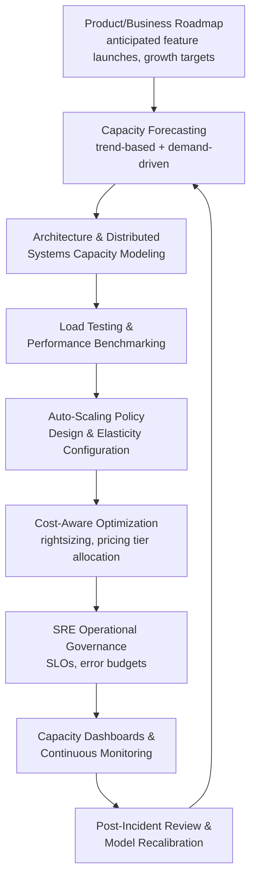

## Capacity Planning in Software and Cloud-Based Services

### Overview

Capacity planning in software and cloud-based services synthesizes the IT infrastructure, elasticity, distributed systems, SRE, and cost-optimization principles covered earlier in this curriculum into an industry-specific case study, examining how software organizations integrate these techniques into a coherent operational practice across the full software delivery lifecycle. Unlike the physical-resource industries covered in preceding case studies (automotive, aerospace, healthcare, call centers), software and cloud services combine near-infinite theoretical elasticity with genuinely hard engineering and organizational constraints — making the discipline as much about managing complexity and trade-offs as about raw resource provisioning.

### The Full Capacity Planning Lifecycle in a Software Organization

This lifecycle demonstrates how software capacity planning is not a single technique but an integration of nearly every method covered in this curriculum's IT-focused chapters, applied continuously rather than as a one-time exercise.

### Capacity Planning Across the Product Lifecycle

Software products experience capacity planning demands that shift qualitatively across their lifecycle stages, echoing the ramp-up planning concepts from manufacturing but compressed and repeated far more frequently:

- **New product/feature launch**: analogous to a new production line's ramp-up phase, a new software service typically launches with conservative, wide auto-scaling bounds and close manual monitoring while the team learns the real traffic and resource-consumption characteristics — over time, as covered under cloud elasticity, these bounds are tightened and automated as confidence grows.
- **Growth phase**: as usage scales, capacity planning shifts from reactive, ad hoc scaling toward the more formal trend-based and demand-driven forecasting practices from general IT capacity planning, since the cost and risk of undersized capacity grows alongside user base size.
- **Maturity phase**: mature, stable services typically shift capacity planning emphasis toward the cost-aware optimization practices (rightsizing, reserved/committed-use pricing, spot instance adoption) covered earlier, since demand patterns are well understood and the marginal value of further headroom investment declines — directly paralleling the automation-versus-learning-curve crossover logic, but applied to capacity commitment strategy rather than physical automation.
- **Sunset/decline phase**: declining or deprecated services require deliberate capacity *reduction* planning (decommissioning, migrating remaining traffic, reclaiming reserved capacity commitments), a phase largely absent from the manufacturing capacity planning literature but increasingly relevant in cloud-native software organizations managing large, evolving service portfolios.

### Organizational Capacity as a Co-Equal Constraint

A defining characteristic of software capacity planning, echoing the SRE toil discussion, is that **engineering and operational team capacity** is frequently as binding a constraint as infrastructure capacity itself:

- **On-call and incident response capacity**: as a system scales, the operational burden of maintaining it (on-call rotations, incident response, capacity tuning) can grow faster than the engineering team's ability to absorb that burden without automation investment — directly mirroring the SRE toil-versus-engineering-work distinction and its 50%-toil guideline discussed under SRE approaches to capacity.
- **Development capacity as a gating constraint on capacity-improving work**: implementing better auto-scaling policies, cost optimizations, or architectural changes to relieve a capacity constraint itself requires engineering capacity — creating a meta-level constraint management problem where the team must apply Theory-of-Constraints-style prioritization to its own limited capacity-improvement bandwidth, not just to infrastructure resources.
- **Knowledge concentration risk**: capacity and scaling expertise for a specific service often concentrates in a small number of engineers, creating the same single-point-of-failure risk discussed under cross-training and workforce flexibility and organizational memory systems — documented runbooks and cross-trained on-call rotations are the direct software-industry application of those general principles.

### Multi-Tenant and Platform Capacity Considerations

Software-as-a-service (SaaS) and platform businesses face a capacity planning dimension largely absent from single-tenant industrial contexts: allocating shared infrastructure capacity fairly and efficiently across many independent customers (tenants) simultaneously.

- **Noisy neighbor management**: one tenant's unusually heavy usage can degrade performance for other tenants sharing the same underlying infrastructure if capacity isolation is insufficient — requiring resource quotas, rate limiting, or dedicated capacity tiers, conceptually similar to the bulkheading and resource isolation patterns discussed under distributed and microservice capacity planning.
- **Capacity planning per pricing/service tier**: many SaaS platforms offer differentiated service tiers (free, standard, enterprise) with different performance and capacity guarantees, requiring capacity planning and quality-of-service tiering decisions similar in spirit to the graceful degradation and prioritization strategies discussed under SRE approaches to capacity.
- **Aggregate demand forecasting across a diverse tenant base**: unlike a single internal workload, a multi-tenant platform's aggregate demand forecast must account for a portfolio of independently growing (or churning) customers, each with different usage patterns — closer in spirit to a diversified demand forecasting problem than a single production line's volume projection.

### Case Study Pattern: Scaling a Growing SaaS Platform

A composite illustrative pattern, synthesizing the concepts above, of how a software organization's capacity planning practice typically matures as a platform grows:

1. **Early stage**: manual provisioning, reactive scaling, capacity decisions made ad hoc by whichever engineer is on call — analogous to a pilot/qualification production phase with heavy engineering involvement.
2. **Growth stage**: introduction of formal auto-scaling policies, basic load testing before major releases, and initial cost monitoring — analogous to the initial ramp and acceleration phases of manufacturing ramp-up planning.
3. **Scale stage**: adoption of SRE practices (formal SLOs, error budgets), distributed tracing and per-service capacity modeling for an increasingly microservice-oriented architecture, and structured cost-aware optimization (rightsizing, reserved capacity purchasing) — analogous to approaching steady-state operation with a focus on continuous improvement rather than fundamental capacity fixes.
4. **Mature/platform stage**: multi-tenant capacity isolation, quality-of-service tiering, predictive/ML-driven auto-scaling, and dedicated capacity planning functions (sometimes formalized as SRE or platform engineering teams) — analogous to a mature production system where constraint management becomes a continuous, institutionalized discipline rather than a series of discrete interventions.

### Interaction with Learning Curve Concepts

Software capacity planning exhibits its own distinctive learning curve pattern, differing from both manufacturing and general service contexts:

- **Operational learning curve for a specific architecture**: as a team gains experience operating a particular technology stack or architecture pattern, their efficiency at capacity tuning, incident diagnosis, and cost optimization improves — this is an organizational, not physical-production, learning curve, but follows a qualitatively similar improvement-with-experience pattern to the general learning curve concept introduced under historical origins in aircraft manufacturing.
- **Resetting on major architectural change**: a significant re-architecture (e.g., migrating from monolith to microservices, or adopting a new cloud provider) substantially resets this operational learning curve, since much of the accumulated tuning knowledge is specific to the prior architecture — directly paralleling the learning curve reset caveat discussed under incorporating learning rates into capacity forecasts.
- **Documentation as the primary defense against learning curve loss**: because software engineering teams often have higher turnover than traditional manufacturing workforces, the organizational memory and documentation practices covered earlier in this curriculum are particularly critical for preserving capacity-tuning knowledge (why specific thresholds, instance sizes, or architectural capacity decisions were made) across personnel changes.

### Common Pitfalls

- **Treating cloud elasticity as eliminating the need for capacity planning**: assuming auto-scaling alone handles all capacity concerns without upfront architectural capacity modeling, load testing, or cost governance, often leading to reactive firefighting and unexpectedly high cloud costs.
- **Ignoring organizational/operational capacity as a real constraint**: focusing capacity planning exclusively on infrastructure metrics while neglecting whether the engineering and operations team has sufficient bandwidth to manage the resulting complexity, echoing the SRE toil pitfall in a broader organizational context.
- **Insufficient multi-tenant isolation planning**: underestimating noisy-neighbor risk in shared multi-tenant infrastructure, leading to unpredictable performance degradation that pure aggregate capacity metrics fail to reveal.
- **Failing to plan for lifecycle-stage transitions**: applying early-stage, manual, reactive capacity practices to a platform that has grown well past the point where they remain adequate, or conversely over-engineering elaborate SRE and cost-optimization processes prematurely for a still-small, rapidly-changing early-stage product.
- **Underinvesting in documentation ahead of architectural change or team turnover**: allowing capacity-tuning knowledge to remain tacit and concentrated in a few individuals, risking significant capability loss when key personnel depart or when a major re-architecture invalidates existing informal knowledge. [Inference] the appropriate pace of transitioning between lifecycle-stage practices is specific to each organization's growth trajectory and risk tolerance, and is not governed by a universal timeline.

### Related Topics

- SRE and platform engineering team structures for capacity governance
- Multi-tenant SaaS architecture patterns and noisy-neighbor mitigation
- Capacity planning transitions across product lifecycle stages
- Documentation practices for preserving operational and architectural capacity knowledge
- Predictive and ML-driven auto-scaling approaches for mature platforms