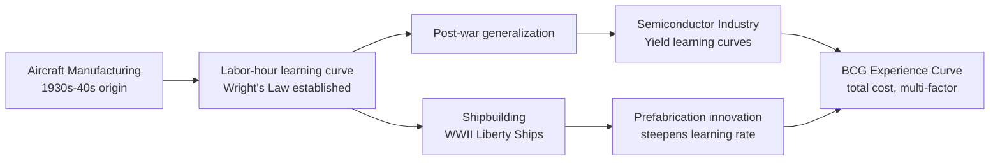

## Historical Learning-Curve Case Studies in Industrial Production

### Overview

Historical learning-curve case studies in industrial production examine documented, empirically measured instances of the learning curve phenomenon across multiple industries beyond its aircraft manufacturing origins, tracing how the model introduced by T.P. Wright has been validated, refined, and applied across shipbuilding, semiconductor fabrication, and broader industrial contexts throughout the 20th century. These case studies serve two purposes for capacity planning practice: they demonstrate the model's empirical robustness across diverse production environments, and they reveal the boundary conditions and complications that arise when applying the idealized power-law formula to messier, real-world industrial data.

### World War II Shipbuilding: The Liberty Ship Program

One of the most extensively documented historical learning-curve case studies outside aircraft manufacturing is the U.S. Liberty Ship program during World War II, in which dozens of shipyards mass-produced a standardized cargo ship design under extreme wartime production pressure.

- **Dramatic construction time reduction**: publicly reported figures from the era describe average construction time per Liberty Ship falling substantially as shipyards accumulated experience — some widely cited figures describe average build time dropping from roughly two months for early vessels to a small number of days for the fastest later builds at the most experienced yards. [Unverified] the most dramatic reported figures (including the famously cited record build time) are often described in secondary sources without consistent methodology, and some historical accounts suggest a degree of publicity/propaganda framing around individual record builds during the wartime period; the general downward trend across the broader program is well documented even where individual record figures may be imprecise.
- **Cross-yard variation as a natural experiment**: because Liberty Ships were built simultaneously at multiple shipyards, each starting from a similar design but with different pre-existing workforce experience and different degrees of specialization, the program provides a natural comparative case study in how learning rates varied across yards facing the same product but different starting conditions and management practices.
- **Kaiser Shipyards and management innovation**: yards employing prefabrication techniques (assembling large sub-sections before final assembly, rather than traditional keel-up construction) demonstrated notably steeper learning curves, illustrating that the learning rate itself is not a fixed property of a product but is significantly influenced by process design choices — directly connecting to the general principle from balancing automation investment against learning-curve gains that process and technology choices shape the achievable learning trajectory, not just accumulated repetition alone.

### Semiconductor Fabrication and the "Experience Curve"

The semiconductor industry provides one of the longest-running and most rigorously tracked applications of learning-curve-like cost decline, closely related to but distinct from the pure labor-hour learning curve originally described by Wright:

- **Yield learning curves**: semiconductor fabrication has a well-documented "yield ramp" phenomenon, where the percentage of functional chips produced from a given wafer process improves following a curve as cumulative production volume increases and defect sources are progressively identified and eliminated — directly paralleling the yield-ramp concept introduced under ramp-up planning for new production lines, but with far more extensively published empirical data given the industry's economic significance and public reporting practices.
- **Distinction from Moore's Law**: it is worth noting that the semiconductor industry's famous exponential improvement trend (commonly associated with Moore's Law, describing transistor density roughly doubling on a regular multi-year cadence) is a distinct phenomenon from the production learning curve — Moore's Law describes technology generation improvement over calendar time, while the yield/cost learning curve describes cost decline as a function of cumulative production volume within a given process generation; the two effects compound together but arise from different underlying mechanisms.
- **Extension to the broader "experience curve"**: semiconductor cost analysis was among the industries that contributed to the Boston Consulting Group's generalization (referenced under historical origins in aircraft manufacturing) of Wright's narrower labor-hour learning curve into the broader "experience curve" concept, which incorporates total unit cost decline from combined sources — labor learning, yield improvement, economies of scale, and process/equipment refinement together — rather than labor hours alone.

### Cross-Industry Learning Rate Comparisons

Historical case study compilations across industries have generally found that observed learning rates vary meaningfully by process characteristics, providing empirical calibration points for the learning-rate assumptions discussed under incorporating learning rates into capacity forecasts and statistical regression for learning-rate estimation:

| Industry/Process Type | Typical Reported Learning Rate Range | General Characteristic |
| --- | --- | --- |
| Highly automated, capital-intensive processes | Higher (shallower curve, e.g., 90-95%) | Less labor-driven, less room for manual learning improvement |
| Labor-intensive assembly (aircraft, shipbuilding) | Lower (steeper curve, e.g., 70-85%) | High manual task content, substantial room for skill and process refinement |
| Semiconductor yield improvement | Varies significantly by process maturity | Early process generations show steeper yield-learning curves than mature ones |

[Inference] these ranges are widely cited as general characterizations in industrial engineering and operations literature, but any specific historical figure should be treated as an illustrative order-of-magnitude reference rather than a precise, universally applicable constant, since reported rates vary considerably by source, measurement methodology, and specific process conditions.

### Diagram: Historical Case Study Comparison Pattern (svg_diagram)

### Methodological Lessons from Historical Case Studies

Reviewing these historical cases surfaces several recurring methodological themes directly relevant to applying learning curve models in current capacity planning practice:

1. **Process design materially affects the learning rate**: the Liberty Ship prefabrication example demonstrates that the learning rate is not solely a function of individual worker skill accumulation but is significantly shaped by deliberate process and technology choices — reinforcing the point made under balancing automation investment against learning-curve gains that process redesign and automation can shift the achievable learning trajectory, not merely accelerate movement along a fixed one.
2. **Wartime/crisis production conditions may not generalize**: some of the most dramatic historical learning curve figures come from wartime production under extreme schedule pressure and resource prioritization atypical of normal peacetime operations; capacity planners should be cautious about directly applying such historically extreme learning rates as benchmarks for typical commercial production planning.
3. **Distinguishing genuine learning from other simultaneous cost-reduction sources**: the semiconductor and broader experience-curve literature highlights those historical cost-decline patterns often reflect a blend of labor learning, yield improvement, economies of scale, and technology refinement occurring simultaneously — a purely labor-hour-focused reading of an aggregate historical cost curve can overstate the pure "learning" component if other simultaneous factors are not separated out, directly echoing the caution in incorporating learning rates into capacity forecasts against conflating individual learning with broader organizational or technological improvement sources.
4. **Publication and reporting bias in historical figures**: as illustrated by the caveat around specific Liberty Ship build-time records, historical case study figures — particularly widely-cited "record" figures — sometimes reflect selective reporting or wartime publicity framing rather than representative, methodologically rigorous measurement; capacity planners using historical benchmarks should favor documented program-wide trends over isolated record-setting anecdotes.

### Practical Relevance to Modern Capacity Planning

These historical case studies remain directly useful reference points for contemporary practice in several ways:

- **Benchmark learning rates for new processes without historical data**: when launching a genuinely novel process with no internal historical data (as discussed under statistical regression for learning-rate estimation), historical cross-industry learning rate ranges provide a starting-point prior, later refined through the organization's own regression once sufficient data accumulates.
- **Justifying process/automation investment through historical precedent**: the Liberty Ship prefabrication case provides a compelling historical illustration supporting the general principle from balancing automation investment against learning-curve gains, that deliberate process redesign can achieve capacity gains beyond what pure accumulated experience would eventually reach on its own.
- **Framing multi-factor cost decline appropriately**: the semiconductor experience-curve lineage reinforces the importance, discussed under spreadsheet modeling and ERP capacity planning modules, of being explicit about whether a capacity or cost model is capturing pure labor learning (Wright's Law) versus the broader multi-factor experience curve, since conflating the two can lead to incorrect model selection and forecasting error.

### Common Pitfalls in Interpreting Historical Case Studies

- **Treating wartime or crisis-driven learning rates as normal-condition benchmarks**: applying unusually steep historically reported wartime learning rates to typical peacetime capacity forecasts risks significant overestimation of achievable improvement.
- **Attributing all historical cost decline to pure learning**: failing to separate labor learning from concurrent yield, scale, and technology effects when using historical industry data as a benchmark, particularly relevant when referencing semiconductor or other technology-intensive historical examples.
- **Over-relying on isolated dramatic figures rather than program-wide trends**: anchoring capacity assumptions to widely circulated "record" figures rather than the broader, more representative trend across an entire historical production program.
- **Assuming learning rates are process-invariant properties**: overlooking that historical case studies show the learning rate itself responds to deliberate process and management choices (e.g., prefabrication), rather than treating it as a fixed characteristic of a product or task type regardless of how it's produced.

### Related Topics

- T.P. Wright's original aircraft manufacturing learning curve research and methodology
- Boston Consulting Group experience curve theory and strategic applications
- Semiconductor yield ramp modeling and process maturity curves
- Historical wartime production management and prefabrication techniques
- Cross-industry learning rate benchmarking for new-process capacity forecasting