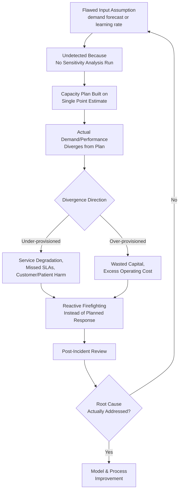

## Lessons from Capacity Planning Failures and Demand Mismatches

### Overview

Lessons from capacity planning failures and demand mismatches synthesizes recurring failure patterns across the industries and techniques covered throughout this curriculum, examining how capacity plans break down when forecasts diverge from reality, when models are misapplied, or when organizational incentives distort capacity decisions. Rather than presenting a single new technique, this topic consolidates the common threads running through the failure modes flagged individually across earlier chapters — under-provisioning, over-provisioning, learning-curve misapplication, and constraint mismanagement — into a structured taxonomy for diagnosing and preventing capacity planning failures.

### The Two Fundamental Failure Modes

Nearly every capacity planning failure reduces to one of two directional errors, each with distinct costs and root causes:

| Failure Mode | Direct Cost | Common Root Causes |
| --- | --- | --- |
| Under-provisioning (capacity shortfall) | Lost throughput, missed SLAs/SLOs, customer/patient harm, reputational damage | Overoptimistic demand or learning-rate assumptions, ignored variability, delayed capacity investment |
| Over-provisioning (excess capacity) | Wasted capital/operating cost, reduced ROI, idle resources | Overly conservative headroom assumptions, static plans not revisited as data improves, sunk-cost commitment to outdated forecasts |

Effective capacity planning does not eliminate the risk of either error entirely — it deliberately manages the trade-off between them using the sensitivity analysis, error-budget, and buffer-management techniques covered earlier, rather than assuming either error can be driven to zero simultaneously.

### Demand Forecast Failures

Many capacity planning failures trace back not to the capacity model itself but to the demand forecast feeding it — a garbage-in, garbage-out problem regardless of how sophisticated the downstream capacity calculation is:

- **Static extrapolation through inflection points**: trend-based forecasting (introduced under IT infrastructure capacity planning fundamentals) implicitly assumes recent growth patterns continue; failures occur when a genuine inflection point (a viral growth event, a competitor's exit, a regulatory change, a new product cannibalizing an old one) breaks the historical trend and the static forecast fails to anticipate the discontinuity.
- **Ignoring known future demand shocks**: as flagged under SRE approaches to capacity, relying solely on organic trend-based forecasting while neglecting known future events (product launches, marketing campaigns, seasonal peaks) requiring dedicated event-specific capacity planning is one of the most common and most preventable classes of capacity failure, since the demand shock is knowable in advance even if its exact magnitude is uncertain.
- **Correlated demand surges across dependent systems**: a demand spike affecting one system frequently affects dependent or related systems simultaneously (e.g., a viral event driving traffic to both a web front-end and its backend services, or a regional emergency driving surges across multiple healthcare facilities) — capacity plans that treat each system's demand as independently forecastable can be caught off guard when correlated surges exceed what any individual system's isolated forecast anticipated.

### Learning-Curve Misapplication Failures

Several failure patterns specifically trace back to misapplying the learning curve models introduced under historical origins in aircraft manufacturing and refined throughout subsequent chapters:

- **Assuming learning-curve gains continue indefinitely**: as flagged under incorporating learning rates into capacity forecasts and spreadsheet modeling, extrapolating the pure power-law formula far beyond the point where genuine process plateaus or floors take hold produces persistently overoptimistic capacity projections, a failure mode that tends to compound the longer a plan goes unrevised.
- **Applying learning rates across a structural break without segmentation**: as detailed under statistical regression for learning-rate estimation, blending pre- and post-process-change data into a single regression produces a distorted, practically meaningless learning rate estimate that misrepresents both the old and new process.
- **Transplanting learning rates across industries without validation**: applying a benchmark learning rate from one context (e.g., an automotive-paced learning rate assumption applied to an aerospace program, as cautioned under capacity planning in automotive and aerospace manufacturing) without adjusting for the fundamentally different doubling frequency and process characteristics of the target context.
- **Ignoring attrition-driven learning curve resets in service and software contexts**: as noted under both learning-curve effects in service capacity planning and capacity planning in call centers, high personnel turnover repeatedly resets the individual-learning component of a service capacity model; plans that assume steady, uninterrupted individual learning progression in high-turnover environments systematically overstate effective capacity.

### Diagram: Common Failure Cascade Pattern (svg_diagram)

### Organizational and Governance Failure Patterns

Beyond purely technical modeling errors, many capacity planning failures stem from organizational and incentive-structure issues:

- **Local optimization overriding system-level constraint management**: as emphasized repeatedly since the Theory of Constraints material, optimizing individual departments, services, or work centers for their own efficiency metrics rather than overall system throughput can create excess work-in-process, hidden bottlenecks, or misallocated investment — a failure of organizational incentive alignment rather than of any single technical model.
- **Ignoring shadow prices and treating all resources as equally worth optimizing**: as discussed under linear programming for capacity allocation, investing improvement effort in non-binding, slack resources while the true binding constraint remains unaddressed wastes limited capacity-improvement capacity itself on the wrong target.
- **Underinvesting in organizational memory ahead of personnel turnover**: as emphasized under documentation and organizational memory systems and reiterated across several industry case studies, failing to document why specific capacity decisions were made (thresholds, learning rate assumptions, buffer sizes) leaves an organization unable to reconstruct or validate its own prior reasoning once the responsible individuals depart — a slow-motion failure mode that often isn't recognized until a crisis forces someone to relearn decisions that were already made once.
- **Treating capacity dashboards as sufficient without acting on their signals**: as cautioned under capacity dashboards and utilization reporting, building sophisticated monitoring and alerting infrastructure does not itself prevent failure if the organization lacks the governance discipline to act on the signals that infrastructure surfaces — dashboards inform decisions but do not make them.
- **Sunk-cost commitment to outdated capacity investments**: having committed capital to a specific automation investment, reserved cloud capacity, or physical facility expansion, organizations sometimes continue operating as though that commitment remains optimal even after demand or technology conditions have shifted substantially, rather than revisiting the underlying crossover analysis (as discussed under balancing automation investment against learning-curve gains) with current data.

### Cross-Industry Recurring Failure Themes

Reviewing the industry case studies covered in this chapter reveals several failure patterns that recur across otherwise very different domains:

| Failure Theme | Automotive/Aerospace | Healthcare | Call Centers/Shared Services | Software/Cloud |
| --- | --- | --- | --- | --- |
| Supply/dependency chain bottleneck underestimated | Semiconductor shortage impact on vehicle assembly | Specialist/supply shortages affecting care delivery | Vendor/tooling outages affecting agent capacity | Downstream service saturation (fan-out amplification) |
| Ramp-up/learning curve misjudged | Automotive-paced expectations misapplied to aerospace | New technique/technology adoption curve underestimated | New-hire ramp curve ignored in staffing forecasts | Operational learning curve reset after re-architecture ignored |
| Physical/technical capacity without matching operational capacity | Tooling capacity without matching workforce flexibility | Beds/equipment without matching staffing capacity | Headcount without matching skill-based routing coverage | Infrastructure capacity without matching engineering/on-call capacity |
| Documentation/institutional knowledge loss | Configuration/variant tracking lost across program lifecycle | Institutional learning lost through clinical staff turnover | Team-level learning eroded by high agent attrition | Architectural capacity-tuning knowledge concentrated in departing individuals |

This cross-industry pattern reinforces a central theme of this entire curriculum: while the specific mechanisms differ by industry (physical production lines, patient flow, call queues, distributed services), the underlying capacity planning failure modes — misjudged learning curves, under-modeled dependency chains, mismatched resource dimensions, and eroded organizational memory — recur with remarkable consistency.

### Practical Diagnostic Framework for Post-Failure Review

When a capacity planning failure occurs, a structured review should trace the failure back through the following diagnostic sequence, drawing on techniques from throughout this curriculum:

1. **Was the demand forecast wrong, or was the capacity conversion from a correct forecast wrong?** Distinguishing these clarifies whether the fix belongs in demand forecasting practice or in capacity modeling technique.
2. **Was a sensitivity analysis run, and if so, did the actual outcome fall outside the analyzed range, or within a range that was known but insufficiently acted upon?** This distinguishes a genuine model blind spot from a known risk that was inadequately mitigated.
3. **Was the binding constraint correctly identified?** As emphasized under linear programming and constraint management throughout, effort spent addressing a non-binding resource while the true constraint remained unaddressed is a distinct failure from correctly identifying but inadequately resourcing the actual constraint.
4. **Was relevant historical knowledge available but not consulted, or genuinely unavailable?** This distinguishes an organizational memory/documentation failure from a genuine first-time, unprecedented scenario.
5. **Were the dashboard/monitoring signals present but not acted upon, or were they genuinely absent or inadequate?** This distinguishes a governance/response failure from a true observability gap.

### Common Pitfalls in Learning from Failures

- **Treating every failure as unique rather than recognizing recurring patterns**: conducting isolated post-mortems without connecting them to the broader cross-industry failure taxonomy above risks repeatedly rediscovering the same root causes under different surface details.
- **Fixing the symptom rather than the root cause**: adding capacity reactively after a shortfall without addressing whether the underlying forecasting, sensitivity analysis, or constraint identification process that missed the shortfall has itself been corrected.
- **Overcorrecting into excessive conservatism after an under-provisioning failure**: swinging from insufficient headroom directly to excessive, poorly justified headroom without applying the same sensitivity-analysis rigor to the revised assumption, trading one form of cost/risk mismanagement for another.
- **Failing to update documentation and models after the failure is resolved**: resolving the immediate capacity crisis without updating the underlying spreadsheet model, regression estimate, or ERP master data that produced the flawed original forecast, leaving the organization vulnerable to repeating the same failure. [Inference] the specific process improvements warranted by any given failure are context-dependent, and this diagnostic framework is intended as a starting structure for investigation rather than a formula that yields a specific fix automatically.

### Related Topics

- Post-mortem and blameless incident review practices (SRE approaches to capacity)
- Sensitivity analysis and scenario planning as failure-prevention tools
- Theory of Constraints diagnostic application to organizational capacity failures
- Cross-industry benchmarking of capacity planning maturity practices
- Documentation and organizational memory systems as failure-prevention infrastructure