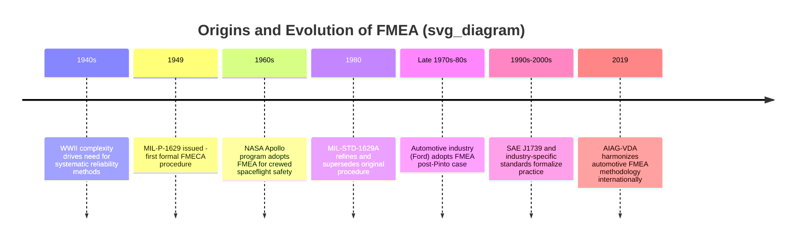

## Origins in Military Reliability Engineering

### Historical Context

Failure Mode and Effects Analysis (FMEA) traces its formal origins to mid-20th century military engineering, where the increasing complexity of weapons systems, aircraft, and electronics during and after World War II created an urgent need for systematic reliability methods. Before this period, reliability assessment was largely ad hoc, relying on engineering judgment and post-failure investigation rather than proactive, structured analysis.

The core problem the military faced was straightforward: systems were growing more complex (more components, more interdependencies), and the cost of failure — in combat, in training, in expensive hardware — was rising sharply. A single overlooked failure mode in a weapons system, an aircraft component, or a guidance system could result in loss of life or mission failure. This drove the need for a repeatable, documented method to anticipate how a system could fail before it was fielded.

### MIL-P-1629: The Foundational Document

The first formalized documentation of the technique is generally attributed to the U.S. military procedure **MIL-P-1629**, titled *"Procedures for Performing a Failure Mode, Effects and Criticality Analysis,"* issued on November 9, 1949.

**Key Points**

- MIL-P-1629 established a standardized procedure for identifying how equipment and systems could fail
- It introduced the concept of ranking failures by their effect on mission success and personnel safety
- It combined what later became separated into two related techniques: FMEA (identifying failure modes and their effects) and CA — Criticality Analysis (ranking those failures by severity and probability), together often called **FMECA**
- The procedure was intended primarily for use by military and aerospace contractors developing hardware for the U.S. Armed Forces

The document's stated purpose was to establish procedures for performing FMECA to systematically evaluate and document, by item failure mode analysis, the potential impact of each functional or hardware failure on mission success, personnel and system safety, system performance, maintainability, and maintenance requirements. [Inference: exact original phrasing may vary slightly across reprints and revisions of MIL-P-1629; the substance of its purpose is well documented across reliability engineering literature.]

### Why the Military Drove This Innovation

Several converging factors in the 1940s–1950s made the military the natural origin point for this discipline rather than commercial industry:

1. **Mission-Critical Consequences**: Military systems (aircraft, missiles, submarines) had failure consequences involving loss of life and strategic failure, unlike most consumer goods of the era.
2. **Contractual Leverage**: The military, as a dominant purchaser of complex defense systems, could mandate that contractors follow specific reliability procedures as a condition of contract award.
3. **Systems Complexity Growth**: Post-war aircraft and missile systems (e.g., early ballistic missile programs) had orders of magnitude more components than pre-war equipment, exceeding the ability of engineers to intuitively predict all failure interactions.
4. **Reliability Engineering as a Formal Discipline**: The 1950s saw the broader emergence of reliability engineering as a distinct discipline, partly driven by military and NASA-adjacent research into quantifying and predicting equipment failure rates.

### Evolution Through Aerospace: NASA and Apollo

FMEA's use expanded significantly in the 1960s as the technique was adopted by NASA for the **Apollo program**. The stakes of crewed spaceflight — where system failure could mean loss of the crew, with no possibility of in-flight repair for many subsystems — pushed FMEA from a military-contractor compliance exercise into a rigorous engineering discipline integrated into design reviews.

**Example**

During Apollo-era spacecraft design, engineers used FMEA to systematically walk through every critical subsystem (life support, guidance, propulsion) and ask: *"If this component fails, what happens next, and how severe is it?"* Components identified as **single points of failure** — where one failure could cause loss of mission or crew — were flagged for redesign, redundancy, or additional safeguards.

This period cemented several practices still used today:

- Explicit criticality ranking (tying back to MIL-P-1629's FMECA roots)
- The use of FMEA as an input to design reviews, not just a retrospective document
- Cross-functional review of failure modes, involving both design engineers and reliability/safety specialists

### Transition Beyond Military Use

Although MIL-P-1629 remained the reference standard for decades, the underlying discipline it established gradually diffused into civilian and commercial sectors:

- **Automotive industry** (from the late 1970s onward, especially via Ford Motor Company after the Pinto fuel-tank controversy) adopted FMEA for design and process reliability, eventually formalizing it in standards like **SAE J1739** and later folding it into **AIAG-VDA** FMEA guidelines.
- **Aerospace and defense contractors** continued using FMECA under evolving military and aerospace standards.
- **Nuclear power, medical devices, and semiconductor manufacturing** adopted variants of the technique as those industries matured their own safety and reliability requirements.

MIL-P-1629 itself was eventually superseded within military contexts by **MIL-STD-1629A** (1980), which refined the procedures and terminology while preserving the same conceptual foundation: systematically identify failure modes, trace their effects, and rank them by criticality.

### Conceptual Diagram: Lineage from Military Origins to Modern FMEA

### Legacy Terminology Still in Use Today

Several terms and structural conventions from the military origin persist directly in modern FMEA practice:

| Term | Military Origin Meaning | Modern Usage |
| --- | --- | --- |
| Failure Mode | The specific manner in which an item fails | Same — the "how" of failure |
| Effect | The consequence of that failure on the system/mission | Same — local, next-level, and end effects |
| Criticality | A ranking combining severity and probability of occurrence | Basis for modern Risk Priority Number (RPN) and Action Priority (AP) methods |
| Single Point of Failure | A component whose failure alone causes system/mission loss | Still a key design-review flag in safety-critical engineering |

### Conclusion

FMEA's military origin is not merely a historical footnote — it explains much of the method's structure: its emphasis on documentation and traceability (a contractual and audit necessity for defense procurement), its severity/criticality ranking logic (born from mission-and-crew-safety stakes), and its use as a proactive design tool rather than a retrospective failure report. Understanding this lineage clarifies why FMEA today still emphasizes rigorous, tabular documentation and cross-functional review — practices inherited directly from a discipline built to prevent catastrophic failure in systems where failure was not an acceptable outcome.

**Related Topics**

- MIL-STD-1629A and its refinements to the original procedure
- Development of Criticality Analysis (CA) and the FMECA distinction
- Adoption of FMEA in the automotive industry (Ford, SAE J1739, AIAG-VDA)
- NASA Apollo-era reliability engineering practices
- Single Point of Failure (SPOF) analysis in safety-critical design
- Comparison of FMEA with Fault Tree Analysis (FTA) as a complementary top-down method