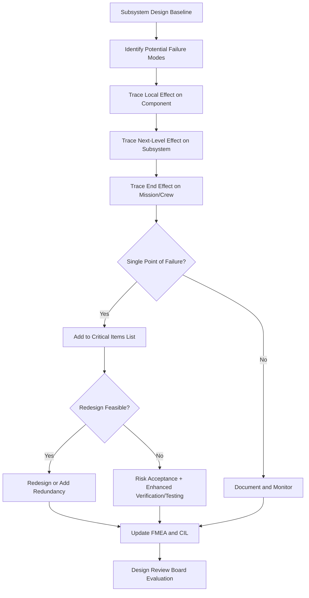

## Application in the NASA Apollo Program

### Historical Context and Motivation

By the time NASA began the Apollo program in the early 1960s, FMEA had already been formally documented via MIL-P-1629 (1949), but its application had largely remained within military hardware procurement. Apollo represented a categorically different challenge: crewed spaceflight, where failures could not be repaired mid-mission for many subsystems, where abort options were limited or nonexistent during certain mission phases, and where the political and human stakes of failure were extraordinarily high following the Cold War space race context.

This combination of factors — irreparable failure, non-abortable phases, and stakes involving human life — pushed FMEA from a compliance-oriented documentation exercise into a core engineering design discipline embedded directly into spacecraft development, systems integration, and design review processes.

### Integration into the Apollo Design Process

NASA and its contractors (North American Aviation for the Command/Service Module, Grumman for the Lunar Module, and others) applied FMEA systematically across major spacecraft subsystems, including:

- Guidance, Navigation and Control (GNC)
- Environmental Control and Life Support Systems (ECLSS)
- Propulsion (Service Propulsion System, Reaction Control System)
- Electrical Power Systems
- Communications
- Structural and mechanical systems (docking mechanisms, hatches, parachutes)

**Key Points**

- FMEA was not a one-time document but an iterative process, updated as designs matured through preliminary design, critical design review, and post-anomaly investigation phases
- Analyses were performed at multiple levels: component level, subsystem level, and full spacecraft/mission level
- Cross-functional teams — design engineers, reliability engineers, and safety personnel — jointly reviewed failure modes rather than leaving the analysis solely to a reliability office

### The Single Point of Failure (SPOF) Concept

Apollo-era engineering is where the concept of the **Single Point of Failure** became central to spacecraft design philosophy. A single point of failure is a component or function whose failure alone — without any other contributing failure — could result in loss of mission or loss of crew.

Given Apollo's mass and volume constraints, full redundancy for every subsystem was not feasible. This forced NASA to use FMEA output specifically to:

1. Identify every credible single point of failure across the spacecraft
2. Categorize each SPOF by criticality (e.g., loss of mission vs. loss of crew and vehicle)
3. Make a deliberate engineering and program-management decision for each SPOF: accept the risk, add redundancy, add a workaround procedure, or redesign the component entirely

This produced what became known internally as **Critical Items Lists (CIL)** — a direct programmatic descendant of the FMECA criticality ranking established in MIL-P-1629, adapted specifically for the Apollo Program's risk-acceptance process.

**Example**

A classic illustrative case is the analysis applied to the Command Module's heat shield and parachute system during reentry. Because there was no redundant path for crew survival if the primary heat shield failed catastrophically, this was flagged as an unavoidable single point of failure. Since redesign to eliminate it entirely was not achievable within program constraints, NASA's response was exhaustive ground testing, material qualification, and design margin analysis rather than redundancy — an example of risk acceptance backed by rigorous verification, a decision path that FMEA is specifically structured to surface and document.

### Failure Mode Analysis and the Apollo 13 Case

While Apollo 13's oxygen tank failure (1970) occurred after extensive FMEA had already been performed on the Service Module's systems, the incident is frequently cited in reliability engineering education as illustrating both the value and the limits of FMEA:

- The failure resulted from a combination of a latent manufacturing defect (damaged tank insulation from a prior ground-test incident) and an operational trigger (a stir procedure), a **combination failure mode** that single-point-of-failure analysis of nominal operating conditions had not fully anticipated
- Post-incident investigation effectively performed a retrospective FMEA-style root cause analysis, tracing the failure mode (thermostat switch welding shut under higher-than-specified test voltage) through to its system-level effect (loss of oxygen and power in the Service Module)
- This event reinforced a a lesson that reliability engineering continues to emphasize: FMEA is only as strong as the assumptions and operational scenarios considered during the analysis; failure modes arising from ground-test history, procedural changes, or component modifications made late in a program can escape earlier analysis cycles unless the FMEA is actively revisited [Inference: characterization of the lesson's broader educational framing, though the underlying technical failure chain is well documented in the Apollo 13 Review Board findings].

### Process Flow: Apollo-Era FMEA Application

### Organizational and Procedural Legacy

Apollo's application of FMEA left a lasting institutional legacy that extended well beyond the program itself:

| Apollo-Era Practice | Later Institutionalization |
| --- | --- |
| Critical Items List (CIL) | Became a standard NASA deliverable for all subsequent crewed programs (Shuttle, ISS) |
| Cross-functional FMEA review boards | Formalized into NASA's systems engineering and safety review processes |
| Risk acceptance documentation for unavoidable SPOFs | Became a template for formal risk acceptance/waiver processes in aerospace safety cases |
| Iterative FMEA updates through design lifecycle | Reinforced FMEA as a living document, not a one-time artifact, in reliability engineering standards |

### Conclusion

The Apollo program marked a pivotal transition point in FMEA's history: it took a military procurement procedure and transformed it into a rigorous, safety-driven design methodology suited to the extreme stakes of crewed spaceflight. The introduction of systematic single-point-of-failure identification, the Critical Items List, and formal risk-acceptance documentation are all direct descendants of Apollo-era practice, and they remain foundational structures in how FMEA is applied today across aerospace, automotive, and other safety-critical industries.

**Related Topics**

- Critical Items List (CIL) methodology and modern equivalents
- Apollo 13 failure investigation as a root-cause-analysis case study
- Single Point of Failure (SPOF) identification techniques
- Risk acceptance and waiver processes in aerospace safety engineering
- Evolution from MIL-STD-1629A to modern aerospace FMECA standards
- Comparison of FMEA with Fault Tree Analysis (FTA) in spacecraft safety cases