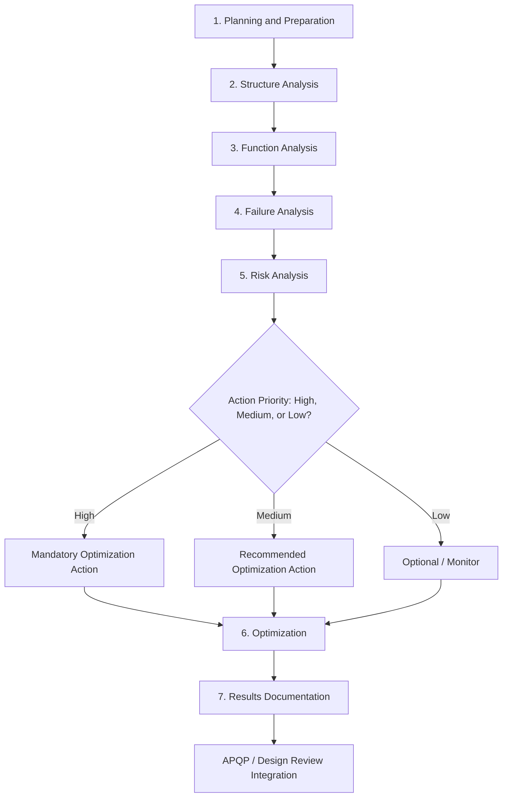

## Adoption and Spread Across the Automotive Industry

### Historical Transition from Aerospace to Automotive

FMEA's migration from military and aerospace applications into the automotive sector occurred gradually through the 1970s, driven by a combination of regulatory pressure, high-profile product liability incidents, and the automotive industry's growing recognition that design-stage failure prevention was more cost-effective than field-failure remediation. Unlike aerospace, where the primary driver was mission and crew safety in low-volume, high-cost systems, automotive adoption was shaped by the economics of high-volume manufacturing, warranty costs, and consumer safety litigation.

### The Ford Pinto Case as a Catalyst

**Key Points**

- The Ford Pinto fuel tank controversy (fires resulting from rear-end collisions, litigated prominently in the late 1970s) became a widely cited case in engineering ethics and reliability engineering education
- The case intensified scrutiny of how automotive manufacturers assessed and documented safety-related design risk
- In response to this environment, Ford Motor Company became one of the first major automakers to formally adopt and institutionalize FMEA as a standard design and process discipline in the late 1970s

Ford's internal adoption is widely credited as the entry point through which FMEA moved from a niche aerospace/defense technique into mainstream automotive engineering practice. [Inference: while Ford's formal adoption timeline is well documented in reliability engineering literature, the precise causal weighting between the Pinto litigation and Ford's internal reliability engineering initiatives is characterized somewhat differently across sources, so the exact motivational balance should be treated as an interpretive historical narrative rather than a single documented decision record.]

### Two Distinct Automotive FMEA Types

As the technique matured within automotive engineering, it diverged into two complementary but distinct applications, a structural distinction that remains foundational today:

1. **Design FMEA (DFMEA)** — evaluates potential failure modes in a *product's design* before production, focusing on how a component or system might fail to meet its intended function due to design weaknesses
2. **Process FMEA (PFMEA)** — evaluates potential failure modes in the *manufacturing or assembly process*, focusing on how a process step could produce a nonconforming or defective part

**Example**

A DFMEA on a brake caliper might identify "insufficient clamping force due to seal degradation under thermal cycling" as a failure mode. A PFMEA on the same part's manufacturing line might instead identify "incorrect torque applied during caliper bolt assembly" as a process-level failure mode — a related but structurally different analysis with its own severity, occurrence, and detection considerations.

### Formalization Through Industry Standards

As automotive FMEA practice matured through the 1980s and 1990s, industry bodies formalized it into published standards to promote consistency across suppliers and manufacturers, particularly given the automotive industry's dependence on complex, multi-tier supply chains where components from many external suppliers had to meet consistent reliability documentation expectations.

| Standard/Body | Contribution |
| --- | --- |
| SAE J1739 | Society of Automotive Engineers standard formalizing DFMEA and PFMEA procedures, terminology, and rating scales |
| QS-9000 | Quality management standard (precursor to ISO/TS 16949) that required FMEA as part of supplier quality documentation for the "Big Three" U.S. automakers |
| AIAG (Automotive Industry Action Group) | Published FMEA reference manuals in coordination with Ford, GM, and Chrysler to standardize practice across the supply base |
| ISO/TS 16949 (later IATF 16949) | International automotive quality management standard incorporating FMEA as an expected element of Advanced Product Quality Planning (APQP) |

This period also introduced the **Risk Priority Number (RPN)**, calculated as:

$$RPN = S \times O \times D$$

where $S$ is severity, $O$ is occurrence (probability), and $D$ is detection (the likelihood that the failure would be caught before reaching the customer). The RPN became the dominant prioritization metric in automotive FMEA practice for decades, allowing engineering teams to numerically rank failure modes for corrective action.

### The AIAG-VDA Harmonization (2019)

A significant modern milestone in this adoption history was the 2019 publication of the **AIAG-VDA FMEA Handbook**, a joint effort between the U.S.-based AIAG and the German VDA (Verband der Automobilindustrie) to harmonize what had become two divergent regional FMEA methodologies — the American AIAG approach and the German VDA approach — into a single unified international standard.

**Key Points of the AIAG-VDA Harmonization**

- Introduced a seven-step FMEA process (Planning and Preparation, Structure Analysis, Function Analysis, Failure Analysis, Risk Analysis, Optimization, Results Documentation)
- Replaced the traditional multiplicative RPN with an **Action Priority (AP)** table-based ranking system (High/Medium/Low), intended to reduce over-reliance on a single numeric score that could obscure genuinely high-severity, low-detectability risks
- Emphasized structure trees and function/failure network diagrams as more explicit representations of system relationships, compared to the traditional flat tabular format

### Process Flow: Automotive FMEA Lifecycle (Modern AIAG-VDA Structure)

### Integration with Broader Automotive Quality Systems

FMEA in the automotive industry rarely functions as a standalone document; it is deeply embedded within the broader **Advanced Product Quality Planning (APQP)** framework and feeds into or draws from several connected artifacts:

- **Design Verification Plan and Report (DVP&R)** — test plans often derived directly from high-risk failure modes identified in DFMEA
- **Control Plans** — manufacturing controls that reference PFMEA-identified failure modes and their detection methods
- **8D Problem Solving** — field failure investigations that frequently trigger FMEA updates to capture previously unidentified failure modes
- **Functional Safety standards (ISO 26262)** — for electronic/electrical systems, FMEA (and its safety-focused variant, FMEDA — Failure Modes, Effects, and Diagnostic Coverage Analysis) supports hazard analysis and risk assessment required for safety case documentation

### Conclusion

The automotive industry's adoption of FMEA represents the technique's most significant expansion beyond its military and aerospace origins, transforming it from a low-volume, high-cost-system safety tool into a high-volume manufacturing and design quality discipline embedded in global supply chain requirements. The divergence into DFMEA and PFMEA, the formalization through SAE J1739 and AIAG reference manuals, and the eventual international harmonization via AIAG-VDA all reflect the automotive sector's distinct pressures: managing risk across complex multi-tier supplier networks, high production volumes, and stringent liability and regulatory environments. This lineage explains why automotive FMEA today remains among the most standardized and widely taught applications of the methodology across any industry.

**Related Topics**

- Design FMEA (DFMEA) vs. Process FMEA (PFMEA) methodology deep dive
- Risk Priority Number (RPN) calculation and its criticisms
- AIAG-VDA Action Priority (AP) tables in detail
- Integration of FMEA with Advanced Product Quality Planning (APQP)
- FMEDA and functional safety analysis under ISO 26262
- 8D Problem Solving and its feedback loop into FMEA updates