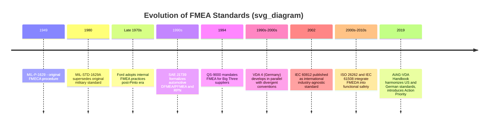

## Evolution of FMEA Standards Over Time

### Overview

The evolution of FMEA standards traces a path from a single military procurement document to a fragmented landscape of industry-specific, regionally divergent standards, followed by a modern trend toward harmonization and integration with functional safety frameworks. Understanding this evolution requires tracking not just the documents themselves, but the underlying methodological shifts each revision introduced — particularly the transition from purely qualitative criticality ranking to numeric risk scoring, and more recently, back toward structured qualitative action-priority frameworks.

### Phase 1: Military Origins (1949–1980)

**MIL-P-1629 (1949)** — *Procedures for Performing a Failure Mode, Effects and Criticality Analysis* — established the foundational structure: identify failure modes, trace their local/next-level/end effects, and rank by criticality (a combination of severity and probability of occurrence).

**MIL-STD-1629A (1980)** superseded the original procedure, refining terminology and structure while preserving the same conceptual foundation. Key refinements included:

- More explicit guidance on criticality matrix construction
- Clearer distinction between hardware-level and functional-level FMEA
- Formal introduction of the term "FMECA" (Failure Mode, Effects, and Criticality Analysis) as the standard's own name, reflecting that criticality ranking had always been integral rather than a later add-on

### Phase 2: Automotive Formalization (Late 1970s–1990s)

As FMEA spread into automotive engineering (catalyzed in part by Ford's adoption following the Pinto litigation era), the standards landscape fragmented along industry and regional lines:

| Standard | Origin | Key Contribution |
| --- | --- | --- |
| Ford/Chrysler/GM internal manuals | Late 1970s–1980s | Company-specific DFMEA/PFMEA procedures, precursors to shared standards |
| SAE J1739 | Society of Automotive Engineers | Formalized DFMEA and PFMEA terminology, rating tables, and the Risk Priority Number (RPN) methodology |
| QS-9000 | 1994, "Big Three" U.S. automakers | Mandated FMEA as a supplier quality requirement |
| VDA 4 (Band 4) | Verband der Automobilindustrie (Germany) | Parallel German-language automotive FMEA standard with distinct terminology and rating conventions from the American approach |

**Key Points**

- This period introduced the multiplicative Risk Priority Number, $RPN = S \times O \times D$, as the dominant prioritization metric
- Because AIAG (American) and VDA (German) standards developed largely independently, multinational suppliers serving both American and European OEMs often had to produce two separate FMEA documents for the same part — a significant administrative burden that later motivated harmonization

### Phase 3: Quality System Integration (1990s–2000s)

FMEA became formally embedded within broader quality management frameworks rather than existing as a standalone technique:

- **ISO/TS 16949** (later superseded by **IATF 16949**) incorporated FMEA as an expected element of Advanced Product Quality Planning (APQP) for automotive suppliers
- **IEC 60812** (*Analysis techniques for system reliability — Procedure for failure mode and effects analysis*) provided an international, industry-agnostic standard for FMEA/FMECA, applicable across electronics, industrial equipment, and general reliability engineering contexts outside the automotive-specific AIAG/VDA lineage
- Medical device and process industries began adopting FMEA variants aligned with **ISO 14971** (medical device risk management) and general process industry reliability practices

### Phase 4: Functional Safety Integration (2000s–2010s)

As embedded electronics and software-controlled systems became safety-critical across industries, FMEA was extended and adapted to support formal functional safety standards:

- **ISO 26262** (automotive functional safety for electrical/electronic systems) integrated FMEA-derived hazard analysis into its safety lifecycle, often via an extended variant called **FMEDA** (Failure Modes, Effects, and Diagnostic Coverage Analysis), which adds diagnostic coverage metrics needed to compute hardware safety metrics like SPFM and LFM (Single-Point and Latent Fault Metrics)
- **IEC 61508** (general functional safety standard for electrical/electronic/programmable electronic safety systems) similarly referenced FMEA/FMEDA-style analysis as an acceptable method for hardware safety integrity verification
- This phase marked a shift in FMEA's role: no longer purely a design-quality tool, but a required input to quantitative safety integrity calculations

### Phase 5: AIAG-VDA Harmonization (2019)

**Key Points**

- Published jointly by AIAG (US) and VDA (Germany) in 2019, this handbook resolved decades of divergence between American and German automotive FMEA practices
- Introduced a unified **seven-step process**: Planning and Preparation, Structure Analysis, Function Analysis, Failure Analysis, Risk Analysis, Optimization, and Results Documentation
- Replaced the traditional multiplicative RPN with an **Action Priority (AP)** table producing a High/Medium/Low categorical rating, addressing a long-standing criticism that RPN could produce numerically identical scores for risk profiles that were substantively very different (e.g., high severity/low occurrence vs. low severity/high occurrence)
- Introduced explicit **structure trees** and **function nets** as visual/relational representations of system architecture, supplementing the traditional flat tabular format

### Timeline of Standards Evolution

### Comparative Snapshot: Then vs. Now

| Dimension | MIL-STD-1629A Era | AIAG-VDA (2019) Era |
| --- | --- | --- |
| Risk ranking | Criticality matrix (severity × probability) | Action Priority table (structured qualitative categories) |
| Documentation format | Flat tabular worksheet | Tabular worksheet supplemented by structure trees and function nets |
| Scope of application | Primarily military/aerospace hardware | Automotive DFMEA, PFMEA, harmonized internationally; adapted across industries |
| Numeric scoring | Criticality number (Cr) | RPN largely deprecated in favor of AP, though still used informally in some organizations |
| Process granularity | Single-pass analysis per design iteration | Explicit seven-step structured process with defined stage gates |

### Conclusion

The evolution of FMEA standards reflects a broader pattern common to mature engineering methodologies: an initial single authoritative origin (MIL-P-1629), followed by fragmentation as the technique diffused into new industries with different needs and regulatory environments (automotive AIAG vs. VDA, aerospace MIL-STD lineage, general-purpose IEC 60812), followed eventually by consolidation and harmonization efforts (AIAG-VDA 2019) once the administrative cost of fragmentation outweighed the benefits of regional customization. The parallel integration with functional safety standards (ISO 26262, IEC 61508) represents a distinct evolutionary branch, transforming FMEA from a purely qualitative design-quality tool into a quantitative input for safety integrity calculations in modern electronic and software-intensive systems.

**Related Topics**

- MIL-STD-1629A procedure structure in detail
- SAE J1739 rating scales and RPN calculation methodology
- AIAG-VDA seven-step process and Action Priority tables
- FMEDA and its role in ISO 26262 hardware metric calculations
- IEC 60812 as an industry-agnostic FMEA/FMECA reference standard
- Criticisms and limitations of the Risk Priority Number (RPN) approach