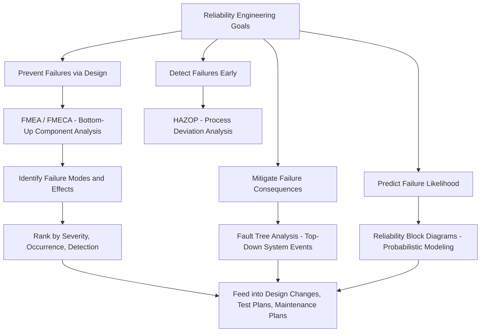

## Reliability Engineering Context and Goals

### Overview

FMEA does not exist as an isolated technique; it is one method within the broader discipline of reliability engineering — the field concerned with designing, operating, and maintaining systems so that they perform their intended function, without failure, for a specified period under specified conditions. Understanding FMEA's place within this larger discipline clarifies why it takes the specific structural form it does, and how it relates to the other analytical tools reliability engineers use.

### What Reliability Engineering Is Trying to Achieve

Reliability engineering exists to answer a deceptively simple question: **will this system do what it's supposed to do, for as long as it's supposed to, under the conditions it will actually encounter?** This breaks down into several concrete goals:

**Key Points**

- **Predict** how likely a system is to fail within a given time period or number of operating cycles
- **Prevent** failures through design choices made before a system is built or fielded
- **Detect** failures or precursors to failure before they cause significant harm
- **Mitigate** the consequences of failures that cannot be entirely prevented
- **Improve** systems over time using data from field failures, testing, and analysis

Reliability is formally distinguished from related but different concepts:

- **Availability** — the proportion of time a system is operational and able to perform its function (accounts for both failure rate and repair/maintenance time)
- **Safety** — the absence of conditions that can cause death, injury, or damage (a failure can be "reliable" in a statistical sense while still being unsafe if its failure mode is hazardous)
- **Quality** — conformance to specifications at the point of manufacture or delivery (a product can pass quality inspection and still have poor long-term reliability)

### The Mathematical Foundation: Reliability as a Function of Time

Reliability engineering formally defines reliability $R(t)$ as the probability that a system performs its intended function without failure over a time interval $[0, t]$, given specified operating conditions:

$$R(t) = P(T > t)$$

where $T$ is the random variable representing time to failure. This is directly related to the failure rate function $\lambda(t)$ and the cumulative distribution of failures $F(t) = 1 - R(t)$.

A widely used conceptual model in reliability engineering is the **bathtub curve**, which describes how failure rate typically varies over a product's life:

1. **Infant mortality period** — high initial failure rate due to manufacturing defects, design flaws, or installation errors, decreasing over time
2. **Useful life period** — a roughly constant, low failure rate, where failures occur randomly due to normal wear or external stress events
3. **Wear-out period** — increasing failure rate as components approach the end of their design life due to fatigue, wear, or degradation

**Example**

A newly manufactured batch of electronic control units might show a cluster of early failures due to a soldering defect (infant mortality), then a long stable period of random failures from occasional electrical surges (useful life), and finally rising failure rates as capacitors degrade near end-of-life (wear-out). Reliability engineering techniques target each phase differently: infant mortality is addressed through burn-in testing and quality control; useful-life failures are addressed through design margin and derating; wear-out is addressed through preventive maintenance scheduling and component life specifications.

### Where FMEA Fits Within Reliability Engineering's Toolkit

FMEA is one of several complementary techniques reliability engineers use, each with a different analytical direction and purpose:

| Technique | Direction of Analysis | Primary Question |
| --- | --- | --- |
| **FMEA/FMECA** | Bottom-up | "If this component fails, what happens to the system?" |
| **Fault Tree Analysis (FTA)** | Top-down | "For this specific system-level failure to occur, which combinations of component failures would need to happen?" |
| **Reliability Block Diagrams (RBD)** | Structural/probabilistic | "Given the reliability of individual components and how they're connected (series/parallel/redundant), what is the system's overall reliability?" |
| **Hazard and Operability Study (HAZOP)** | Deviation-based | "What happens if a process parameter deviates from its intended value (too much, too little, reversed, etc.)?" |
| **Root Cause Analysis (RCA)** | Retrospective | "Given that this failure already occurred, what chain of causes led to it?" |

FMEA's bottom-up, component-by-component structure makes it particularly well suited to **exhaustive discovery** of failure modes across a system, especially early in design when a full system-level fault tree may not yet be available. Its complementary counterpart, FTA, is often applied afterward to explore specific high-consequence system-level failures in more probabilistic depth, particularly where multiple simultaneous or combined failures matter.

### Relationship Diagram: FMEA Within the Reliability Engineering Toolkit

### Core Goals FMEA Specifically Serves Within This Context

Within the broader reliability engineering mission, FMEA specifically targets:

1. **Early failure discovery** — surfacing failure modes during design, when changes are cheapest, rather than after production or field deployment
2. **Systematic completeness** — using a structured worksheet format to reduce the risk that engineers overlook failure modes due to reliance on memory or informal review alone
3. **Cross-functional communication** — providing a shared document that design engineers, safety personnel, test engineers, and maintenance planners can all reference and contribute to
4. **Traceability and audit support** — creating a documented rationale for design decisions, particularly important in regulated industries (aerospace, automotive, medical devices) where safety cases must be defensible to regulators or auditors
5. **Input to downstream reliability activities** — FMEA output directly feeds test planning (verifying that high-risk failure modes are adequately tested), maintenance planning (informing preventive maintenance schedules), and design reviews (providing a structured basis for engineering risk discussions)

### Why This Context Matters for Learning FMEA

Understanding FMEA purely as an isolated worksheet technique — without this reliability engineering context — often leads to two common misapplications: treating FMEA as a compliance checkbox exercise disconnected from real design decisions, or expecting FMEA alone to answer questions it is not structurally suited for (such as probabilistic system-level risk quantification, which is better addressed through Reliability Block Diagrams or Fault Tree Analysis). Recognizing FMEA as one deliberately-scoped tool within a larger toolkit — one optimized specifically for bottom-up, exhaustive, single-failure-mode discovery — clarifies both its strengths and its appropriate limits.

**Related Topics**

- Bathtub curve and failure rate modeling in depth
- Fault Tree Analysis (FTA) methodology and Boolean logic gates
- Reliability Block Diagrams (RBD) and series/parallel system modeling
- Mean Time Between Failures (MTBF) and Mean Time To Failure (MTTF) calculations
- HAZOP methodology for process industries
- Root Cause Analysis (RCA) techniques (5 Whys, Fishbone/Ishikawa diagrams)