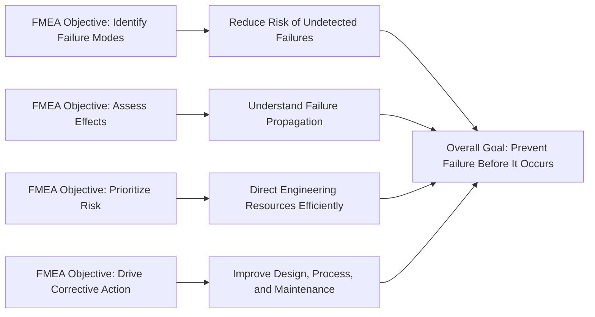

## Purpose and Objectives of FMEA

### Definition

**Failure Mode and Effects Analysis (FMEA)** is a systematic, structured method for identifying potential ways a system, product, process, or service could fail, evaluating the consequences of each failure, and prioritizing corrective or preventive action based on the severity, likelihood, and detectability of each failure mode. It is fundamentally a **proactive, bottom-up** technique: it begins at the component or process-step level and works upward to trace how a localized failure propagates into broader system or mission consequences.

### Core Purpose

The central purpose of FMEA is to answer three linked questions for every relevant component, function, or process step in a system:

1. **What could go wrong?** (the failure mode — the specific manner in which an item could fail to perform its intended function)
2. **What happens if it does?** (the effect — the consequence of that failure, traced locally, at the next level up, and at the overall system/end-user level)
3. **How bad is it, and what should be done about it?** (the assessment and prioritization of risk, followed by corrective action)

**Key Points**

- FMEA is fundamentally about **anticipating failure before it occurs**, rather than reacting to failures after they happen
- It is most valuable when performed early in a design or process lifecycle, when changes are cheapest and most feasible to implement
- It produces a living document meant to be revisited and updated as designs evolve, as field data accumulates, or as manufacturing processes change

### Primary Objectives

FMEA is typically applied to achieve several distinct but interrelated objectives:

**Identify Failure Modes Systematically**

Rather than relying on ad hoc engineering judgment or tribal knowledge, FMEA imposes a structured worksheet format that forces explicit, itemized consideration of every component or process step, reducing the likelihood that a critical failure mode is overlooked due to oversight or assumption.

**Assess Consequences of Failure**

For each identified failure mode, FMEA traces its effects at multiple levels:

- **Local effect** — the immediate consequence on the component or step itself
- **Next-level effect** — the consequence on the immediate subsystem or surrounding process
- **End effect** — the ultimate consequence on the overall system, end user, or mission

**Prioritize Risk for Action**

Not all failure modes warrant the same response. FMEA provides a structured basis for prioritization, historically via the **Risk Priority Number (RPN)**:

$$RPN = S \times O \times D$$

where $S$ = severity of the effect, $O$ = occurrence/probability of the failure mode, and $D$ = detectability (the likelihood that the failure would be caught before it causes harm). More modern frameworks (such as AIAG-VDA's Action Priority tables) replace this multiplicative score with structured qualitative categories (High/Medium/Low) to avoid some of the RPN's known distortions, but the underlying objective — directing limited engineering resources toward the failure modes that matter most — remains unchanged.

**Drive Corrective and Preventive Action**

FMEA is not merely a documentation exercise; its output is meant to directly inform design changes, added redundancy, improved detection mechanisms (such as sensors, alarms, or inspection steps), revised manufacturing controls, or updated maintenance procedures.

**Support Cross-Functional Communication and Traceability**

Because FMEA is typically performed by a cross-functional team (design engineers, reliability engineers, quality personnel, manufacturing engineers, and sometimes field service or customer support representatives), it creates a shared reference document. This also produces an audit trail — a documented rationale for design and process decisions that is often required in regulated industries.

### Example: Objective-Driven Analysis in Practice

**Example**

Consider a DFMEA performed on an automotive fuel pump. The failure mode "pump motor bearing seizes" might be traced as follows:

- **Local effect**: motor stops rotating
- **Next-level effect**: no fuel delivery from tank to engine
- **End effect**: engine stalls while driving, potentially in traffic

Given a high severity rating (stalling in traffic poses a safety risk), even a low occurrence probability might still yield a high priority for action if detection is also poor (e.g., no warning indicator before failure). This might drive a design team to add a diagnostic sensor that detects early bearing wear (improving detectability), which lowers the overall risk priority without needing to redesign the bearing itself.

### FMEA's Objectives Mapped to Reliability Engineering Goals

### What FMEA Is Not Intended to Do

Clarifying FMEA's scope also requires understanding its boundaries:

- FMEA is generally **not** designed to model combinations of simultaneous failures (that is better addressed by Fault Tree Analysis)
- FMEA is generally **not** a quantitative reliability prediction tool in the way Reliability Block Diagrams or statistical life-testing are; its occurrence ratings are typically categorical/ordinal rather than precise probability estimates
- FMEA is **not** intended as a one-time compliance document; treating it as such undermines its core value as a living, iteratively updated engineering artifact

### Conclusion

The purpose of FMEA can be summarized as **structured foresight**: a disciplined method for anticipating how things can go wrong, understanding the consequences if they do, and using that understanding to direct engineering effort toward the failures that matter most — before those failures ever reach a customer, a production line, or a mission-critical operation. Its objectives — systematic identification, effect analysis, risk prioritization, and action-driving — work together to embed failure prevention directly into the design and process development lifecycle, rather than leaving it to chance or after-the-fact correction.

**Related Topics**

- Failure mode identification techniques and brainstorming methods
- Severity, Occurrence, and Detection rating scales in detail
- Risk Priority Number (RPN) vs. Action Priority (AP) comparison
- DFMEA vs. PFMEA distinctions and worked examples
- FMEA team composition and facilitation best practices
- Linking FMEA output to Control Plans and Design Verification Plans