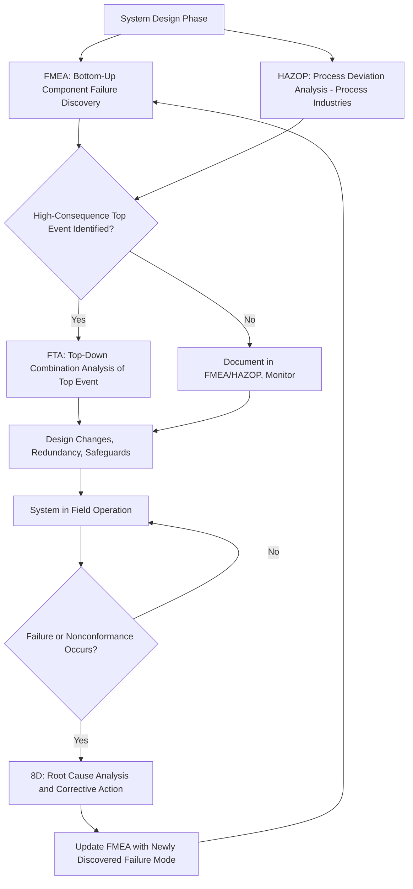

## FMEA Compared with Fault Tree Analysis, HAZOP, and 8D

### Overview

FMEA is one of several structured techniques used in reliability, safety, and quality engineering, and much confusion in practice stems from applying FMEA where a different technique would be more appropriate — or vice versa. Each of these four methods (FMEA, Fault Tree Analysis, HAZOP, and 8D) analyzes failure or problems from a different direction, at a different point in a system's lifecycle, and for a somewhat different purpose. Understanding their distinctions clarifies not just how they differ, but how they are frequently used together as complementary parts of a broader reliability and quality program.

### FMEA: Bottom-Up, Proactive, Component-Driven

FMEA starts at the component or process-step level and works upward, asking: *"If this specific item fails in this specific way, what happens to the system?"* It is inductive reasoning — moving from a specific cause (a component failure mode) to its general consequences.

**Key Points**

- Structured as a tabular worksheet, itemizing failure modes, causes, effects, and current controls for each function or component
- Prioritizes failure modes using Severity, Occurrence, and Detection (traditionally combined into an RPN, or more recently an Action Priority category)
- Performed proactively, ideally early in design or process development, before failures occur
- Best suited for **exhaustive, systematic discovery** of failure modes across many components or steps

### Fault Tree Analysis (FTA): Top-Down, Deductive, Event-Driven

FTA starts from a specific undesired system-level event (the "top event") and works downward, asking: *"What combination of lower-level failures could cause this specific top-level event to occur?"* It is deductive reasoning — moving from a general consequence back to its possible specific causes.

**Key Points**

- Represented graphically as a tree of logic gates (AND, OR, and others) connecting basic events to the top event
- Explicitly models **combinations of failures** — a critical capability that pure FMEA does not structurally provide, since standard FMEA typically analyzes single failure modes independently
- Supports quantitative probability calculation for the top event, given probabilities of the basic events, using Boolean algebra
- Best suited for analyzing specific, well-defined catastrophic or high-consequence events where understanding *which combinations* of failures matter is essential

**Example**

An FMEA on an aircraft hydraulic system might identify "hydraulic pump seal failure" as a failure mode with the end effect "loss of one hydraulic circuit." A complementary FTA on the top event "total loss of aircraft hydraulic power" would instead explore which *combinations* of circuit failures (e.g., pump failure AND backup pump failure AND manual reversion failure) would need to co-occur for that catastrophic top event to materialize — a question FMEA alone, analyzing single failure modes, is not structured to directly answer.

### HAZOP: Deviation-Based, Process-Centric

**Hazard and Operability Study (HAZOP)** originated in the process industries (chemical processing, oil and gas, and similar continuous-process environments) and asks a structurally different question: *"What happens if a process parameter deviates from its design intent?"* rather than *"What happens if this component fails?"*

**Key Points**

- Uses standardized **guide words** (e.g., "No," "More," "Less," "Reverse," "As Well As," "Other Than") applied systematically to each process parameter (flow, pressure, temperature, level, composition) at each node in a process
- Performed by a multidisciplinary team walking through a Piping and Instrumentation Diagram (P&ID) or equivalent process representation, node by node
- Particularly well suited to identifying **hazards arising from process deviations** rather than purely from component hardware failure — for example, an operator error, an upstream process change, or an unexpected interaction between process parameters
- Complements FMEA in process industries: FMEA might analyze how a specific valve can fail, while HAZOP analyzes how a flow deviation at that point in the process — regardless of whether it originates from a valve failure, an operator action, or an upstream disturbance — could create a hazard

### 8D: Retrospective, Problem-Solving, Team-Based

**Eight Disciplines (8D)** is fundamentally different in character from FMEA, FTA, and HAZOP: it is a **retrospective, reactive** problem-solving methodology applied *after* a failure or nonconformance has already occurred, most commonly in response to a customer complaint or field failure in automotive and manufacturing contexts.

**Key Points**

- Structured as eight sequential steps (originally developed by Ford Motor Company): D1 (Team Formation) through D8 (Recognize Team and Prevent Recurrence), including root cause identification, containment actions, and permanent corrective actions
- Root cause analysis within 8D often uses complementary tools such as the 5 Whys or Fishbone (Ishikawa) diagrams
- Critically, 8D investigations frequently **feed back into existing FMEA documents** — a failure mode discovered through 8D that was not previously captured in the FMEA should be added, updating the FMEA's occurrence and detection ratings and closing a gap in the original proactive analysis

### Comparative Summary Table

| Dimension | FMEA | Fault Tree Analysis (FTA) | HAZOP | 8D |
| --- | --- | --- | --- | --- |
| Direction | Bottom-up (inductive) | Top-down (deductive) | Deviation-based, node-by-node | Retrospective/reactive |
| Timing | Proactive, pre-failure | Proactive, pre-failure | Proactive, pre-failure | Reactive, post-failure |
| Core Question | "If this fails, what happens?" | "What must fail together for this event to occur?" | "What if this parameter deviates?" | "Why did this already happen, and how do we stop recurrence?" |
| Handles Combined Failures | Generally no (single failure mode focus) | Yes (explicit logic gates) | Indirectly, via deviation causes | Yes, via root cause chains |
| Output Format | Tabular worksheet | Graphical logic tree | Tabular worksheet (guide word by node) | Structured 8-step report |
| Typical Domain | Automotive, aerospace, manufacturing, medical devices | Aerospace, nuclear, safety-critical systems | Chemical/process industries | Automotive and general manufacturing quality |

### How These Techniques Relate Within a Reliability Program

### Why Organizations Use These Together Rather Than Choosing One

**Key Points**

- FMEA's strength (systematic, exhaustive single-failure-mode coverage) is also its limitation (it doesn't natively model failure combinations) — this is precisely where FTA adds value for the small number of genuinely catastrophic top events that warrant deeper combinatorial analysis
- HAZOP's process-deviation framing catches hazard scenarios that a purely component-failure-oriented FMEA might miss, particularly in continuous process environments where operator actions and process parameter interactions matter as much as hardware failure
- 8D closes the loop: it ensures that failures which escape proactive analysis (FMEA, FTA, HAZOP) during real-world operation are fed back into those proactive documents, so the same gap doesn't recur in future designs or production runs

### Conclusion

FMEA, Fault Tree Analysis, HAZOP, and 8D are not competing alternatives for the same job — they are complementary tools addressing different analytical questions at different points in a system's lifecycle. FMEA excels at proactive, exhaustive, bottom-up discovery of individual failure modes; FTA excels at rigorously analyzing specific high-consequence events and the failure combinations that could cause them; HAZOP excels at identifying hazards arising from process parameter deviations in continuous-process environments; and 8D excels at systematically resolving and learning from failures that have already occurred in the field. Mature reliability and quality programs typically integrate several of these techniques, using each where its particular analytical strength is best suited, and using the feedback loop between reactive techniques (8D) and proactive ones (FMEA, FTA, HAZOP) to continuously improve system reliability over time.

**Related Topics**

- Fault Tree Analysis logic gates and quantitative probability calculation
- HAZOP guide words and node selection methodology
- 8D report structure and root cause tools (5 Whys, Fishbone diagrams)
- Combining FMEA and FTA in safety case development
- Bowtie analysis as a technique bridging fault tree and event tree methods
- Selecting the appropriate analysis technique based on system lifecycle phase