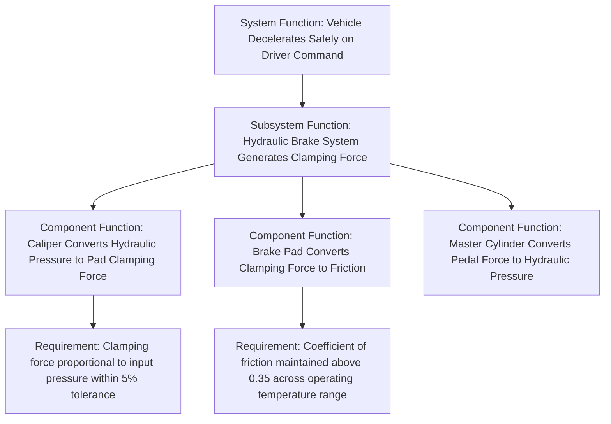

## Function and Requirement Definitions

### Overview

Before any failure mode can be meaningfully identified, an FMEA team must first clearly define what the item under analysis is *supposed to do*. This step — establishing functions and requirements — is foundational and frequently underweighted in practice, yet it fundamentally determines the quality of everything that follows: a failure mode is, by definition, the manner in which an item fails to fulfill a defined function, so an ambiguous or incomplete function definition produces an incomplete or misdirected FMEA.

### What Is a Function?

A **function** describes what an item, component, subsystem, or process step is intended to do, expressed in terms of an action and, ideally, a measurable or verifiable performance parameter. Functions are typically written using an active verb plus an object, often with a quantified performance criterion attached.

**Key Points**

- Functions should be stated in terms of **intended performance**, not physical description — "seals the chamber to prevent fluid leakage below 0.01 mL/hr" is a function; "is made of rubber" is a physical attribute, not a function
- A single component often has **multiple functions**, and each should be analyzed separately, since a component can fail to meet one function while still meeting others
- Functions exist at multiple levels of a system hierarchy: system-level functions, subsystem-level functions, and component-level functions, each linked to the level above

**Example**

For an automotive brake caliper, functions might include:

- Convert hydraulic pressure into clamping force on the brake pad (primary function)
- Allow the brake pad to retract slightly when pressure is released (secondary function)
- Dissipate heat generated during braking (secondary function)
- Contain hydraulic fluid without external leakage (secondary function)

Each of these is analyzed as a distinct function in the FMEA worksheet, because a failure mode affecting heat dissipation is a different engineering problem from a failure mode affecting fluid containment, even though both concern the same physical component.

### What Is a Requirement?

A **requirement** is a specific, verifiable criterion that defines what constitutes acceptable performance of a function. Where a function describes *what* an item does, a requirement quantifies or qualifies *how well* it must do it. Requirements provide the reference point against which "failure" is actually defined — without a stated requirement, "failure" becomes subjective.

**Key Points**

- Requirements should be **specific and measurable** wherever possible (e.g., "must withstand 150°C continuous operating temperature" rather than "must be heat resistant")
- Requirements typically originate from multiple sources: customer specifications, regulatory/safety standards, internal engineering standards, and downstream manufacturing or serviceability constraints
- A well-formed requirement enables a clear failure mode statement, because the failure mode is essentially "the requirement is not met, and here is the specific way it is not met"

### The Function-Requirement-Failure Mode Relationship

This relationship is foundational to the entire FMEA structure and is worth making explicit:

$$\text{Function} + \text{Requirement} \Rightarrow \text{Failure Mode} = \text{the way the requirement fails to be met}$$

**Example**

- **Function**: Maintain cabin pressure within a specified range during flight
- **Requirement**: Cabin altitude must not exceed 8,000 ft equivalent pressure altitude during cruise
- **Failure Mode**: Cabin pressure decays below the equivalent of 8,000 ft (a specific, verifiable failure mode directly derived from the stated function and requirement)

Without the explicit requirement (8,000 ft equivalent), the failure mode could only be vaguely stated as "loses pressure," which is far less useful for driving design analysis, test planning, or corrective action, since it provides no clear threshold against which design margin or test results can be evaluated.

### Sources of Function and Requirement Information

FMEA teams typically draw function and requirement definitions from several documented sources rather than inventing them from scratch:

| Source | Typical Content |
| --- | --- |
| Product/System Requirements Document | Customer or program-level functional and performance requirements |
| Engineering drawings and specifications | Dimensional, material, and tolerance requirements |
| Interface Control Documents (ICDs) | Requirements governing how a component interacts with adjacent systems |
| Regulatory and industry standards | Mandated safety, environmental, or performance requirements (e.g., FMVSS in automotive, DO-178C/DO-254 in aerospace software/hardware) |
| Block diagrams and functional flow diagrams | Visual representation of how functions relate and flow through a system |

### Structure Analysis: Linking Functions Across System Levels

In modern FMEA methodology (particularly the AIAG-VDA seven-step process), function definition is formalized into an explicit **Function Analysis** step, which follows a preceding **Structure Analysis** step that establishes the system hierarchy (system → subsystem → component). Functions are then defined at each level and explicitly linked to the level above and below, producing what is often visualized as a **function net** or **function tree**.

This layered structure ensures that when a failure mode is identified at the component level (e.g., "caliper piston seal degrades"), its effect can be systematically traced upward through each linked function level to the ultimate system-level consequence (e.g., "vehicle fails to decelerate safely on driver command") — the same local/next-level/end-effect tracing structure inherited from FMEA's original military formulation.

### Common Pitfalls in Function and Requirement Definition

**Key Points**

- **Vague functions**: Stating a function as "works correctly" or "operates as intended" provides no basis for identifying specific failure modes; functions should specify the actual action and object
- **Missing secondary functions**: Teams often capture the obvious primary function but overlook secondary functions (thermal, acoustic, ergonomic, serviceability) that can also fail independently
- **Conflating function with implementation**: Describing "how" something is built rather than "what" it must accomplish limits the FMEA's ability to identify failure modes unrelated to the specific implementation chosen
- **Unquantified requirements**: A requirement without a measurable threshold (e.g., "must be reliable" instead of "must achieve $B_{10}$ life of 500,000 cycles") makes it difficult to later assess severity and design margin objectively

### Conclusion

Function and requirement definitions form the essential groundwork upon which the entire FMEA analysis is built. A function describes intended behavior; a requirement quantifies the threshold of acceptable performance for that behavior; and a failure mode is, by direct construction, the specific way in which that requirement is not met. Skipping or rushing this foundational step — a common shortcut under schedule pressure — routinely produces FMEAs with vague, incomplete, or poorly prioritized failure modes, since the quality of failure mode identification is directly bounded by the clarity of the function and requirement definitions that precede it.

**Related Topics**

- Structure Analysis and system hierarchy decomposition (AIAG-VDA Step 2)
- Function nets and function tree diagrams in detail
- Deriving failure modes systematically from stated requirements
- Requirements traceability across the product development lifecycle
- Interface Control Documents (ICDs) and their role in function definition
- Distinguishing primary, secondary, and parasitic functions in FMEA scoping