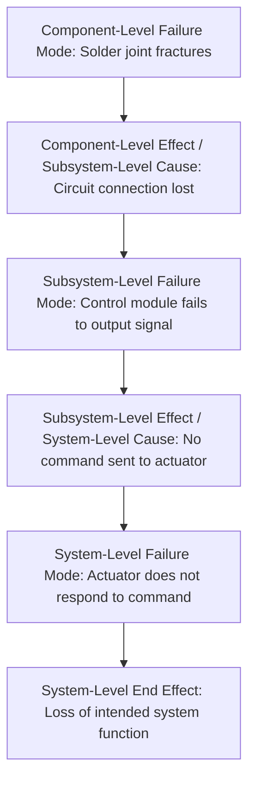

## Failure Mode Definition

### Definition

A **failure mode** is the specific manner in which an item — a component, subsystem, function, or process step — fails to perform its intended function as defined by its stated requirement. It describes *how* something fails, as distinct from *why* it fails (the cause) or *what happens as a result* (the effect). This precise three-way distinction — failure mode, cause, and effect — is one of the most fundamental structural elements of FMEA, and confusing these categories is among the most common errors in practical FMEA execution.

### The Core Distinction: Mode vs. Cause vs. Effect

**Key Points**

- **Failure mode**: the observable or definable way the function is not met (e.g., "fractures," "leaks," "fails to close," "outputs incorrect value")
- **Failure cause**: the mechanism or root reason the failure mode occurs (e.g., "material fatigue due to cyclic loading," "seal degradation from thermal exposure," "software logic error under boundary condition")
- **Failure effect**: the consequence of the failure mode on the next level up, and ultimately on the system or end user (e.g., "loss of structural support," "fluid leakage into engine bay," "unexpected system shutdown")

**Example**

Consider a pressure relief valve:

- **Failure mode**: valve fails to open at the specified pressure threshold
- **Failure cause**: spring fatigue causing incorrect set-point force, or contamination causing the valve seat to stick
- **Failure effect (local)**: system pressure continues rising unchecked
- **Failure effect (end)**: vessel rupture, potential injury or equipment loss

A common practical error is writing "spring fatigue" directly as the failure mode, when it is actually the cause. The failure mode must be phrased in terms of the function not being met ("fails to open at set pressure"), while the cause explains the underlying mechanism driving that failure mode. This distinction matters because a single failure mode can have multiple distinct causes, and correctly separating them allows each cause to be addressed with its own targeted corrective action.

### Categories of Failure Modes

Failure modes are commonly classified into a small number of generic categories, which serve as a useful checklist when brainstorming potential failure modes for a given function:

| Category | Description | Example |
| --- | --- | --- |
| Loss of function | The function does not occur at all | Pump does not deliver fluid |
| Partial/degraded function | The function occurs, but below required performance | Pump delivers fluid at reduced flow rate |
| Intermittent function | The function occurs unpredictably, sometimes correctly and sometimes not | Sensor intermittently drops signal |
| Unintended function | The item performs a function it is not supposed to perform | Valve opens when it should remain closed |
| Delayed function | The function occurs, but later than required | Airbag deploys after the required response window |
| Over-performance | The function occurs beyond its intended or safe limit | Actuator applies excessive force beyond design limit |

These categories are not universally standardized in exact wording across every FMEA reference document, but the underlying taxonomy — no function, degraded function, intermittent function, unintended function, and untimely function — appears consistently across AIAG, VDA, and general reliability engineering literature. [Inference: category naming conventions vary somewhat by source and industry standard, though the substantive taxonomy is well established.]

### Deriving Failure Modes from Function and Requirement Statements

As established in the function/requirement relationship, a failure mode is systematically derivable once a function and its requirement are clearly stated:

$$\text{Failure Mode} = \neg(\text{Requirement is satisfied})$$

In practical terms, this means the FMEA team asks, for each stated function and requirement: *"In how many distinct ways could this specific requirement fail to be satisfied?"* — and each distinct answer becomes a separate failure mode entry in the worksheet.

**Example**

- **Function**: Regulate output voltage
- **Requirement**: Output voltage held at $12V \pm 0.5V$ under specified load conditions
- Possible failure modes derived directly from this requirement:
  - Output voltage exceeds $12.5V$ (over-voltage)
  - Output voltage falls below $11.5V$ (under-voltage)
  - Output voltage oscillates outside tolerance band (instability)
  - No output voltage produced (complete loss of function)

Each of these is analyzed as a separate row in the FMEA worksheet, since each may have different causes, different effects, and different appropriate corrective actions.

### Failure Modes at Different Levels of System Hierarchy

Because functions exist at multiple hierarchical levels (system, subsystem, component), failure modes are similarly scoped at each level, and a failure mode at one level often becomes the *cause* of a failure mode at the next level up — a key structural link that connects individual FMEA worksheet rows into a coherent chain of causation.

This chaining illustrates why FMEA is frequently performed across multiple linked worksheets (component-level, subsystem-level, system-level) in complex systems, with the effect column of a lower-level FMEA feeding directly into the cause column of the FMEA one level above it.

### Practical Guidance for Writing Failure Mode Statements

**Key Points**

- State the failure mode as the **negation or degradation of the specific function**, not as a vague general statement ("fails" alone is insufficient — specify *how* it fails)
- Avoid embedding the cause within the failure mode statement (e.g., write "gear fails to transmit torque," not "gear strips teeth due to overload," which conflates mode and cause)
- Avoid embedding the effect within the failure mode statement (e.g., write "seal fails to contain fluid," not "seal failure causes environmental contamination," which conflates mode and effect)
- Ensure every stated function and requirement has at least one corresponding failure mode considered — an unanalyzed function represents a gap in FMEA coverage

### Conclusion

The failure mode is the structural anchor point of the entire FMEA worksheet: it is the specific, function-derived statement of "how" something fails, deliberately separated from "why" (cause) and "so what" (effect) so that each can be independently analyzed, rated, and addressed. Precision in failure mode definition — phrasing it strictly as an unmet function or requirement, without conflating cause or effect — is what allows the rest of the FMEA structure (severity, occurrence, detection ratings, and the resulting prioritization) to function correctly, since each of those ratings is only meaningful when applied to a clearly and consistently defined failure mode.

**Related Topics**

- Failure cause identification and root-cause categorization techniques
- Failure effect analysis: local, next-level, and end-effect tracing
- Linking failure modes across multi-level FMEA worksheets
- Brainstorming techniques for exhaustive failure mode identification
- Severity, Occurrence, and Detection rating scales applied to failure modes
- Common failure mode taxonomies by industry (mechanical, electrical, software)