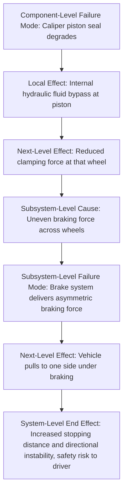

## Failure Effects: Local, Next Level, and End Effect

### Definition

A **failure effect** describes the consequence of a failure mode — what happens as a result of the item failing in the specified manner. Because a single failure mode can produce consequences that ripple across multiple levels of a system hierarchy, FMEA formally decomposes failure effects into three distinct levels: **local effect**, **next-level effect**, and **end effect**. This tiered structure, directly inherited from the original military FMECA methodology (MIL-STD-1629A), is what allows a component-level failure to be traced systematically all the way up to its ultimate consequence on the overall system, mission, or end user.

### The Three Levels of Effect

**Local Effect**

The consequence of the failure mode confined to the item itself or its immediate function — the most narrowly scoped level of effect, describing what happens right at the point of failure, without yet considering how that consequence propagates outward.

**Next-Level Effect**

The consequence of the failure mode on the immediately surrounding subsystem, assembly, or process stage — one level up in the system hierarchy from the local effect. This is sometimes referred to as the "higher-level effect" and may itself be further subdivided in complex, deeply nested systems (e.g., next-level effect at the subsystem level, then again at the system level) before reaching the end effect.

**End Effect**

The ultimate consequence of the failure mode as experienced at the highest level of concern for the analysis — typically the overall system, the mission, the end user/customer, or the operator. This is the effect most directly relevant to severity rating, since severity is conventionally assessed based on the end effect's consequence to safety, mission success, regulatory compliance, or customer satisfaction.

**Key Points**

- The three levels are linked in a causal chain: local effect leads to (or contributes to) next-level effect, which leads to (or contributes to) end effect
- Severity ratings in FMEA are assigned based on the **end effect**, not the local effect, since the end effect represents the actual consequence that matters to safety, mission, or customer experience
- Documenting all three levels — not just the end effect — preserves the reasoning chain, which is essential for design reviews, audits, and for correctly updating the analysis when a component or subsystem design changes

### Worked Example: Automotive Braking System

**Example**

Consider the failure mode "brake caliper piston seal degrades, causing internal hydraulic fluid leakage":

- **Local effect**: Reduced hydraulic pressure available at the caliper piston; some fluid bypasses the piston internally
- **Next-level effect**: Reduced clamping force applied to the brake pad on that wheel; that wheel's braking contribution is diminished
- **End effect**: Increased overall stopping distance for the vehicle; in a worst case combined with other factors (e.g., wet road, high speed), potential loss of adequate braking performance, posing a safety risk to the driver and others

Note how the severity assessment would properly be based on the end effect ("increased stopping distance / potential safety risk"), not the local effect ("internal fluid bypass"), which in isolation might seem like a minor internal condition. This is precisely why the effect-tracing structure matters: analyzing only the local effect risks systematically under-rating the true severity of a failure mode.

### Effect Tracing as a Chained Structure Across System Levels

In systems with deep hierarchical structure (system → subsystem → assembly → component), the "next-level effect" of one FMEA worksheet often becomes the "local effect" or the "cause" entry of the FMEA worksheet one level above it — creating a chain that links multiple FMEA documents together across the system hierarchy.

This diagram illustrates the key mechanism: the component-level next-level effect ("reduced clamping force") becomes the input/cause for the subsystem-level analysis, whose own next-level effect then feeds the system-level end effect. This chaining is what allows FMEA to maintain traceability across a complex, multi-tiered system without requiring a single, unwieldy worksheet spanning every level simultaneously.

### Effects in Different Industry Contexts

The local/next-level/end-effect structure applies consistently across industries, though the specific terminology and typical "end effect" categories vary by domain:

| Industry | Typical End-Effect Categories |
| --- | --- |
| Aerospace/Military (MIL-STD-1629A lineage) | Loss of mission, loss of aircraft/crew, degraded mission capability, no effect |
| Automotive (AIAG-VDA) | Safety-related failure (regulatory noncompliance), loss of primary function, degradation of comfort/convenience function, no discernible effect to customer |
| Medical devices | Patient harm severity levels, device malfunction affecting treatment, no clinical impact |
| Process/Manufacturing (PFMEA) | Product shipped nonconforming, scrap/rework required, production line stoppage, no impact on product or process |

### Common Pitfalls in Effect Analysis

**Key Points**

- **Skipping directly to end effect**: Jumping straight from failure mode to end effect without documenting the intermediate local and next-level effects loses the reasoning chain needed for later design reviews or when a subsystem's design changes
- **Confusing effect with cause**: An effect describes *consequence*, not *mechanism* — "increased stopping distance" is an effect; "seal material degraded by heat" is a cause, not an effect
- **Inconsistent end-effect scope across a worksheet**: If some rows in an FMEA state end effects at the system level while others stop at the subsystem level, severity ratings become inconsistent and difficult to compare across the worksheet — the team should agree on a consistent end-effect scope (typically "effect on the customer/mission/safety") before beginning the analysis
- **Ignoring effects on other functions**: A failure mode can sometimes produce effects on functions other than the one being directly analyzed (e.g., a coolant leak affecting not just cooling function but also electrical insulation nearby); thorough effect analysis should consider these secondary propagation paths where relevant

### Conclusion

The local/next-level/end-effect structure is what transforms FMEA from a simple list of "things that could break" into a genuinely predictive tool for understanding system-level consequences. By deliberately tracing a failure mode's consequences through each level of the system hierarchy — rather than jumping directly to an assumed end result — the analysis preserves the causal reasoning needed for accurate severity assessment, cross-level traceability in complex multi-tiered systems, and defensible documentation during design reviews or regulatory audits. This structure, established in FMEA's original military formulation and preserved through every subsequent industry adaptation, remains one of the method's most distinctive and valuable structural features.

**Related Topics**

- Severity rating scales and their basis in end-effect consequence
- Linking multi-level FMEA worksheets across system hierarchy
- Failure mode vs. cause vs. effect: precise terminology distinctions
- Structure Analysis and Function Analysis in the AIAG-VDA seven-step process
- Effect categories by industry: aerospace, automotive, medical device
- Common documentation pitfalls in FMEA effect analysis