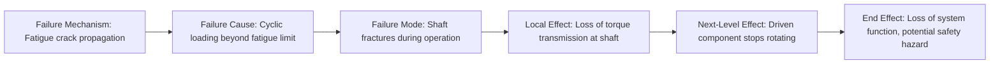

## Failure Causes and Failure Mechanisms

### Definition

A **failure cause** is the specific circumstance, condition, or root reason that leads to the occurrence of a failure mode — it answers the question "why did this failure mode happen?" A closely related but more granular concept is the **failure mechanism**: the underlying physical, chemical, electrical, or logical process by which the failure cause actually produces the observed failure mode. Together, cause and mechanism provide the explanatory link between "how something fails" (the failure mode) and the actionable engineering basis for preventing it.

### Distinguishing Cause from Mechanism

While often used loosely or interchangeably in casual engineering discussion, formal reliability engineering treats these as related but distinct concepts:

**Key Points**

- **Failure cause**: the immediate, assignable circumstance that triggers the failure (e.g., "excessive vibration during transport," "contamination in hydraulic fluid," "operator error during assembly")
- **Failure mechanism**: the underlying physical or chemical process through which that cause actually degrades or breaks the item (e.g., "fatigue crack propagation," "corrosion," "electromigration," "dielectric breakdown")
- A single failure cause can operate through a specific mechanism to produce a failure mode; understanding the mechanism is often what enables a genuinely effective corrective action, rather than merely addressing the surface-level cause

**Example**

Failure mode: "shaft fractures during operation"

- **Failure cause**: cyclic loading beyond the component's fatigue limit over the product's service life
- **Failure mechanism**: high-cycle fatigue crack initiation at a stress concentration point (e.g., a fillet radius or surface scratch), followed by crack propagation until fracture
- Corrective action informed by mechanism: increasing the fillet radius to reduce local stress concentration, or improving surface finish to eliminate crack initiation sites — actions that specifically target the fatigue mechanism, rather than a generic action like "use stronger material," which may not address the actual mechanism at all

### The Full Causal Chain

FMEA's terminology forms a complete causal chain that links root-level mechanisms all the way up to system-level consequences:

$$\text{Mechanism} \rightarrow \text{Cause} \rightarrow \text{Failure Mode} \rightarrow \text{Effect (Local} \rightarrow \text{Next-Level} \rightarrow \text{End)}$$

This chain clarifies why FMEA worksheets typically include separate columns for cause and for effect on either side of the failure mode entry: they represent fundamentally different analytical directions relative to the failure mode itself — cause looks backward (why did this happen), effect looks forward (what happens as a result).

### Categories of Failure Causes

Failure causes are commonly grouped into broad categories, which serve as a useful checklist during brainstorming to ensure comprehensive coverage rather than fixating on the most obvious cause:

| Category | Description | Example |
| --- | --- | --- |
| Design-related | Inherent weakness or inadequate margin in the design itself | Undersized component for actual operating loads |
| Manufacturing/process-related | Deviation introduced during production | Incorrect heat treatment, contamination during assembly |
| Material-related | Deficiency in the material itself | Material defect, incorrect material specified or substituted |
| Environmental | External conditions the item is exposed to | Corrosive environment, extreme temperature cycling, humidity |
| Operational/usage-related | How the item is actually used, which may differ from design assumptions | Operation beyond rated duty cycle, improper maintenance |
| Human/procedural | Errors in operation, assembly, or maintenance procedures | Incorrect torque applied during assembly, skipped inspection step |
| Wear-out/aging | Degradation accumulating naturally over time within normal use | Bearing wear after extended service life |

### Common Failure Mechanisms by Domain

Because failure mechanisms are rooted in physical or chemical processes, they tend to be domain-specific. Recognizing standard mechanisms for a given engineering domain helps FMEA teams move beyond generic cause statements toward mechanistically grounded ones.

**Mechanical/Structural**

- Fatigue (cyclic stress-driven crack initiation and propagation)
- Creep (time-dependent deformation under sustained load at elevated temperature)
- Wear (surface material loss from friction or abrasive contact)
- Corrosion (chemical or electrochemical material degradation)
- Overload/fracture (single-event stress exceeding ultimate material strength)

**Electrical/Electronic**

- Electromigration (metal atom displacement under high current density, common in integrated circuits)
- Dielectric breakdown (insulation failure under excessive voltage stress)
- Thermal cycling fatigue (solder joint or interconnect cracking from repeated thermal expansion/contraction)
- Electrostatic discharge (ESD) damage

**Software/Logic**

- Boundary condition errors (logic that behaves incorrectly at input extremes)
- Race conditions (timing-dependent incorrect behavior in concurrent processes)
- Memory leaks or resource exhaustion over extended runtime
- Incorrect exception handling leading to unhandled failure states

[Inference: this is a representative, not exhaustive, list of standard mechanisms drawn from widely documented reliability engineering and failure analysis literature; specific mechanism taxonomies can vary somewhat by industry standard and material science sub-discipline.]

### Root Cause Depth: How Far Should Cause Analysis Go?

**Key Points**

- FMEA cause analysis should go deep enough to identify an **actionable** root cause — one that, if addressed, would meaningfully reduce the occurrence rating of the failure mode
- Stopping at a superficial cause (e.g., "part broke") without identifying the underlying mechanism (e.g., "fatigue crack from stress concentration at an unfilleted corner") risks producing an ineffective corrective action
- Conversely, cause analysis in FMEA typically does not need to descend to the deepest possible physics-of-failure level for every failure mode — the appropriate depth depends on the failure mode's severity and occurrence significance; high-severity or frequently occurring failure modes warrant deeper mechanistic investigation, while low-consequence failure modes may be adequately addressed at a higher-level cause statement

### Relationship to Occurrence Rating

The failure cause (and its underlying mechanism) is what the **Occurrence (O)** rating in the FMEA worksheet is actually assessing — not the failure mode itself, but the likelihood that the identified cause will actually arise and, through its mechanism, produce the failure mode. This is why a single failure mode with multiple distinct causes is typically given a separate occurrence rating for each cause, since different causes can have very different likelihoods.

**Example**

Failure mode: "pressure sensor outputs incorrect reading"

- Cause 1: internal calibration drift over time (moderate occurrence likelihood, mechanism: gradual component aging)
- Cause 2: connector corrosion from moisture ingress (low occurrence likelihood in a sealed enclosure, mechanism: electrochemical corrosion)
- Cause 3: software rounding error in signal processing (very low occurrence likelihood if code is verified, mechanism: floating-point precision limitation)

Each cause is evaluated, rated, and addressed independently, even though all three produce the same observable failure mode.

### Conclusion

Failure causes and mechanisms provide the explanatory backbone of FMEA: they answer *why* a failure mode occurs, distinguishing the immediate assignable circumstance (the cause) from the underlying physical or logical process that actually drives the degradation (the mechanism). Precise cause and mechanism identification — rather than superficial or generic cause statements — is what enables genuinely effective corrective actions and accurate occurrence ratings, making this analytical step as critical to FMEA's value as the failure mode and effect definitions it connects.

**Related Topics**

- Occurrence rating scales and their relationship to failure cause likelihood
- Physics-of-failure approaches to mechanism identification
- Root cause analysis techniques (5 Whys, Fishbone/Ishikawa diagrams) applied within FMEA
- Design-related vs. process-related cause categorization in DFMEA vs. PFMEA
- Domain-specific failure mechanism taxonomies (mechanical, electrical, software)
- Linking failure mechanism identification to targeted corrective action design