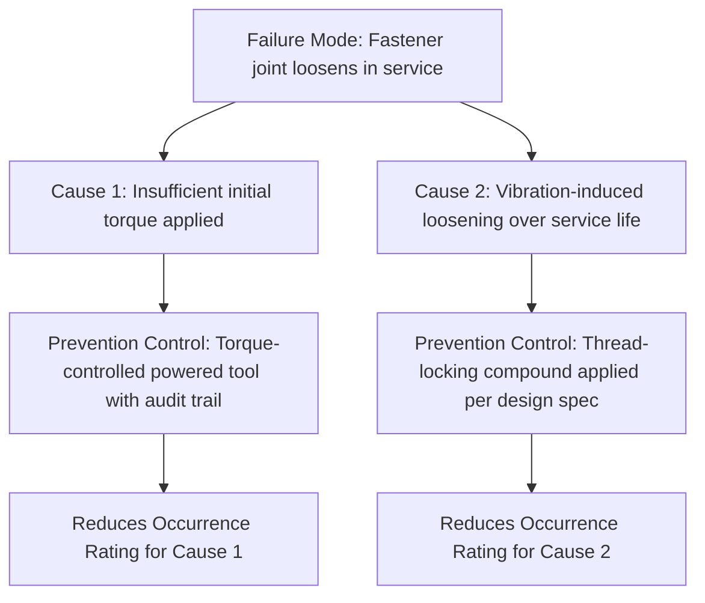

## Current Prevention Controls

### Definition

**Current prevention controls** are the design features, process controls, or procedural safeguards that are already in place — at the time the FMEA is performed — specifically intended to eliminate or reduce the likelihood that a failure cause will occur, or that a failure mechanism will actually produce the associated failure mode. Prevention controls act *before* the failure occurs, distinguishing them structurally from **detection controls**, which act *after* a failure cause or mode has occurred, aiming instead to catch it before it produces harm.

### Prevention Controls vs. Detection Controls

This distinction is one of the more frequently confused aspects of FMEA terminology, yet it is structurally important because prevention and detection controls influence different rating columns in the FMEA worksheet.

**Key Points**

- **Prevention controls** reduce the *Occurrence (O)* rating — they make the failure cause itself less likely to arise in the first place
- **Detection controls** reduce the *Detection (D)* rating — they increase the likelihood that, if the failure cause or failure mode does occur, it will be caught before reaching the customer, end user, or next process step
- A single control can sometimes serve both purposes, but most controls are meaningfully classified as primarily one or the other, and the FMEA worksheet should reflect this distinction clearly rather than lumping all "current controls" into a single undifferentiated column

**Example**

For the failure cause "incorrect torque applied during bolt assembly":

- A **prevention control** would be a torque-limiting powered tool that mechanically prevents over-torquing from occurring at all — this reduces the *occurrence* of the cause
- A **detection control** would be a post-assembly torque audit using a calibrated torque wrench on a sample of completed units — this does not prevent incorrect torque from happening, but increases the likelihood of catching it before the product ships

### Types of Prevention Controls

Prevention controls span design, process, and procedural domains, and are typically categorized according to where in the product or process lifecycle they act:

| Category | Description | Example |
| --- | --- | --- |
| Design-based prevention | Inherent design features that eliminate or reduce failure cause likelihood | Redundant load paths, generous design margin, error-proofed connector geometry (poka-yoke) |
| Process-based prevention | Manufacturing or assembly process controls that reduce the chance of introducing a defect | Automated torque-controlled fastening, controlled cleanroom assembly environment, statistical process control (SPC) on critical dimensions |
| Material/component selection | Choosing materials or components with inherently lower susceptibility to the failure mechanism | Corrosion-resistant alloy selection, derated component ratings relative to actual operating stress |
| Procedural/training-based prevention | Documented procedures and operator training intended to prevent human-error causes | Standardized work instructions, mandatory training certification before performing a critical assembly step |
| Design rule/standard compliance | Adherence to established design rules known to prevent specific failure mechanisms | Minimum fillet radius standards to prevent stress concentration, derating guidelines for electronic components |

### Poka-Yoke as a Prevention Control Archetype

**Poka-yoke** (a Japanese term roughly translating to "mistake-proofing") is a particularly important and frequently cited category of prevention control in both DFMEA and PFMEA contexts, because it represents controls that prevent a failure cause not merely by reducing its probability, but by making the erroneous condition physically or logically impossible to occur.

**Example**

A connector designed with an asymmetric keying feature so that it can only be plugged in one correct orientation is a poka-yoke prevention control: it doesn't just reduce the likelihood of incorrect installation through training or inspection, it structurally eliminates the possibility of the error occurring at all. This generally warrants a notably lower occurrence rating than a control relying purely on operator care or inspection, since the failure cause becomes physically unable to manifest rather than merely less likely to.

### Placement of Prevention Controls in the FMEA Worksheet

Prevention controls are documented against the **failure cause**, not directly against the failure mode or effect — this is a structurally important placement, since a single failure mode may have several distinct causes, each potentially addressed by a different prevention control (or by no current control at all, which itself is an important finding).

Note that each cause is paired with its own targeted prevention control, and each control's effectiveness is reflected in the occurrence rating assigned specifically to that cause — not as a single blended rating across the failure mode as a whole.

### Assessing Prevention Control Effectiveness

**Key Points**

- The occurrence rating assigned to a given cause should reflect the effectiveness of the **current** prevention control actually in place — not the effectiveness of a control that is merely planned or aspirational
- A prevention control that has not been validated (e.g., a design margin calculation that has not been confirmed through testing) should generally not be assumed fully effective when assigning the occurrence rating; the FMEA should reflect the verified, current state of prevention, not an assumed future state
- When no prevention control currently exists for a given cause, this should be explicitly documented as a gap ("no current prevention control identified") rather than left blank, since this gap itself is often the single most valuable finding an FMEA can surface — it directly highlights where a recommended action is most needed

### Relationship to Recommended Actions

When current prevention controls are assessed as inadequate — either absent entirely or insufficiently robust relative to the failure mode's severity — this becomes the basis for a **recommended action** in the FMEA worksheet, typically aimed at introducing a new prevention control, strengthening an existing one, or shifting reliance from a weaker control type (e.g., procedural/training-based) toward a stronger one (e.g., design-based or poka-yoke-based), since design-based and poka-yoke prevention controls are generally regarded as inherently more robust and less dependent on ongoing human diligence than procedural controls alone.

### Conclusion

Current prevention controls represent the existing engineering or process safeguards that act on the failure cause side of the FMEA structure, directly informing the occurrence rating by reflecting how effectively the cause is already being kept from arising. Distinguishing prevention controls clearly from detection controls — and documenting them against specific causes rather than as a single generic entry per failure mode — ensures that the FMEA's occurrence and detection ratings remain analytically meaningful, and that gaps in current prevention (a frequent and highly actionable finding) are made explicit rather than obscured within a vague or incomplete "current controls" entry.

**Related Topics**

- Detection controls and their distinct role in the Detection (D) rating
- Poka-yoke (mistake-proofing) design principles in depth
- Occurrence rating scales and how prevention control effectiveness informs them
- Recommended actions and closing the loop on inadequate prevention controls
- Design margin and derating practices as prevention strategies
- Statistical Process Control (SPC) as a process-based prevention mechanism