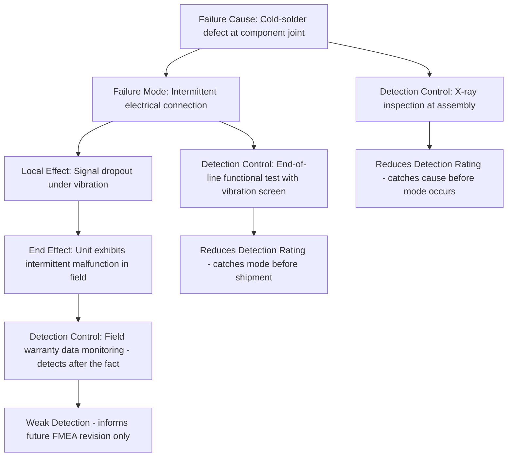

## Current Detection Controls

### Definition

**Current detection controls** are the design features, testing methods, inspections, or monitoring mechanisms already in place at the time of the FMEA that are intended to identify a failure cause, failure mechanism, or failure mode *after it has occurred* but *before it produces its full end effect* — ideally before the item reaches the customer, the next process step, or a point where the failure becomes hazardous. Detection controls are structurally distinct from prevention controls: prevention controls act to stop a failure cause from arising in the first place, while detection controls accept that a cause or failure mode may occur and instead focus on catching it in time.

### Detection Controls vs. Prevention Controls

**Key Points**

- **Prevention controls** reduce the *Occurrence (O)* rating by making the failure cause less likely to happen at all
- **Detection controls** reduce the *Detection (D)* rating by increasing the likelihood that, given the cause or failure mode has occurred, it is identified before it reaches the customer or causes harm
- A low Detection rating (in traditional 1–10 RPN scales, where 1 = high detectability and 10 = failure would definitely escape undetected) indicates strong detection capability; a high Detection rating indicates the failure would likely go unnoticed until it manifests as a real-world consequence

**Example**

For the failure cause "solder joint contains a cold-solder defect":

- A **prevention control** might be a controlled reflow oven profile that ensures proper solder wetting, reducing the likelihood of the defect occurring at all
- A **detection control** might be automated optical inspection (AOI) or X-ray inspection performed on every assembled board, which does not prevent the defect but is intended to catch it before the board ships

### What Detection Controls Actually Detect

Detection controls can be aimed at different points in the causal chain, and this distinction matters for assessing their true effectiveness:

| Detection Target | Description | Example |
| --- | --- | --- |
| Detects the failure cause directly | Identifies the presence of the cause before it produces the failure mode | Incoming material inspection catching a contaminated batch before assembly |
| Detects the failure mode | Identifies that the item has actually failed to perform its function | End-of-line functional test catching a non-operational unit |
| Detects the failure effect | Identifies the downstream consequence after the failure mode has already occurred | Field warranty claim data revealing a recurring issue after customer use |

**Key Points**

- Detection controls positioned earlier in this chain (detecting the cause before it produces the failure mode) are generally more valuable, since they prevent the failure mode from ever manifesting in a shipped or fielded product
- Detection controls positioned later (detecting only after the effect has already occurred, such as field failure data) still have analytical value for feeding back into future FMEA revisions, but they do not protect the specific unit that already failed
- In safety-critical systems, detection controls are sometimes designed to operate in real time during actual operation (e.g., an onboard diagnostic system that detects an anomalous sensor reading during flight or driving), which is structurally different from detection controls that operate only during manufacturing or testing before the product reaches the field

### Common Types of Detection Controls

Detection controls span testing, inspection, and monitoring across the product lifecycle:

**Design Verification and Test-Based Detection**

- Design Verification Plan and Report (DVP&R) testing that specifically exercises the failure mode under known stress conditions
- Highly Accelerated Life Testing (HALT) or Highly Accelerated Stress Screening (HASS) intended to surface latent design weaknesses before production
- Environmental stress testing (thermal cycling, vibration, humidity) targeting known failure mechanisms

**Manufacturing/Process-Based Detection**

- Automated Optical Inspection (AOI), X-ray inspection, or other non-destructive testing on production lines
- Statistical Process Control (SPC) charts monitoring process parameters for out-of-control conditions
- End-of-line functional testing verifying that each unit meets its performance requirements before shipment
- In-process torque verification, dimensional gauging, or leak testing at specific process steps

**Field/Operational Detection**

- Onboard diagnostic systems (e.g., automotive OBD systems monitoring sensor and actuator health in real time)
- Built-in test equipment (BITE) in aerospace and defense systems performing continuous or periodic self-checks
- Preventive maintenance inspections scheduled to catch wear-related degradation before functional failure
- Warning indicators or alarms designed to alert an operator to an anomalous condition before it escalates

### Detection Control Placement in the FMEA Worksheet

Detection controls are typically documented against the failure cause or failure mode (depending on what they actually detect), and — like prevention controls — should be evaluated for their genuine, current effectiveness rather than an assumed or aspirational level of capability.

### Assessing Detection Control Effectiveness

**Key Points**

- Detection rating should reflect the **actual, validated** capability of the current control — an inspection method with a known, quantified escape rate (e.g., from a Measurement System Analysis or gauge R&R study) provides a defensible basis for the Detection rating, whereas an unvalidated assumption of inspection effectiveness does not
- Sampling-based detection controls (e.g., inspecting 1 unit in every 50) inherently provide weaker detection than 100% inspection or automated in-line testing, and the Detection rating should reflect this reduced coverage
- A detection control that relies entirely on visual inspection by an operator is generally considered less reliable than an automated or instrumented detection method, particularly for defects that are subtle, intermittent, or require sustained attention to notice consistently
- When no current detection control exists for a given failure mode or cause, this should be explicitly documented as a gap, since — much like an absent prevention control — this is frequently among the most actionable findings an FMEA can surface

### Relationship to Recommended Actions and Risk Priority

A high Severity combined with poor Detection is a particularly important risk signature: even if occurrence is rated as low, a failure mode that would go completely undetected until it produces a severe consequence often warrants a recommended action, because the lack of any opportunity to intervene before the effect materializes is itself a significant risk driver. This is part of the rationale behind the AIAG-VDA Action Priority framework's approach, which treats high-severity, low-detection combinations as warranting elevated priority even when occurrence alone might otherwise suggest a lower overall concern under a purely multiplicative RPN calculation.

### Conclusion

Current detection controls represent the safeguards already in place to catch a failure cause or failure mode after it has occurred but before it produces its full consequence, forming the direct basis for the Detection rating in the FMEA worksheet. Distinguishing detection controls clearly from prevention controls — and assessing them based on validated, current effectiveness rather than assumed capability — ensures that the FMEA accurately identifies where a failure could occur essentially unnoticed, which is often the single most valuable insight the analysis can provide for directing recommended actions toward genuinely reducing risk.

**Related Topics**

- Prevention controls and their distinct role in the Occurrence (O) rating
- Detection rating scales and how validated inspection capability informs them
- Measurement System Analysis (Gauge R&R) as a basis for detection effectiveness
- Built-in test equipment (BITE) and onboard diagnostics in safety-critical systems
- High-severity, low-detection risk signatures and Action Priority frameworks
- Recommended actions targeting detection gaps identified in FMEA