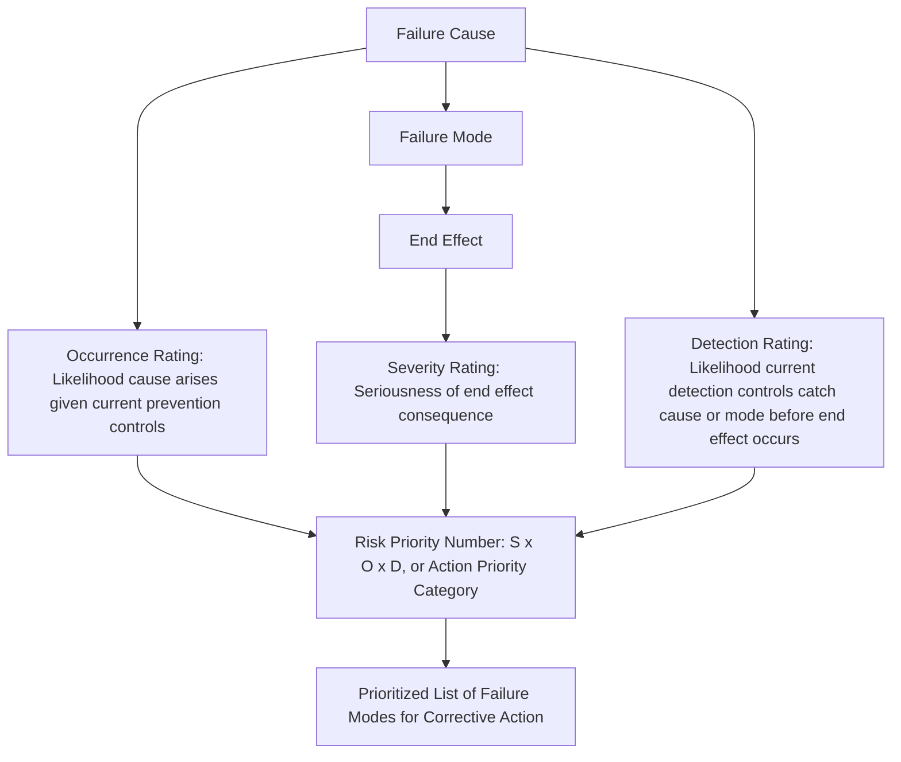

## Severity Occurrence and Detection Defined

### Overview

**Severity, Occurrence, and Detection** — commonly abbreviated as **S, O, and D** — are the three rating dimensions that FMEA uses to numerically or categorically assess the risk associated with each identified failure mode and cause. Together, these three ratings form the analytical core that transforms a purely descriptive list of failure modes into a prioritized risk assessment, historically combined into the Risk Priority Number ($RPN = S \times O \times D$) and, in more recent frameworks such as AIAG-VDA, mapped instead to a structured Action Priority category. Understanding each dimension precisely — and what specifically it is meant to measure — is essential to producing a defensible and useful FMEA.

### Severity (S)

**Definition**: Severity measures the seriousness of the **end effect** of a given failure mode — that is, the consequence experienced by the system, mission, end user, or customer if the failure mode occurs, assuming it is not detected or prevented.

**Key Points**

- Severity is assessed against the **end effect**, not the local effect, since the end effect represents the actual real-world consequence relevant to safety, mission success, or customer satisfaction
- Severity ratings are typically anchored to concrete, defined categories rather than left to subjective judgment — common anchors include safety impact (injury or death), regulatory noncompliance, loss of primary function, loss of secondary function, and effects imperceptible to the customer
- Severity is generally treated as an inherent property of the failure mode's consequence — it is **not** reduced by improving detection or reducing occurrence; a design change that alters the *actual consequence* of the failure (e.g., adding a physical barrier that prevents an electrical fault from reaching a person) is what changes severity, not merely detecting the fault sooner or making it less likely

**Example (Typical 1–10 Automotive-Style Scale)**

| Rating | Description |
| --- | --- |
| 9–10 | Failure affects safe vehicle operation and/or involves noncompliance with government regulation, potentially without warning |
| 7–8 | Loss of primary function; vehicle inoperable, but without direct safety hazard |
| 5–6 | Degradation of primary function or loss of a secondary function, noticeable to most customers |
| 3–4 | Minor, noticeable defect; most customers notice but impact is slight |
| 1–2 | No discernible effect on function or performance |

[Inference: exact wording and numeric anchor points vary somewhat between AIAG, VDA, and company-specific severity tables, though the general 1–10 structure with safety-related failures anchored at the highest end is broadly consistent across automotive FMEA practice.]

### Occurrence (O)

**Definition**: Occurrence measures the likelihood that a specific **failure cause** will arise and, through its associated failure mechanism, actually produce the failure mode — taking into account the effectiveness of any **current prevention controls** already in place.

**Key Points**

- Occurrence is rated against the **cause**, not the failure mode in the abstract — since a single failure mode can have multiple causes with very different likelihoods, each cause typically receives its own occurrence rating
- Occurrence should reflect the failure rate or probability of the cause **given current prevention controls**, not the theoretical likelihood in the complete absence of any controls
- Occurrence ratings are ideally grounded in quantitative data where available (historical failure rates, warranty data, reliability testing results, field return rates) rather than purely subjective estimation, though qualitative anchor-based scales are common in practice when quantitative data is unavailable

**Example (Typical 1–10 Automotive-Style Scale)**

| Rating | Description | Approximate Failure Rate |
| --- | --- | --- |
| 9–10 | Very high; failure is almost inevitable | $\geq 1$ in 10 |
| 7–8 | High; repeated failures likely | 1 in 100 |
| 5–6 | Moderate; occasional failures | 1 in 2,000 |
| 3–4 | Low; relatively few failures | 1 in 20,000 |
| 1–2 | Very low or remote; failure is unlikely | $\leq 1$ in 1,500,000 |

[Inference: specific failure-rate anchor values vary across published AIAG, VDA, and company-internal occurrence scales; the values shown represent a commonly cited style of anchor rather than a single universally fixed standard.]

### Detection (D)

**Definition**: Detection measures the likelihood that a **current detection control** will identify the failure cause or failure mode before it reaches the customer, end user, or the point at which the end effect actually occurs.

**Key Points**

- Detection is rated inversely to detection *effectiveness* — in traditional 1–10 scales, a rating of 1 typically indicates the control would almost certainly catch the issue, while a rating of 10 indicates the failure would almost certainly go completely undetected until it manifests as the full end effect
- Detection should reflect the actual, validated capability of current detection controls (inspection methods, testing, monitoring), not an assumed or idealized detection capability
- Detection is distinct from occurrence: a failure cause can be rare (low occurrence) yet still warrant concern if, on the rare occasion it does occur, there is no mechanism in place to catch it before it produces a severe end effect (poor detection)

**Example (Typical 1–10 Automotive-Style Scale)**

| Rating | Description |
| --- | --- |
| 9–10 | No current detection control exists, or control is known to be ineffective; failure will reach the customer undetected |
| 7–8 | Detection control has a low probability of catching the failure |
| 5–6 | Moderate detection capability; control may catch the failure some of the time |
| 3–4 | High probability of detection before the failure reaches the customer |
| 1–2 | Detection is nearly certain; automated, 100% inspection or design feature that makes the failure immediately obvious |

### How the Three Ratings Combine

### Why All Three Dimensions Are Necessary

**Key Points**

- Severity alone cannot drive prioritization, since even a catastrophic failure mode with essentially zero occurrence and perfect detection may not warrant the same urgency as a moderately severe failure mode that occurs frequently and is rarely caught
- Occurrence alone is similarly insufficient, since a very frequent but low-severity, well-detected failure mode (e.g., a minor cosmetic defect caught by 100% inspection) may warrant far less engineering attention than a rare but catastrophic and undetectable one
- Detection alone cannot indicate risk either, since a failure mode with poor detection but negligible severity and vanishingly rare occurrence may still represent minimal actual risk
- The genuine risk insight FMEA provides emerges specifically from the **combination** of all three dimensions, which is why the RPN (or the newer Action Priority framework) is calculated from all three rather than any one in isolation

### A Note on RPN vs. Action Priority

While the traditional multiplicative $RPN = S \times O \times D$ remains widely used and taught, it has a well-documented limitation: different combinations of S, O, and D can produce identical RPN values despite representing substantively different risk profiles (for example, $S=9, O=2, D=5$ and $S=3, O=6, D=5$ both yield an RPN of 90, despite the first representing a high-severity/low-occurrence profile and the second a low-severity/moderate-occurrence profile). This limitation directly motivated the AIAG-VDA Action Priority table approach, which uses explicit combinations of S, O, and D categories to assign a High/Medium/Low priority rather than relying on a single multiplied score, specifically to ensure that high-severity failure modes are not under-prioritized merely because their calculated RPN happens to be numerically similar to a lower-severity, higher-occurrence failure mode.

### Conclusion

Severity, Occurrence, and Detection form the three-dimensional risk assessment core of FMEA: Severity captures the seriousness of the end effect, Occurrence captures the likelihood the cause arises given current prevention controls, and Detection captures the likelihood the cause or mode is caught given current detection controls before the end effect materializes. Precisely distinguishing what each rating is actually meant to measure — and against which specific element of the failure mode/cause/effect chain it applies — is essential to producing consistent, defensible ratings across an FMEA worksheet, and ultimately to ensuring that the resulting prioritization genuinely reflects risk rather than an artifact of inconsistent rating practice.

**Related Topics**

- Detailed severity, occurrence, and detection rating table development
- Risk Priority Number (RPN) calculation and its known limitations
- AIAG-VDA Action Priority tables as an RPN alternative
- Grounding occurrence ratings in quantitative reliability data
- Validating detection control effectiveness through Gauge R&R studies
- Rating consistency and calibration across FMEA team members