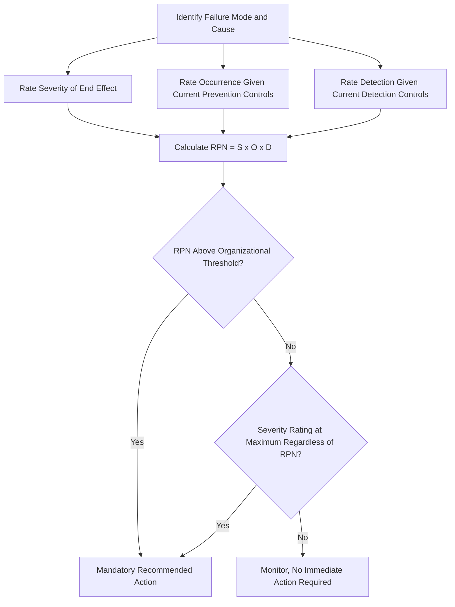

## Risk Priority Number Overview

### Definition

The **Risk Priority Number (RPN)** is a numeric score used in traditional FMEA methodology to prioritize identified failure modes and causes for corrective action, calculated as the product of three independently rated dimensions: Severity, Occurrence, and Detection.

$$RPN = S \times O \times D$$

Where each of $S$, $O$, and $D$ is typically rated on an ordinal scale — most commonly 1 to 10 — resulting in an RPN range of 1 (lowest risk) to 1,000 (highest risk) on a standard 10-point scale. The RPN provides a single, sortable number that allows an FMEA team to rank all identified failure modes and direct limited engineering resources toward those with the highest calculated scores first.

### Why RPN Was Introduced

**Key Points**

- Before RPN-style prioritization became standard, FMEA teams needed some method to decide which of potentially dozens or hundreds of identified failure modes warranted immediate corrective action versus routine monitoring
- Severity, Occurrence, and Detection each capture a genuinely different aspect of risk (see the corresponding S/O/D content), and no single one of them alone is sufficient to determine overall priority
- Multiplying the three ratings together provides a simple, computationally trivial method (well suited to manual calculation on paper worksheets in the era before FMEA software tools) for combining all three dimensions into a single comparable score

### Worked Example

**Example**

Consider three failure modes rated on a 1–10 scale for each dimension:

| Failure Mode | Severity (S) | Occurrence (O) | Detection (D) | RPN |
| --- | --- | --- | --- | --- |
| A: Brake fluid line ruptures | 9 | 2 | 4 | 72 |
| B: Dashboard trim clip loosens | 3 | 6 | 3 | 54 |
| C: Sensor reading drifts undetected | 7 | 3 | 8 | 168 |

Ranked purely by RPN, Failure Mode C (168) would receive the highest corrective-action priority, followed by A (72), then B (54) — despite B having a much higher occurrence rating than A, because A's severity and B's severity differ so substantially.

### Typical RPN Threshold Practice

Many organizations historically established an **RPN threshold** above which a recommended action becomes mandatory, though practice varies significantly across companies and industries:

**Key Points**

- A common (though not universal) practice was to require corrective action review for any failure mode with an RPN above a fixed threshold, such as 100 or 120 on a 1,000-point scale
- Some organizations supplemented a raw RPN threshold with a **supplemental rule**, such as "any failure mode with a Severity rating of 9 or 10 requires review and action regardless of the calculated RPN" — this rule exists specifically to prevent a high-severity failure mode from being deprioritized simply because its occurrence or detection ratings happened to be favorable
- This supplemental severity-override rule anticipated, in practice, the core criticism that later formally motivated the AIAG-VDA Action Priority framework's replacement of RPN altogether

### Known Limitations of RPN

The RPN approach, despite its long history of use, has several well-documented structural weaknesses that reliability engineering literature and industry standards bodies have extensively discussed:

**Non-Uniqueness of Scores**

Different combinations of S, O, and D can produce mathematically identical RPN values despite representing substantively different risk profiles.

**Example**

- $S=9, O=2, D=4 \Rightarrow RPN = 72$
- $S=3, O=6, D=4 \Rightarrow RPN = 72$

Both failure modes receive identical RPN scores, yet the first represents a high-severity, low-occurrence failure (e.g., a rare but catastrophic failure), while the second represents a low-severity, moderate-occurrence failure (e.g., a frequent but minor issue) — profiles that arguably warrant very different engineering responses despite the identical numeric score.

**Insensitivity Near Threshold Boundaries**

An RPN of 99 versus 100 may fall on opposite sides of an organization's action threshold, despite representing an essentially negligible difference in actual risk — a well-known artifact of imposing a hard numeric cutoff on what is fundamentally an ordinal, not a continuous ratio-scale, measurement.

**Ordinal Scale Multiplication Concerns**

Severity, Occurrence, and Detection ratings are ordinal scales (a rating of "8" does not necessarily represent exactly twice the risk of a rating of "4" in any strictly quantitative sense), yet RPN treats them as though they were true numeric quantities suitable for multiplication — a mathematical operation whose validity on ordinal data is questioned within measurement theory and reliability engineering methodology literature. [Inference: this critique reflects a widely discussed methodological concern in reliability engineering literature, though organizations have continued using RPN for decades despite it, generally treating it as a useful heuristic ranking tool rather than a rigorously defensible quantitative risk metric.]

**Equal Weighting Assumption**

The simple product treats Severity, Occurrence, and Detection as equally weighted contributors to risk, which does not necessarily reflect how organizations actually want to prioritize risk — many safety-critical industries place disproportionate emphasis on severity specifically, which a pure multiplicative formula does not inherently capture without a supplemental override rule.

### Visualizing the RPN Ranking Process

### The Shift Toward Action Priority (AP)

In direct response to RPN's known limitations, the 2019 **AIAG-VDA FMEA Handbook** replaced the multiplicative RPN with a structured **Action Priority (AP)** table, which assigns a High/Medium/Low categorical priority based on specific combinations of Severity, Occurrence, and Detection ratings, rather than their numeric product.

**Key Points**

- The AP table is constructed such that high-severity failure modes are systematically routed toward "High" priority across a much wider range of occurrence and detection combinations than a pure RPN threshold would produce, directly addressing the severity-override concern that many organizations had previously handled only through informal supplemental rules
- The AP approach does not eliminate the need for the underlying S, O, and D ratings — it simply changes how those three ratings are *combined* into a final prioritization decision
- Many organizations, particularly those with long-established internal RPN-based practices, continue using RPN informally or in parallel with AP during the ongoing industry transition, especially where existing supplier quality systems and historical FMEA documents were built around RPN scoring [Inference: characterization of ongoing mixed industry practice, since adoption timelines for AIAG-VDA vary by organization and are still evolving as of the FMEA reference literature currently available.]

### Conclusion

The Risk Priority Number served for decades as FMEA's standard method for converting three independently rated risk dimensions — Severity, Occurrence, and Detection — into a single, sortable prioritization score, and it remains widely taught and used today. However, its well-documented limitations — particularly non-unique scores across substantively different risk profiles and the mathematically questionable treatment of ordinal ratings as multipliable quantities — have driven the industry, particularly in automotive engineering via the AIAG-VDA harmonization, toward structured Action Priority frameworks that preserve the same underlying S/O/D rating structure while combining them in a way explicitly designed to avoid RPN's most significant analytical pitfalls.

**Related Topics**

- Severity, Occurrence, and Detection rating scale construction in detail
- AIAG-VDA Action Priority (AP) table structure and worked examples
- Criticisms of ordinal scale multiplication in risk scoring methodology
- Organizational RPN threshold-setting practices and severity override rules
- Transitioning an organization's FMEA practice from RPN to Action Priority
- Alternative risk matrix approaches used outside automotive FMEA contexts