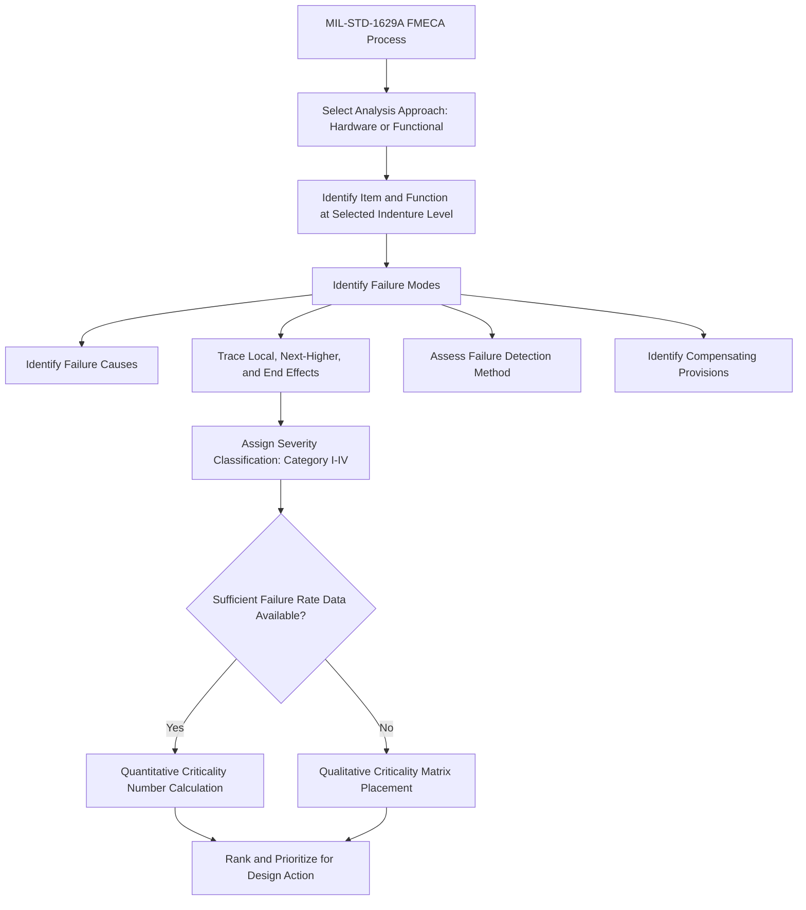

## MIL-STD-1629A Foundations

### Overview

**MIL-STD-1629A**, titled *"Procedures for Performing a Failure Mode, Effects and Criticality Analysis,"* issued by the U.S. Department of Defense in 1980, is the direct successor to the original 1949 MIL-P-1629 and remains the most widely cited foundational military standard for FMECA methodology. While later superseded in formal military procurement practice and eventually cancelled as an active mandatory military standard, MIL-STD-1629A's structural approach, terminology, and analytical logic remain deeply embedded in virtually every subsequent industry-specific FMEA standard, making it essential background for understanding the discipline's conceptual foundations.

### Purpose and Scope

MIL-STD-1629A was established to provide a standardized, disciplined procedure that contractors developing military hardware and systems could follow to systematically identify potential failure modes, determine their effects on system performance and safety, and rank those failures by criticality — enabling defense procurement authorities to compare FMECA documentation consistently across different contractors and programs.

**Key Points**

- The standard applies the combined technique of **FMEA** (Failure Mode and Effects Analysis) and **CA** (Criticality Analysis), together forming **FMECA**
- It was intended to be applied iteratively throughout a system's development lifecycle — from early design through production — rather than as a single one-time analysis performed at a fixed milestone
- The standard explicitly ties the analysis output to design decision-making, reliability prediction, maintainability planning, and safety assessment, rather than treating FMECA as a standalone documentation requirement disconnected from engineering action

### Two Primary Analysis Approaches

MIL-STD-1629A formally defines two distinct approaches for conducting the failure mode analysis, and this dual-approach structure is one of its most influential and enduring conceptual contributions:

**Hardware Approach**

An inductive, bottom-up analysis that begins with the lowest indenture level of hardware (individual parts or components) and works upward, identifying how each component's failure modes affect progressively higher levels of assembly, up to the overall system.

**Functional Approach**

An analysis performed at the functional level rather than the hardware/part level, particularly useful early in design when detailed hardware design has not yet been finalized, or for systems where functional block diagrams are more readily available than detailed component-level design data.

**Key Points**

- The Hardware Approach is generally preferred when detailed design information is available, since it provides the most granular and specific failure mode identification
- The Functional Approach is generally preferred during early conceptual or preliminary design phases, or for complex systems where a full hardware-level breakdown would be premature or impractical
- Many programs use the Functional Approach early in development and transition to the Hardware Approach as the design matures — a practice that anticipates the modern iterative, lifecycle-spanning approach to FMEA maintenance seen across contemporary industry standards

### The Criticality Analysis (CA) Component

The criticality analysis portion of MIL-STD-1629A is what distinguishes full FMECA from a basic FMEA, and it introduced two distinct quantitative methods for ranking failure mode criticality:

**Quantitative Approach (Criticality Number, $C_r$)**

$$C_r = \sum_{n} (\beta \times \alpha \times \lambda_p \times t)$$

Where:

- $\beta$ = conditional probability that the failure effect results in the identified criticality classification (given that the failure mode occurs)
- $\alpha$ = failure mode ratio (the proportion of the component's overall failure rate attributable to this specific failure mode)
- $\lambda_p$ = part failure rate
- $t$ = duration of the applicable mission phase (operating time)

The item's overall criticality number is calculated by summing across all failure modes contributing to a given criticality category, allowing a genuinely quantitative comparison of relative risk contribution across different components and failure modes, provided reliable failure rate data ($\lambda_p$) is available.

**Qualitative Approach (Criticality Matrix)**

When quantitative failure rate data is unavailable or insufficiently reliable, MIL-STD-1629A provides a **qualitative criticality matrix**, which plots failure modes on a two-dimensional grid according to:

- **Severity Category** (typically four levels: Catastrophic, Critical, Marginal, Minor)
- **Probability of Occurrence Level** (typically qualitative levels such as Frequent, Reasonably Probable, Occasional, Remote, Extremely Unlikely)

**Key Points**

- This qualitative criticality matrix approach is a direct conceptual ancestor of the risk matrices and severity/occurrence rating scales used throughout virtually all modern FMEA frameworks, including the automotive S/O/D rating tables discussed elsewhere in this curriculum
- The four-level severity categorization (Catastrophic/Critical/Marginal/Minor) established a severity classification pattern that persists, in adapted form, across aerospace, defense, and many civilian safety-critical industry standards to this day

### Severity Classification Categories

MIL-STD-1629A's severity categories are foundational and worth stating explicitly, since variants of this exact four-tier structure recur throughout subsequent standards:

| Category | Description |
| --- | --- |
| Category I — Catastrophic | A failure that may cause death or system loss |
| Category II — Critical | A failure that may cause severe injury, major property damage, or major system damage resulting in mission loss |
| Category III — Marginal | A failure that may cause minor injury, minor property damage, or system damage resulting in delay or loss of availability, or degradation |
| Category IV — Minor | A failure not serious enough to cause injury, property damage, or system damage, but which results in unscheduled maintenance or repair |

### The FMECA Worksheet Structure

MIL-STD-1629A defines a standardized worksheet format that established the tabular structure still recognizable in virtually every modern FMEA template: item identification, item function, failure modes, failure causes, mission phase/operational mode, failure effects (local, next higher level, and end effect), failure detection method, compensating provisions, severity classification, and remarks/recommended actions.

### Legacy and Continued Influence

**Key Points**

- Although MIL-STD-1629A was formally cancelled as an active mandatory military procurement standard (with the U.S. military generally moving toward performance-based and commercial-standard-referencing procurement practices in subsequent decades), it was never formally replaced by a direct military successor document in the same numbered series, and it continues to be referenced as an authoritative methodological baseline in aerospace, defense, and reliability engineering literature and training
- Its hardware/functional approach distinction, its severity categorization structure, and its formal separation of quantitative (criticality number) versus qualitative (criticality matrix) risk assessment methods all persist conceptually in modern civilian standards, including automotive AIAG-VDA severity tables and general-purpose standards such as IEC 60812
- The standard's explicit definition of "indenture level" (the specific level within a system hierarchy at which the analysis is performed — component, subassembly, subsystem, or system) directly anticipates the modern "Structure Analysis" step formalized in the AIAG-VDA seven-step process

### Conclusion

MIL-STD-1629A represents the mature codification of military FMECA methodology, refining the original 1949 procedure into a structured framework encompassing hardware and functional analysis approaches, formal severity categorization, and both quantitative and qualitative criticality assessment methods. Its influence extends far beyond its formal military procurement context: the worksheet structure, severity classification logic, and layered analytical approach it established continue to underpin the conceptual architecture of essentially every major FMEA standard used across aerospace, automotive, medical device, and general industrial reliability engineering practice today.

**Related Topics**

- Criticality Number ($C_r$) calculation methodology in depth
- Hardware Approach vs. Functional Approach selection criteria
- Severity classification category mapping across modern industry standards
- Indenture levels and system hierarchy decomposition
- Transition from MIL-STD-1629A to civilian and international FMEA standards
- IEC 60812 as an international, industry-agnostic successor framework