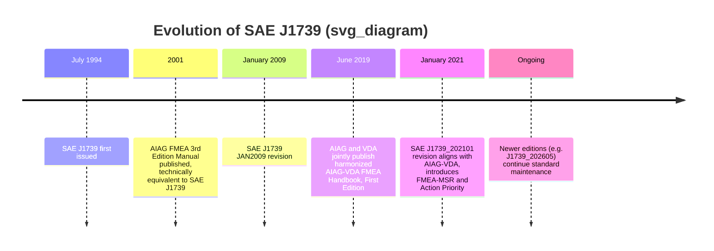
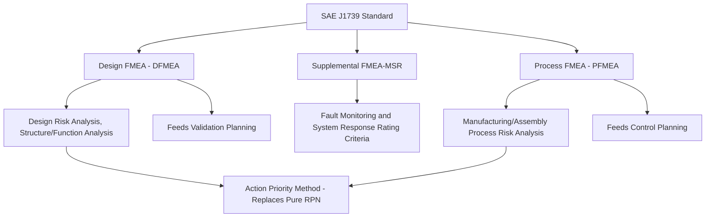

## SAE J1739 Standard

### Overview

**SAE J1739** is a technical standard published by SAE International (Society of Automotive Engineers) titled *"Potential Failure Mode and Effects Analysis (FMEA) Including Design FMEA, Supplemental FMEA-MSR, and Process FMEA."* Originally issued in July 1994, it has undergone several revisions, most notably a significant 2021 update (**J1739_202101**) that fundamentally realigned the standard with the harmonized AIAG-VDA methodology. The standard was issued in July 1994 and most recently revised January 13, 2021, and a newer version, J1739_202605, has since become the latest edition, indicating the standard continues to be actively maintained and updated. [sae](https://saemobilus.sae.org/content/J1739_202101/)[snv](https://connect.snv.ch/en/sae-j1739_202101)

### Purpose and Scope

SAE J1739 describes potential failure mode and effects analysis in design (DFMEA), supplemental FMEA-MSR, and potential failure mode and effects analysis in manufacturing and assembly processes (PFMEA), assisting users in identifying and mitigating risk by providing appropriate terms, requirements, rating charts, and worksheets. [sae](https://saemobilus.sae.org/content/j1739_202101/)

**Key Points**

- As a standard, it contains both requirements ("must") and recommendations ("should") intended to guide users through the FMEA process [sae](https://saemobilus.sae.org/content/j1739_202101/)
- FMEA process and documentation must comply with the standard as well as any applicable corporate policy, with documented rationale and customer agreement required to justify deviations during audit reviews [sae](https://saemobilus.sae.org/content/j1739_202101/)
- The standard covers three distinct FMEA applications under one document: DFMEA (design), Supplemental FMEA-MSR (monitoring and system response), and PFMEA (process)

### The 2021 Revision: Alignment with AIAG-VDA

The most significant recent development in this standard's history is the January 2021 revision, which was published specifically in response to the 2019 AIAG-VDA harmonization effort.

**Key Points**

- In June 2019, AIAG combined with VDA to publish the AIAG-VDA FMEA Handbook; in January 2021, SAE published the J1739 JAN2021 revision to the prior SAE J1739 JAN2009 standard [asq](https://my.asq.org/communities/events/item/180/60/3831)
- Prior to this, since the AIAG FMEA 3rd Edition manual was published in July 2001, the AIAG manual and SAE J1739 had been technical equivalents of each other — but this ceased to be the case with the 2021 revision [asq](https://my.asq.org/communities/events/item/180/60/3831)
- This document contains content directly from the AIAG and VDA Handbook, First Edition, 2019, reflecting SAE's deliberate incorporation of the harmonized methodology rather than maintaining a fully independent standard [sae](https://saemobilus.sae.org/content/j1739_202101/)

### Key Content Changes in the 2021 Revision

The standard was revised to emphasize the process of FMEA selection, creation, documentation, reporting, and change management. Specific additions and changes include: [sae](https://saemobilus.sae.org/content/j1739_202101/)

**Key Points**

- New additions include a table of contents, a supplemental DFMEA for Monitoring and System Response (DFMEA-MSR) with rating criteria for frequency and monitoring, and an introduction of the Action Priority method [sae](https://saemobilus.sae.org/content/j1739_202101/)
- The standard includes expanded guidance on how information flows from DFMEA to validation planning and from PFMEA to control planning [sae](https://saemobilus.sae.org/content/j1739_202101/)
- Revisions were made to the rating criteria for Severity, Occurrence, and Detection for both DFMEA and PFMEA [sae](https://saemobilus.sae.org/content/j1739_202101/)
- A key change is the shift away from the pure Risk Priority Number (RPN = S × O × D), motivated by long-standing documented research on RPN's limitations — including identical RPN scores for very different risk profiles, the flattening of severity relative to occurrence and detection, and arbitrary thresholding effects [mdpi-res](https://mdpi-res.com/d_attachment/processes/processes-14-01976/article_deploy/processes-14-01976.pdf)

### FMEA-MSR: A Notable New Addition

**Supplemental FMEA-MSR** (Monitoring and System Response) is one of the most substantive additions introduced in the 2021 revision, and it reflects the automotive industry's growing need to analyze systems with active fault detection and mitigation behavior — particularly relevant to modern vehicles with embedded software, sensors, and automated safety responses.

**Key Points**

- FMEA-MSR extends traditional DFMEA analysis to specifically address how a system detects a fault during customer operation (monitoring) and what corrective or protective action the system takes in response (system response)
- It includes rating criteria specifically for frequency and monitoring, distinct from the traditional Severity/Occurrence/Detection ratings used in standard DFMEA [sae](https://saemobilus.sae.org/content/j1739_202101/)
- This addition is particularly relevant for systems involving electronic control units, driver-assistance features, and other software-mediated safety functions where a fault occurring during actual vehicle operation (rather than being caught during manufacturing) must be detected and mitigated in real time

### Relationship to the AIAG-VDA Seven-Step Process

**Key Points**

- The SAE J1739:2021 revision mirrors the AIAG-VDA harmonized approach, including the DFMEA-MSR addition for monitoring and system response, making terminology and decision logic more consistent across OEMs and tier suppliers [mdpi-res](https://mdpi-res.com/d_attachment/processes/processes-14-01976/article_deploy/processes-14-01976.pdf)
- This mirrors the seven-step AIAG-VDA process (Planning and Preparation, Structure Analysis, Function Analysis, Failure Analysis, Risk Analysis, Optimization, Results Documentation) discussed elsewhere in this curriculum, rather than introducing a separate, competing process structure
- The practical effect is that organizations following SAE J1739:2021 and organizations following the AIAG-VDA Handbook directly are now working from substantively aligned terminology, rating criteria, and prioritization logic (Action Priority rather than RPN), reducing the historical friction of maintaining separate DFMEA/PFMEA documentation for American versus European/German customer requirements

### Standard Evolution Timeline

### Document Structure Overview

### Practical Significance for Practitioners

**Key Points**

- Documented rationale and customer agreement are necessary for any deviation from the standard, meaning suppliers working with OEMs that reference SAE J1739 contractually are expected to follow its specific terminology, rating charts, and worksheet formats rather than an internally developed equivalent, absent an agreed exception [sae](https://saemobilus.sae.org/content/j1739_202101/)
- Because the 2021 revision explicitly incorporates AIAG-VDA content, organizations transitioning from older RPN-based J1739 practices to the current revision face similar adaptation considerations as those transitioning to the AIAG-VDA Handbook directly, including the shift from a single multiplicative RPN score to the categorical Action Priority framework
- Practitioners referencing this standard should confirm they are using the current edition, since SAE continues to issue updated versions beyond the widely cited 2021 revision [snv](https://connect.snv.ch/en/sae-j1739_202101)

### Conclusion

SAE J1739 has served since 1994 as the primary American automotive industry standard for DFMEA, PFMEA, and now supplemental FMEA-MSR practice, and its 2021 revision marks a pivotal moment in the standard's history: rather than continuing as an independently evolving American counterpart to the German VDA methodology, SAE J1739 explicitly absorbed the harmonized AIAG-VDA framework, including its seven-step process alignment, revised Severity/Occurrence/Detection rating criteria, and the replacement of RPN with the Action Priority method. This makes the current SAE J1739 less a competing standard and more a formally SAE-published implementation of the same harmonized methodology now shared across AIAG and VDA, substantially reducing the historical documentation burden for suppliers serving both American and European automotive customers.

**Related Topics**

- AIAG-VDA FMEA Handbook seven-step process in detail
- FMEA-MSR (Monitoring and System Response) methodology and rating criteria
- Action Priority method as implemented in SAE J1739:2021
- Historical divergence and harmonization of AIAG and VDA FMEA practices
- Linking DFMEA to validation planning and PFMEA to control planning
- Contractual and audit implications of standard deviations in supplier FMEA documentation