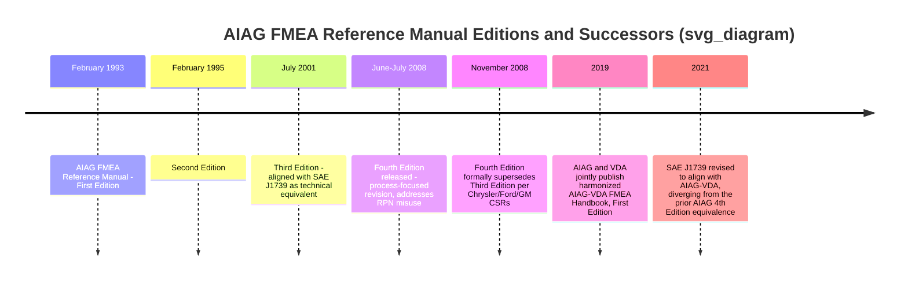

## AIAG Fourth Edition Reference Manual

### Overview

The **AIAG FMEA Reference Manual, Fourth Edition** (commonly cited as "FMEA-4") is a foundational automotive quality core tool document published by the Automotive Industry Action Group (AIAG), jointly copyrighted by Chrysler LLC, Ford Motor Company, and General Motors Corporation. Released in June/July 2008, it represented the fourth iteration of a manual lineage stretching back to 1993, and it served for over a decade as one of the most widely referenced automotive FMEA methodology documents in North America before being superseded by the harmonized AIAG-VDA FMEA Handbook in 2019. [ansi](https://webstore.ansi.org/preview-pages/AIAG/preview_AIAG+FMEA-4-2008.pdf)

### Publication History and Edition Lineage

**Key Points**

- The manual's edition history runs: First Edition, February 1993; Second Edition, February 1995; Third Edition, July 2001; Fourth Edition, June 2008 [ansi](https://webstore.ansi.org/preview-pages/AIAG/preview_AIAG+FMEA-4-2008.pdf)
- The Fourth Edition officially superseded the Third Edition beginning November 1, 2008, per customer-specific requirements from Chrysler, Ford, and GM
- A significantly later harmonization effort — the AIAG-VDA FMEA Handbook — eventually replaced this manual as the current joint American-German automotive standard, discussed separately in this curriculum

### Purpose and Nature of the Document

**Key Points**

- The manual is explicitly a reference document, not a requirements document: it is intended to be used by suppliers to Chrysler, Ford, and General Motors as a guide to assist in developing both Design and Process FMEAs, clarifying technical development questions rather than establishing binding requirements in itself [ansi](https://webstore.ansi.org/preview-pages/AIAG/preview_AIAG+FMEA-4-2008.pdf)
- The Fourth Edition was explicitly aligned with SAE J1739 — the two documents were, at that time, treated as technically equivalent references (a relationship that later diverged following SAE J1739's 2021 revision toward AIAG-VDA alignment, as covered separately in this curriculum) [ansi](https://webstore.ansi.org/preview-pages/AIAG/preview_AIAG+FMEA-4-2008.pdf)
- FMEA is one of the exclusive North American Automotive Quality Core Tools developed jointly by the three manufacturers, placing it alongside sibling core tools such as APQP (Advanced Product Quality Planning), PPAP (Production Part Approval Process), and SPC (Statistical Process Control) [elsmar](https://elsmar.com/elsmarqualityforum/threads/aiags-fmea-manual-4th-edition-pushed-back-to-1st-quarter-2008.23417/page-2)

### Scope: DFMEA and PFMEA Coverage

The DFMEA and PFMEA methods described in the Fourth Edition include those associated with design at the system, subsystem, interface, and component level, and the process at manufacturing and assembly operations. This dual scope — covering both design-stage and manufacturing-process-stage analysis within a single reference manual — reflects the same DFMEA/PFMEA structural distinction established earlier in automotive FMEA history and preserved through subsequent standard revisions. [ansi](https://webstore.ansi.org/preview-pages/AIAG/preview_AIAG+FMEA-4-2008.pdf)

### Key Changes and Improvements Introduced in the Fourth Edition

**Key Points**

- The new manual was updated to provide a clearer explanation of the steps to develop a robust failure mode analysis, clarify the linkage between DFMEA and PFMEA as well as linkages to other Core Tools, and incorporate alternate methods applied within the automotive industry [elsmar](https://elsmar.com/elsmarqualityforum/threads/aiags-fmea-manual-4th-edition-pushed-back-to-1st-quarter-2008.23417/page-2)
- Additional appendices included example forms and special case applications of FMEA, including "standard form" options representing current industry applications [elsmar](https://elsmar.com/elsmarqualityforum/threads/aiags-fmea-manual-4th-edition-pushed-back-to-1st-quarter-2008.23417/page-2)
- General formatting changes were intended to improve readability, including the addition of an index and the use of icons to indicate key paragraphs and visual cues [ansi](https://webstore.ansi.org/preview-pages/AIAG/preview_AIAG+FMEA-4-2008.pdf)
- A central intent of the Fourth Edition was to treat the entire FMEA process rather than just the forms themselves, specifically to reduce common improper implementation practices that had been observed under the Third Edition [omnex](https://my.omnex.com/whitepapers/move-from-fmea-3-rd-to-4th-editions)

### Addressing Common Misuse Patterns

One of the more substantively important motivations behind the Fourth Edition was correcting widespread problematic FMEA practices that AIAG had observed across the supplier base under the prior edition:

The Fourth Edition expanded on the Third Edition specifically to minimize improper uses and implementation of FMEA, including: [omnex](https://my.omnex.com/whitepapers/move-from-fmea-3-rd-to-4th-editions)

| Misuse Pattern | Description |
| --- | --- |
| Column shifting | Placing information in the wrong columns, thus hindering the analysis and product/process improvement efforts |
| RPN deflation | Artificially lowering the RPN to fall under an arbitrarily set action threshold, rather than genuinely addressing risk |
| Sole reliance on RPN | Using RPN as the only basis for evaluating risk priorities and improvement actions, rather than considering severity independently or other contextual factors |
| Form-completion focus | Focusing only on completing the FMEA form rather than on the engineering knowledge the document is meant to capture and communicate |

This list is notable because it directly anticipates concerns that would later drive the broader industry shift away from RPN-based prioritization altogether in the 2019 AIAG-VDA harmonization — the Fourth Edition attempted to address RPN misuse through improved guidance and process emphasis, while the later Action Priority framework addressed the same underlying concern through a structural change to the rating methodology itself.

### Rating Scale Changes

**Key Points**

- The Fourth Edition introduced updated occurrence rating criteria and detection rating language compared to prior editions
- Detection rating descriptions in the Fourth Edition are commonly cited using qualitative anchor phrases such as "High," "Moderate," "Low," and "Absolute Uncertainty," reflecting the likelihood that a design control would detect a potential cause/mechanism and subsequent failure mode
- Because occurrence and detection rating criteria changed relative to the Third Edition, organizations transitioning between editions faced a practical question of whether and how to reconcile existing FMEA documents rated under the prior scale with the new Fourth Edition criteria — commonly addressed through a phased FMEA revision plan communicated to customers or auditors rather than an immediate wholesale re-rating of all existing documents

### Document Lifecycle: Living Document Principle

**Key Points**

- Consistent with FMEA's broader conceptual foundation as an iteratively maintained document rather than a one-time deliverable, the Fourth Edition reinforced that an FMEA requires continuous analysis and updating as a process or design changes, rather than being written once and left static
- This "living document" framing — already present in earlier editions and in the military FMECA lineage — was given renewed emphasis in the Fourth Edition's broader process-oriented approach

### Position Within the Broader FMEA Standards Timeline

### Adoption Beyond the "Big Three"

**Key Points**

- While developed specifically for Chrysler, Ford, and GM supplier requirements, industry discussion at the time of release noted that the manual's core content was considered broadly applicable beyond strictly automotive contexts by dropping the manufacturer-specific requirements, with adoption observed informally across military use, NASA-adjacent practice, and general ISO-certified organizations domestically and internationally [Inference: this reflects informal industry practitioner discussion and community consensus at the time rather than a formal AIAG endorsement of cross-industry adoption] [elsmar](https://elsmar.com/elsmarqualityforum/threads/aiags-fmea-manual-4th-edition-released-2nd-july-2008.28303/page-8)
- The manual's broad influence during its period of use reflects a pattern common throughout FMEA's history: a document developed for one specific industry or customer requirement frequently becomes a de facto general-purpose reference well beyond its original intended audience, echoing the same dynamic seen earlier when military MIL-STD-1629A concepts diffused into automotive practice

### Conclusion

The AIAG FMEA Fourth Edition Reference Manual (2008) represents a significant maturation point in automotive FMEA methodology: rather than merely updating forms and rating tables, it deliberately addressed the *process* of FMEA development and the common misuse patterns — column shifting, RPN deflation, sole RPN reliance, and form-completion-only thinking — that had emerged as automotive suppliers implemented earlier editions inconsistently. Though eventually superseded by the harmonized AIAG-VDA FMEA Handbook in 2019, the Fourth Edition served for over a decade as the primary reference document for DFMEA and PFMEA development across the North American automotive supply base, and its emphasis on FMEA as a knowledge-capturing process rather than a form-completion exercise anticipated concerns that later motivated the industry's broader shift away from pure RPN-based prioritization.

**Related Topics**

- AIAG-VDA FMEA Handbook (2019) as the Fourth Edition's eventual successor
- Common FMEA misuse patterns: column shifting and RPN deflation in depth
- Occurrence and Detection rating scale evolution across AIAG manual editions
- SAE J1739's historical technical equivalence with the AIAG Fourth Edition
- APQP, PPAP, and SPC as sibling Automotive Quality Core Tools
- Transitioning legacy FMEA documents between reference manual editions