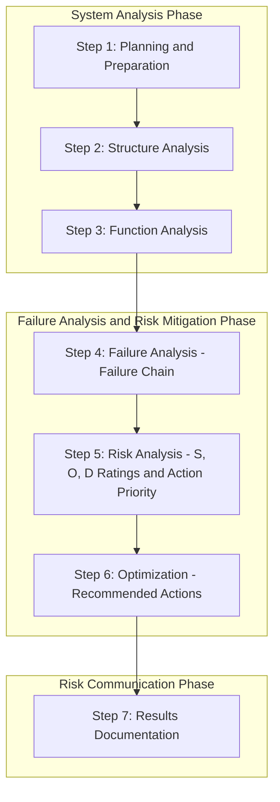

## AIAG-VDA 2019 Handbook

### Overview

The **AIAG & VDA FMEA Handbook**, First Edition, published jointly in June 2019 by the Automotive Industry Action Group (AIAG) and the German Verband der Automobilindustrie (VDA), represents the harmonization of two previously independent, regionally divergent automotive FMEA methodologies into a single global standard. Prior to this publication, suppliers serving both North American OEMs (Chrysler, Ford, GM — governed by the AIAG FMEA Fourth Edition) and European/German OEMs (governed by VDA Volume 4) often had to produce two separate, differently structured FMEA documents for the same part. The 2019 handbook directly addressed this administrative burden by establishing shared terminology, a unified process structure, and common rating tables.

### Motivation for Harmonization

**Key Points**

- Suppliers providing products to both European and North American automotive OEMs previously had to satisfy two distinct, non-equivalent FMEA methodologies simultaneously, creating duplicated effort and potential inconsistency between the two documents for the same part
- The publication is formally the **First Edition** of the joint AIAG & VDA FMEA Handbook — it is not, despite some informal industry discussion, considered a "5th edition" continuation of the AIAG FMEA Fourth Edition lineage, but rather a new, jointly authored document
- The handbook incorporates best practices and examples drawn from both AIAG's and VDA's previous respective handbooks, along with real-world industry experience, rather than being built from scratch

### The Seven-Step Approach

The most significant structural change introduced by the handbook is a new **seven-step approach** for FMEA development, providing a framework for documenting technical risks in a precise, relevant manner, so that product design and process risk become more transparent and can be anticipated, calibrated, and managed comprehensively.

**Key Points**

- The seven steps are: **Planning and Preparation, Structure Analysis, Function Analysis, Failure Analysis, Risk Analysis, Optimization,** and **Results Documentation**
- These steps are grouped into three broader phases: Steps 1–3 represent the **System Analysis** phase; Steps 4–6 represent the **Failure Analysis and Risk Mitigation** phase; and Step 7 alone constitutes the **Risk Communication** phase
- This explicit three-phase grouping (Analyze the System → Analyze and Mitigate Failure Risk → Communicate Results) gives the seven-step process a clear logical progression that earlier, less formally structured FMEA approaches did not always make explicit

### Step-by-Step Breakdown

**Step 1 — Planning and Preparation**

The study begins with a purposeful and careful definition of scope, with the management team responsible for setting that scope; this step also involves assembling the cross-functional team, gathering supporting documentation, and establishing boundary conditions for the analysis. Skipping or rushing this step is widely cited as a common origin point for weak FMEAs that follow.

**Step 2 — Structure Analysis**

This step identifies and breaks down the design (or process) into system, subsystem, assembly, and component elements. Using the boundaries set during scope definition, Structure Analysis identifies every relevant element of the product or process. It is organized around three columns: the **Focus Element** in the middle, the **System** of which the Focus Element is a part (above), and the **Component Elements** contained within the Focus Element (below).

**Step 3 — Function Analysis**

This step explores what the product or process should be doing and how that functionality is achieved. Using the structure developed in Step 2, each element is analyzed separately in terms of its function(s) and corresponding requirement(s) — directly building on the function/requirement foundation covered earlier in this curriculum.

**Step 4 — Failure Analysis**

This step uses the concept of a **Failure Chain**, visualizing failures as three linked elements — the failure mode, its cause, and its effect — directly mirroring the local/next-level/end-effect and mode/cause/effect structures established in earlier FMEA methodology, but now explicitly formalized as a structured "chain" tied to the system, function, and structure trees built in the preceding steps.

**Step 5 — Risk Analysis**

This step applies the revised Severity, Occurrence, and Detection rating tables (updated relative to prior AIAG and VDA versions) and determines the **Action Priority (AP)** rating, replacing the traditional multiplicative RPN calculation.

**Step 6 — Optimization**

This step identifies and assigns recommended actions targeting the highest-priority risks identified in Step 5, tracks responsibility and target completion dates, and confirms implementation and effectiveness of those actions.

**Step 7 — Results Documentation**

This final step, constituting the "Risk Communication" phase on its own, summarizes the analysis and communicates it to relevant stakeholders in a clear, structured form.

### Process Flow Diagram

### Additional Major Changes Beyond the Seven-Step Structure

**Key Points**

- A new chapter on **Supplemental FMEA for Monitoring and System Response (FMEA-MSR)** was introduced, addressing systems with active fault detection and mitigation behavior during customer operation — the same FMEA-MSR concept later mirrored in the SAE J1739:2021 revision covered earlier in this curriculum
- **Totally revised Severity, Occurrence, and Detection tables** were published, differentiated with specific criteria for DFMEA and PFMEA contexts respectively, rather than a single generic table applied loosely across both
- The **Action Priority (AP) methodology and tables** replaced RPN as the primary prioritization method — a structural change directly motivated by RPN's well-documented limitations (non-unique scores across different risk profiles, arbitrary thresholding, and the flattening of severity relative to occurrence and detection)
- New **Form Sheets** were introduced for spreadsheet users, along with **Software Report Views** for users of dedicated FMEA software tools, alongside explicit "change point" highlights showing how content differed from both the prior AIAG Fourth Edition manual and the VDA Volume 4 FMEA manual

### Introduction of the Parameter Diagram (P-Diagram)

A further structural addition introduced within the harmonized methodology (particularly emphasized in Step 3, Function Analysis) is the **Parameter Diagram (P-Diagram)**, used to visually represent a system's inputs, outputs, control factors, noise factors, and error states — providing a structured visual tool for understanding function and potential failure sources before proceeding into detailed failure mode identification. [Inference: while the P-Diagram is well documented in AIAG-VDA training and secondary literature as an emphasized tool within the handbook's function analysis approach, its precise placement and treatment within the handbook's own internal chapter structure is better confirmed against the primary published text for detailed compliance purposes.]

### Industry Adoption

**Key Points**

- Within the first six months following the handbook's June 2019 publication, it gained rapid popularity across the global automotive industry, with both U.S. and European OEMs beginning to require the AIAG-VDA approach in their supplier programs
- Like the AIAG Guidebook Fourth Edition before it, the handbook provides guidance, instruction, and illustrative examples of the required analytical techniques rather than functioning as a rigid, form-only requirements document
- The transition from AIAG Fourth Edition to AIAG-VDA has been widely characterized in industry training material as one of the most significant changes in automotive FMEA practice in recent years, given the scope of structural, terminological, and rating-methodology changes involved

### Comparative Snapshot: AIAG 4th Edition vs. AIAG-VDA 2019

| Dimension | AIAG Fourth Edition (2008) | AIAG-VDA Handbook (2019) |
| --- | --- | --- |
| Governing bodies | AIAG (Chrysler, Ford, GM) only | Joint AIAG (US) and VDA (Germany) |
| Process structure | Less formally staged, form-centric guidance | Explicit seven-step process across three phases |
| Prioritization method | RPN (S × O × D) | Action Priority (AP) tables |
| Monitoring/response coverage | Not explicitly addressed | Dedicated FMEA-MSR chapter |
| System representation | Primarily tabular | Structure trees, function nets, P-Diagram emphasis |
| Rating tables | Single generic S/O/D tables | Revised tables differentiated for DFMEA and PFMEA |

### Conclusion

The AIAG-VDA 2019 Handbook represents the most significant structural evolution in automotive FMEA methodology since the technique's original adoption by the industry, replacing decades of parallel, incompatible American and German practice with a single harmonized seven-step process, revised rating tables, a formalized Action Priority replacement for RPN, and a new supplemental treatment of monitoring-and-response systems via FMEA-MSR. Its rapid adoption across both U.S. and European OEMs within months of publication reflects the automotive industry's clear recognition of the prior fragmentation's cost, and it now stands as the current global reference framework against which subsequent standards, including the 2021 SAE J1739 revision, have been explicitly aligned.

**Related Topics**

- Structure Analysis and Function Analysis worked examples (Steps 2–3)
- The Failure Chain concept and its relationship to mode/cause/effect terminology
- Action Priority (AP) tables versus traditional RPN calculation
- FMEA-MSR: Monitoring and System Response methodology in depth
- Parameter Diagrams (P-Diagrams) in function and failure analysis
- Transitioning legacy AIAG Fourth Edition FMEAs to the AIAG-VDA structure