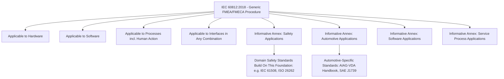

## IEC 60812 International Standard

### Overview

**IEC 60812**, titled *"Failure modes and effects analysis (FMEA and FMECA),"* is an international standard published by the International Electrotechnical Commission (IEC) under Technical Committee 56 (Dependability). Unlike the automotive-specific AIAG-VDA Handbook or the military-originated MIL-STD-1629A, IEC 60812 is deliberately structured as a **generic, industry-agnostic** standard applicable across hardware, software, processes, and human-action interfaces in any combination — making it one of the broadest-scoped and most widely cross-referenced FMEA/FMECA standards internationally.

### Publication History

**Key Points**

- The standard's lineage traces back to an original 1985 edition, followed by a second edition in 2006, and the current **third edition, published August 2018**
- The 2018 third edition cancels and replaces the 2006 second edition, constituting a full technical revision rather than a minor amendment
- It is maintained by IEC Technical Committee 56, which is responsible for dependability standards more broadly, situating FMEA/FMECA within a larger family of reliability and dependability analysis techniques

### Scope and Purpose

IEC 60812:2018 explains how failure modes and effects analysis (FMEA), including the failure modes, effects and criticality analysis (FMECA) variant, is planned, performed, documented, and maintained. The purpose of FMEA is to establish how items or processes might fail to perform their function so that any required treatments could be identified.

**Key Points**

- An FMEA under this standard provides a systematic method for identifying modes of failure together with their effects on the item or process, both **locally and globally** — directly mirroring the local/next-level/end-effect tracing structure common across FMEA methodology generally
- The standard notes that an FMEA may also include identifying the causes of failure modes, though this is framed as an optional extension rather than a strictly mandatory core element
- Failure modes can be prioritized to support treatment decisions; where the criticality ranking involves at least the severity of consequences (and often other measures of importance), the analysis is specifically termed **FMECA** — a terminological distinction the standard makes explicit
- This document is applicable to **hardware, software, processes including human action, and their interfaces, in any combination** — a notably broad scope compared to industry-specific standards
- An FMEA under this standard can be used in a safety analysis, for regulatory and other purposes, but because it is a generic standard, it does **not** give specific guidance for safety applications — safety-specific FMEA guidance is left to domain-specific standards (such as automotive functional safety standards like ISO 26262) that build on this generic foundation

### Significant Technical Changes in the 2018 Third Edition

The 2018 revision introduced several substantive changes relative to the 2006 second edition:

| Change | Description |
| --- | --- |
| Generic normative text | The core normative text was made fully generic, covering all applications rather than being written primarily around one domain |
| Informative application annexes | Examples of application for safety, automotive, software, and (service) process contexts were added as informative annexes |
| Tailoring guidance | Explicit description of how to tailor the FMEA approach for different application contexts |
| Reporting format flexibility | Different reporting formats are described, including database information system approaches, rather than a single fixed worksheet format |
| Alternative RPN calculation methods | Alternative means of calculating Risk Priority Numbers were added, reflecting broader industry awareness of RPN's known limitations |
| Criticality matrix method | A criticality matrix-based method was added as an alternative or complement to numeric criticality calculation — directly echoing the qualitative criticality matrix approach originally established in MIL-STD-1629A |
| Relationship to other methods | The standard now explicitly describes the relationship between FMEA/FMECA and other dependability analysis methods, situating it within a broader reliability engineering toolkit |

### Structural Relationship to Other Standards

**Key Points**

- IEC 60812's explicit inclusion of both a numeric RPN-style calculation option and a qualitative criticality matrix option reflects the same dual quantitative/qualitative approach originally established by MIL-STD-1629A decades earlier, suggesting a direct conceptual lineage from the military origins of FMECA through to the current international generic standard
- Because the standard is deliberately generic and industry-agnostic, it functions differently from automotive-specific standards like AIAG-VDA or SAE J1739: rather than prescribing a single mandatory worksheet format or rating scale, it describes the general procedure and principles, leaving specific tailoring (such as automotive-specific severity tables) to be addressed either within its own informative annexes or by referencing industry-specific standards that build upon it
- The standard's explicit statement that it does not provide safety-specific guidance is significant: industries requiring formal safety case documentation (aerospace, automotive functional safety, medical devices) typically layer domain-specific safety standards (such as IEC 61508 or ISO 26262) on top of the generic FMEA/FMECA procedure IEC 60812 describes, rather than relying on IEC 60812 alone for safety analysis

### Relationship Diagram: IEC 60812 Within the Standards Landscape

### Reporting and Documentation Flexibility

**Key Points**

- Unlike more prescriptive automotive standards that specify particular form-sheet layouts, IEC 60812:2018 describes multiple acceptable reporting formats, explicitly including database information system approaches, reflecting the broader range of industries and organizational contexts (from small-scale process FMEAs to large, software-managed FMECA programs) the standard is intended to serve
- This flexibility means organizations across very different sectors — process manufacturing, general electronics, software systems, service industries — can adopt IEC 60812 as a foundational methodology reference while adapting the specific documentation format to their existing quality management systems

### Why This Standard Matters as a Cross-Industry Reference

**Key Points**

- For organizations or industries without a dedicated sector-specific FMEA standard (unlike automotive, which has AIAG-VDA, or aerospace/defense, which has MIL-STD-1629A as a historical reference), IEC 60812 often serves as the primary authoritative methodology reference
- Its explicit coverage of software and human-action process failure modes, alongside traditional hardware failure modes, makes it particularly relevant for modern systems engineering contexts where failures increasingly originate from software logic, human-system interaction, or complex hardware-software-process interfaces rather than purely mechanical or electrical component failure
- The standard's description of the relationship between FMEA/FMECA and other dependability analysis methods (such as Fault Tree Analysis, covered elsewhere in this curriculum) provides an internationally recognized reference point for how these complementary techniques fit together within a broader dependability engineering program

### Conclusion

IEC 60812:2018 occupies a distinct and important position in the FMEA standards landscape: rather than being tailored to a single industry's specific practices and rating conventions, it provides a deliberately generic, internationally recognized procedural foundation applicable to hardware, software, processes, and human-action interfaces in any combination. Its third edition's significant technical revisions — generic normative text, industry-specific informative annexes, expanded reporting format guidance, alternative RPN and criticality matrix calculation methods, and explicit positioning relative to other dependability analysis methods — reflect a deliberate effort to serve as a flexible, cross-industry reference standard that other domain-specific frameworks (automotive, safety-critical, and beyond) can build upon rather than duplicate.

**Related Topics**

- FMECA criticality matrix methodology across MIL-STD-1629A, AIAG-VDA, and IEC 60812
- IEC 61508 functional safety and its relationship to generic FMEA procedures
- Software and human-action failure mode analysis under IEC 60812
- Comparing generic (IEC 60812) versus industry-specific (AIAG-VDA, MIL-STD-1629A) FMEA standards
- Database and software-based FMEA reporting system approaches
- Relationship between FMEA/FMECA and other dependability analysis methods (FTA, RBD)